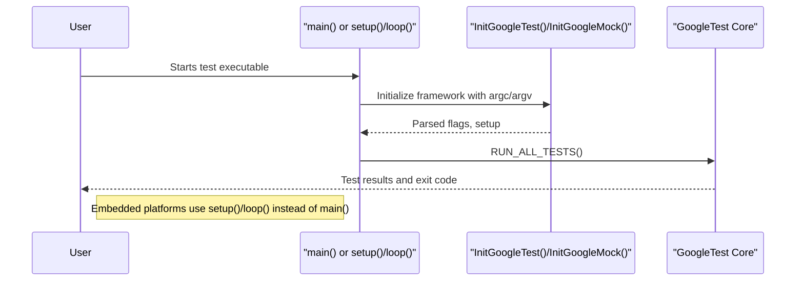

# Main Function Integration

GoogleTest and GoogleMock provide default `main()` implementations to simplify running your tests, while also allowing flexibility for custom or embedded main functions on special platforms. This page explains the default main implementations (`gtest_main`, `gmock_main`), platform-specific adaptations (such as for ESP8266 or Arduino), and how you can provide your own `main()` when needed.

---

## Overview of Default Main Functions

GoogleTest and GoogleMock come with default `main()` implementations that initialize the respective frameworks, parse command-line arguments, and run all registered tests.

### 1. gtest_main

- Provided by the `gtest_main` library.
- Defines a standard `main()` function for normal host platforms.
- Calls `testing::InitGoogleTest()` to initialize GoogleTest with command-line flags.
- Invokes `RUN_ALL_TESTS()` to execute all registered tests.

### 2. gmock_main

- Provided by the `gmock_main` library, which depends on GoogleTest.
- Defines a standard `main()` function that initializes GoogleMock (which internally initializes GoogleTest).
- Calls `testing::InitGoogleMock()` with command-line args.
- Calls `RUN_ALL_TESTS()` to execute all tests and mock expectations.

Both implementations aim to provide an out-of-the-box executable that runs all tests with minimal setup.

---

## Platform-Specific Main Function Adaptations

Some embedded or special platforms (e.g., ESP8266, ESP32, Arduino, NRF52) do not support the typical `main(int argc, char** argv)` entry point. Instead, they rely on loop-driven or event-driven execution models. GoogleTest and GoogleMock provide adapted entry points to fit these environments.

### ESP8266, ESP32, Arduino, and NRF52

- Instead of `main()`, user code must define `setup()` and `loop()` functions.
- GoogleTest/GoogleMock provide default `setup()` functions that initialize the frameworks.
- The `loop()` function repeatedly calls `RUN_ALL_TESTS()`.

Example from `gtest_main.cc` and `gmock_main.cc`:

```cpp
// Arduino-like platforms: program entry points are setup()/loop() instead of main()

void setup() {
  testing::InitGoogleTest(); // or InitGoogleMock() for gmock_main
}

void loop() {
  RUN_ALL_TESTS();
}
```

- This design fits the Arduino event-driven model and allows continuous test execution or integration with hardware loops.

---

## Using the Default Main Implementations

### Linking with gtest_main or gmock_main

- When building your test executable, link with `gtest_main` or `gmock_main` instead of just `gtest` or `gmock`.
- This automatically provides the `main()` function as described above.

Example (CMake):

```cmake
add_executable(my_tests test1.cpp test2.cpp)
target_link_libraries(my_tests gtest_main)
add_test(NAME my_tests COMMAND my_tests)
```

- This removes the need for writing your own `main()` to initialize and run tests.

### When to Provide a Custom `main()`

You may need to write your own `main()` in cases such as:

- Custom initialization or environment setup before running tests.
- Integration that requires additional command-line argument processing.
- When using specialized platforms where default `main()` is unsupported.

In these cases:

- Manually call `testing::InitGoogleTest(&argc, argv);` (or `InitGoogleMock()` if mocking is used).
- Then call `RUN_ALL_TESTS()` and return its value.

Example:

```cpp
int main(int argc, char **argv) {
  testing::InitGoogleTest(&argc, argv);
  // custom setup here
  return RUN_ALL_TESTS();
}
```

---

## Practical Programming Flow with Default Mains

1. **Compile tests linking with `gtest_main` or `gmock_main`.**  
   Your test executable includes a main that initializes the framework.

2. **Invoke executable with optional GoogleTest flags.**  
   The main function parses flags like `--gtest_filter`, `--gtest_repeat`, etc.

3. **Run all registered tests using `RUN_ALL_TESTS()`.**  
   The framework executes all tests and reports results.

4. **Exit with code indicating test success or failure.**  
   This enables integration with CI systems.

---

## Example: Minimal Custom Main Function

```cpp
#include "gtest/gtest.h"

int main(int argc, char **argv) {
  testing::InitGoogleTest(&argc, argv);  // Initialize framework and parse flags
  return RUN_ALL_TESTS();                 // Run all tests and return exit code
}
```

---

## Custom Main for Embedded Platforms

For Arduino, ESP8266, ESP32, and similar platforms, provide `setup()` and `loop()` functions:

```cpp
void setup() {
  testing::InitGoogleTest();  // or InitGoogleMock()
}

void loop() {
  RUN_ALL_TESTS();
}
```

This approach adapts to platforms that lack a normal `main()` entry point and fit testing into the device lifecycle.

---

## Troubleshooting Common Main Function Issues

<AccordionGroup title="Common Issues and Solutions">
<Accordion title="Linker errors due to multiple mains">
Ensure only one `main()` function is linked. Use either `gtest_main` or provide your own `main()`, but not both.
</Accordion>
<Accordion title="Tests not running or InitGoogleTest() not called">
Verify that `testing::InitGoogleTest()` (or `InitGoogleMock()`) is called before `RUN_ALL_TESTS()`. Without initialization, no tests will run.
</Accordion>
<Accordion title="Unsupported platforms missing setup()/loop()">
On embedded platforms like Arduino, define `setup()/loop()` instead of `main()`. Use framework-provided versions or implement your own with calls to the testing API.
</Accordion>
<Accordion title="Incorrect return code from main()">
Always return the value of `RUN_ALL_TESTS()` in your `main()` to signal test success or failure correctly to your build or CI system.
</Accordion>
</AccordionGroup>

---

## Summary

- GoogleTest provides default main implementations in `gtest_main` and `gmock_main` libraries.
- These mains initialize testing, parse flags, and run all tests via `RUN_ALL_TESTS()`.
- Embedded and Arduino-like platforms use `setup()` and `loop()` instead of `main()`.
- Users can provide custom mains when needing special setup or platform-specific adaptations.
- Proper initialization and return values ensure correct test execution and integration.

---

## Additional Resources

- [GoogleTest Primer](https://github.com/google/googletest/blob/main/docs/primer.md) – Start writing tests and using the default main.
- [Integration with Build Systems](https://github.com/google/googletest/blob/main/docs/getting-started/prerequisites-installation/integration-build-systems.md) – How to link and build with `gtest_main`.
- [Troubleshooting Installation & Running Tests](https://github.com/google/googletest/blob/main/docs/getting-started/first-steps-validation/troubleshooting-common-issues.md) – Fix common main and linking issues.
- [gtest_main.cc Source](https://github.com/google/googletest/blob/main/googletest/src/gtest_main.cc) – See default main implementation.
- [gmock_main.cc Source](https://github.com/google/googletest/blob/main/googlemock/src/gmock_main.cc) – See default mocking main.


---

### Diagram: Main Function Integration Flow


