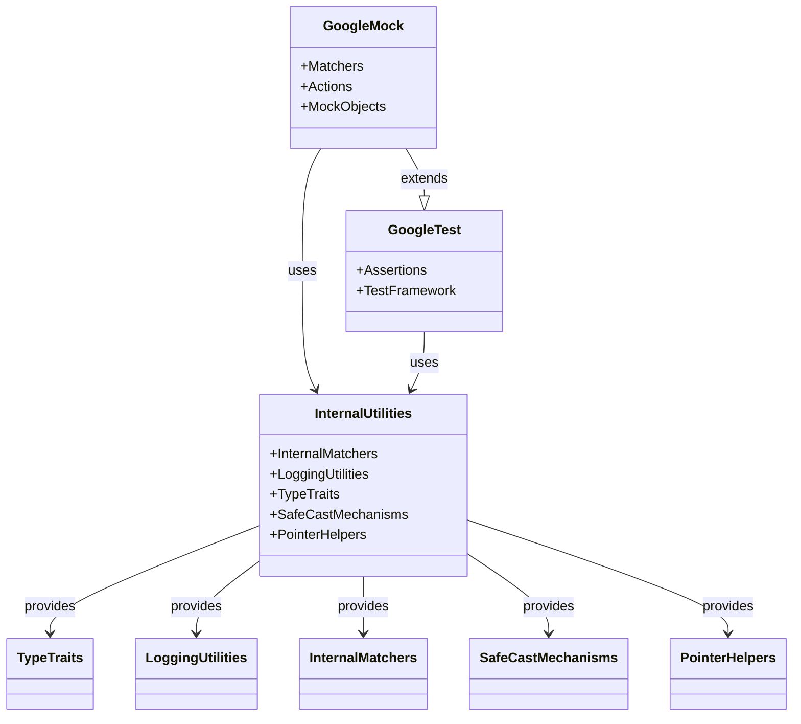

# Internal Utilities Reference

This reference documentation provides detailed information on the utility classes, helper functions, internal matchers, logging utilities, type traits, and safe cast mechanisms built into GoogleTest and GoogleMock. These internal utilities support extension and advanced test infrastructure construction, offering powerful tools for working beyond standard API usage.

---

## Overview of Internal Utilities

GoogleTest and GoogleMock include numerous internal utility components designed to streamline advanced testing frameworks and extend the capabilities of testing code. These utilities are primarily intended for framework developers or users building complex extensions or infrastructural features.

These internal components cover:

- **Internal Matchers:** Specialized matchers that facilitate complex assertions and comparisons.
- **Logging Utilities:** Facilities for controlling output verbosity, formatting, and capturing log messages.
- **Type Traits:** Compile-time meta utilities for type categorization and safety.
- **Safe Cast Mechanisms:** Conversions between matcher types ensuring type compatibility without sacrificing safety.

These components are usually transparent to typical test authors but become invaluable while developing custom matchers, mock actions, or advanced test harnesses.

---

## Internal Matchers and Matcher Utilities

GoogleMock offers a rich collection of matchers, some of which are implemented internally. These internal matchers provide foundational patterns for:

- **Polymorphic Matching:** Matchers that work across multiple types seamlessly.
- **Composite Matching:** Combining multiple matchers logically (e.g., `AllOf`, `AnyOf`, `Not`).
- **Pointer and Smart Pointer Matching:** Utilities like `Pointee` that match pointer dereferenced objects.
- **Property and Field Matching:** `Field()` and `Property()` matchers that inspect members or getter results on objects.

### Defining and Using Internal Matchers

- Internal matchers typically follow the interface with three primary methods:
  - `MatchAndExplain(const T& value, MatchResultListener* listener)`: Returns `true` if the value matches, optionally writing explanations.
  - `DescribeTo(std::ostream* os)`: Describes the expected matcher condition.
  - `DescribeNegationTo(std::ostream* os)`: Describes the negated condition.

- Internal matchers often implement matcher polymorphism without inheritance, offering template-based flexible matching without virtual functions for performance and extensibility.

- Common internal matchers can be chained and combined using facilities like `AllOf()`, `AnyOf()`, and parameterized matchers such as `MATCHER_P` macros for quick definitions.

### Example: Implementing a Custom Internal Matcher

```cpp
MATCHER(IsEven, "") {
  // 'arg' is the matched value.
  return (arg % 2) == 0;
}
```

Use in tests:

```cpp
EXPECT_THAT(value, IsEven());
EXPECT_CALL(mock, Foo(IsEven()));
```

The matcher prints descriptive failure messages generated from the matcher name.

---

## Logging Utilities

GoogleMock includes robust internal logging utilities that control what diagnostic information is printed during test execution. These support configurable verbosity levels, stack trace logging, and thread-safe output.

### Key Features

- Logging severities: `info`, `warning`, `error`.
- Log visibility controlled by the `--gmock_verbose` flag.
- Thread-safe logging utilizing internal mutex locks.
- Stack trace capture integration for warnings and failures (adjustable via `--gtest_stack_trace_depth`).

### Logging Example

```cpp
Log(kWarning, "Uninteresting call to mock method", 1);
```

This writes a warning message and includes a stack trace depth of 1 frame.

### Common Configuration Flags

- `--gmock_verbose=info|warning|error` to adjust verbosity.
- `--gtest_stack_trace_depth=<number>` to limit stack trace size.

---

## Type Traits and Type Safety Mechanisms

GoogleTest and GoogleMock implement multiple compile-time utilities to classify and handle types safely in generic code.

### Type Kinds

- `kBool` for boolean types
- `kInteger` for integral types
- `kFloatingPoint` for floating-point types
- `kOther` for all other types

These are used internally to enforce safe matcher casts and argument passing.

### SafeMatcherCast

Allows casting of a matcher to another matcher type safely if the conversion between their argument types is safe and allowed by the type system.

For example, you can use a `Matcher<long>` to match an `int` argument when the conversion is lossless.

```cpp
EXPECT_CALL(mock, Foo(SafeMatcherCast<int>(matcher)));
```

This mechanism prevents unsafe conversions, especially involving references and arithmetic types.

---

## Utilities for Handling Pointers

Several internal utilities deal with the correct handling of raw pointers, smart pointers, and reference wrappers inside matchers and actions.

### GetRawPointer

This utility extracts the raw pointer from pointers of various smart pointer types (`std::unique_ptr`, `std::shared_ptr`) or reference wrappers.

Use cases include safely dereferencing pointers in matchers like `Pointee()`.

### Pointer and Pointee Matchers

- **Pointer(m):** Matches pointers that themselves match matcher `m`.
- **Pointee(m):** Matches pointers whose pointed-to value matches matcher `m`. Treats `nullptr` as a mismatch.

---

## String and Identifier Helpers

GoogleTest implements internal utilities for handling strings and identifiers, often to help produce human-readable messages.

### Identifier Name Conversion

Internal utilities convert identifier names such as `FooBar123` or `foo_bar_123` into human-readable lowercase phrases like "foo bar 123", improving error messages and descriptions.

### Base64 Decoding

Utilities to decode base64-encoded strings exist to support matchers like `WhenBase64Unescaped` that assert on the unencoded contents.

---

## MatchResultListener

Internal helper class capturing and streaming additional explanation strings for matcher failures to produce richer diagnostics messages.

Matchers can stream specific reasons for failure or success into this listener.

---

## Random Number Generator

An internal simple and reproducible Linear Congruential Generator is provided for usage such as shuffling tests with `--gtest_shuffle` flag.

---

## Synchronization Primitives

For thread safety in test execution and mock interaction, internal synchronization classes such as `Mutex`, `MutexLock`, and `ThreadLocal` storage are implemented, abstracting platform differences.

---

## Using These Utilities

While most users will never need to directly interact with the internal utilities, understanding these tools is critical when:

- Building complex **custom matchers** or **actions**.
- Handling **pointers and smart pointers** safely within expectations.
- Implementing **logging and diagnostics** for richer test reports.
- Writing **type-safe generic mock classes or extensions**.

### Practical Tips

- Use **`SafeMatcherCast<T>(m)`** to ensure matcher type compatibility without losing correctness.
- When working with polymorphic pointers in matchers, prefer **`Pointee(m)`** over manual null checks.
- For internal logging or debugging of matchers, adjust **`--gmock_verbose`**.

---

## Troubleshooting Common Issues

- **Incorrect type casting in matchers:** Use `SafeMatcherCast` to avoid subtle runtime errors.
- **Unprotected commas in mock method declarations:** Wrap types with commas in parentheses or use type aliases.
- **Mismatch in string comparison:** Internal string comparison helpers handle both narrow and wide strings and ignore case when required.

## Further Reading and References

For full user-focused API and practical examples, please refer to the following documentation pages:

- [Mocking Framework Overview and Usage](/api_reference/mocking_framework/defining_mocks)
- [Matchers Reference](/api_reference/core_assertions_matchers/matchers_reference)
- [Assertions Reference](/docs/reference/assertions.md)
- [gMock Cookbook](/docs/gmock_cook_book.md)

---

## Mermaid Diagram: Conceptual Relationships



---

## Summary
The internal utilities within GoogleTest and GoogleMock offer foundational tools such as type traits, internal matchers, logging infrastructure, and pointer helpers that empower advanced testing scenarios. They form the building blocks for custom extensions and provide type-safe, flexible mechanisms to augment the core testing and mocking APIs.


