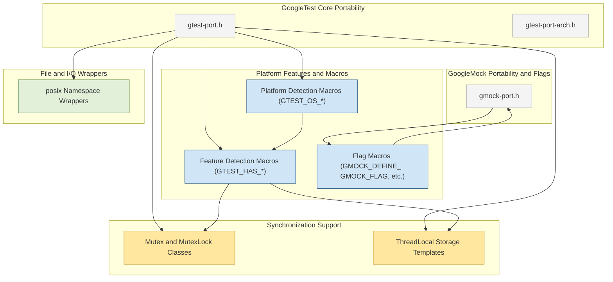

# Platform and Portability APIs

GoogleTest and GoogleMock provide a comprehensive set of APIs and macros designed to ensure smooth operation across a broad range of platforms, compilers, and system architectures. This page outlines these platform and portability interfaces, configuration flags, and internal utilities that support diverse build environments and maintain consistent behavior.

---

## 1. Overview

GoogleTest and GoogleMock are built with portability as a core principle. They detect and adapt to the environment at compile-time via platform-indicating macros, feature flags, and abstraction layers. This enables the frameworks to run reliably on Windows, Linux, macOS, and numerous other operating systems, as well as varied compilers from MSVC to GCC and Clang.

The portability APIs mostly consist of macros and helper classes that:

- Identify platform and compiler capabilities
- Manage threading and synchronization primitives
- Provide internal replacements or wrappers for standard functions
- Define configuration flags for feature toggling

Users typically benefit from these automatically. However, understanding these APIs empowers advanced users to tweak builds, extend support, or debug environment-specific behavior.

---

## 2. Platform Detection Macros

GoogleTest defines macros that indicate the platform it is being built on. These macros are always defined to 1 if the compilation target matches, otherwise they are undefined. They enable conditional compilation for platform-specific features or workarounds.

Some key platform macros include:

- `GTEST_OS_WINDOWS` (and subtypes `GTEST_OS_WINDOWS_DESKTOP`, `GTEST_OS_WINDOWS_MINGW`, etc.)
- `GTEST_OS_LINUX` (including `GTEST_OS_LINUX_ANDROID`)
- `GTEST_OS_MAC` and `GTEST_OS_IOS`
- `GTEST_OS_CYGWIN`
- `GTEST_OS_FREEBSD`, `GTEST_OS_OPENBSD`, etc.

These macros are directly derived from compiler predefined macros and platform detection headers (`gtest-port-arch.h`).


---

## 3. Feature-Detection Macros

GoogleTest uses compile-time macros to indicate whether certain features or libraries are available, including:

- `GTEST_HAS_PTHREAD` — Indicates pthreads support.
- `GTEST_HAS_EXCEPTIONS` — Is C++ exceptions enabled.
- `GTEST_HAS_RTTI` — Is runtime type information enabled.
- `GTEST_HAS_STD_WSTRING` — Is `std::wstring` supported.
- `GTEST_HAS_CLONE` — Availability of `clone()` system call (Linux).
- `GTEST_HAS_DEATH_TEST` — Support for death test functionality.
- `GTEST_HAS_STREAM_REDIRECTION` — Support for capturing stdout/stderr.

These macros are critical for conditions such as enabling multi-threading and exception-safe test features.

---

## 4. Configuration Flags

Flags provide tunable options to adjust GoogleMock and GoogleTest behavior, especially in varied build contexts or unusual platforms.

GoogleMock exposes flag macros for users to reference or define:

- `GMOCK_FLAG(name)` — Macro to reference a flag named `name`.
- `GMOCK_DEFINE_bool_(name, default_val, doc)` — Define a boolean flag.
- `GMOCK_DECLARE_bool_(name)` — Declare (extern) a boolean flag.

These macros switch implementation based on whether Abseil's flag library is available.

Example of usage:

```cpp
// Defines a bool flag with default value false
GMOCK_DEFINE_bool_(verbose, false, "Enable verbose mock output");

// Using the flag in code
if (GMOCK_FLAG_GET(verbose)) {
  // Detailed logging
}
```

Users can set these flags via command line or programmatically before running tests.

---

## 5. Synchronization Primitives and Threading Support

GoogleTest/GoogleMock provide portable mutex, lock, and thread local storage abstractions to ensure thread-safe behaviors.

- On platforms with pthreads support (`GTEST_HAS_PTHREAD == 1`), these are thin wrappers over pthread APIs.
- On Windows, native synchronization primitives like `CRITICAL_SECTION` are used.
- Otherwise, dummy implementations that compile but perform no locking are provided, allowing single-threaded use.

**Key classes include:**

- `Mutex` — basic mutual exclusion with `Lock()` and `Unlock()`.
- `MutexLock` — RAII-style lock guard that locks in constructor and unlocks in destructor.
- `ThreadLocal<T>` — thread-local storage for instances of type `T`.

This uniform interface allows test code and GoogleMock internals to assume consistent, thread-safe behavior across environments without platform-specific rewriting.


---

## 6. File System and I/O Wrappers

To cope with platform differences in file and directory APIs, GoogleTest provides.

- `posix::FileNo(FILE*)` — Platform-aware equivalent of `fileno()`.
- `posix::Stat(const char*, StatStruct*)` — Retrieves file status.
- `posix::RmDir(const char*)` — Remove directory.
- `posix::IsDir(const StatStruct&)` — Checks if a path is a directory.
- Wrappers for `isatty()`, `strcasecmp() / stricmp()`.

These allow consistent test code operations on files/directories even on Windows, Linux, or embedded targets that might differ in API or feature completeness.

---

## 7. Logging and Diagnostic Utilities

The platform APIs also define logging macros and classes for consistent error reporting across compilers/platforms:

- `GTEST_LOG_(severity)` — Logs a message at the specified severity.
- The `GTestLog` class formats logging messages and handles fatal aborts.

These use standard output streams or system-specific logging facilities.

---

## 8. Usage Patterns and Best Practices

### How This Affects You as a User

You rarely need to directly use platform-portability APIs unless:

- You are building GoogleMock/GoogleTest on an uncommon platform.
- You want to extend or customize GoogleMock by defining internal macros or overriding flags.
- You develop tests that require adapting to platform capabilities explicitly (e.g., conditional compilation around threading or wide-string support).

### Tips

- Use `GMOCK_FLAG(name)` and related macros to reliably reference GoogleMock flags.
- Check feature macros like `GTEST_HAS_PTHREAD` or `GTEST_HAS_EXCEPTIONS` to guard code that needs those capabilities.
- Prefer GoogleTest-provided mutex and thread local classes over direct OS APIs in test-code where possible.

### Common Pitfalls

- Avoid assuming threading is always available; verify `GTEST_IS_THREADSAFE` or `GTEST_HAS_PTHREAD`.
- Certain platforms might lack file system support, so file operations might be no-op or behave differently.
- Be cautious with flags implementation differences depending on the Abseil dependency.

---

## 9. Example: Checking Thread Safety and Using Mutex

```cpp
#include "gmock/gmock.h"  // for GoogleMock main headers
#include "gtest/gtest.h"  // for GoogleTest main headers

TEST(ThreadSafetyTest, CheckMutex) {
  if constexpr (GTEST_IS_THREADSAFE) {
    testing::internal::Mutex mu;
    testing::internal::MutexLock lock(&mu);
    // Critical section
  } else {
    // Running on a non-threadsafe platform
  }
}
```


---

## 10. Additional Resources

- Platform and architecture detection: `gtest/internal/gtest-port-arch.h`
- Synchronization primitives and threading: `gtest/internal/gtest-port.h`
- GoogleMock-specific flags and porting: `gmock/internal/gmock-port.h`
- Customization markers for advanced users: `gtest/internal/custom` and `gmock/internal/custom`

---

For most developers, the platform portability APIs operate transparently under the hood, enabling stable and predictable testing behavior on any supported platform.

---

## Mermaid Diagram: Platform and Portability API Components



---

## 11. Troubleshooting Tips

**Issue:** Code fails to compile with error about missing pthreads.

- Verify `GTEST_HAS_PTHREAD` is set correctly via compiler flags or CMake options.
- On Windows, ensure not trying to use pthread-dependent features.

**Issue:** Unexpected mock or test behavior on embedded or exotic platform.

- Check if feature macros such as `GTEST_HAS_EXCEPTIONS` or `GTEST_HAS_STREAM_REDIRECTION` are properly set.
- Review any custom overrides in `gtest/internal/custom` or `gmock/internal/custom` directories.

**Issue:** Flags not recognized or not behaving as expected.

- Confirm if the build uses Abseil flag library (check `GTEST_HAS_ABSL` macro).
- Use `GMOCK_FLAG_GET` and `GMOCK_FLAG_SET` macros consistently.

---

## 12. Summary

The Platform and Portability APIs are the backbone that lets GoogleTest and GoogleMock execute raising reliable tests on hundreds of platforms and compilers. They bring abstraction layers for file I/O, threading, feature detection, flagging, and logging to deliver a unified experience regardless of environment nuances.

Understanding these is key for embedding GoogleTest and GoogleMock into custom or constrained build setups, extending their capabilities, or debugging environment-specific issues.

Users developing in typical environments benefit silently but can reference this documentation to guide advanced customization or troubleshoot platform-related challenges.

---