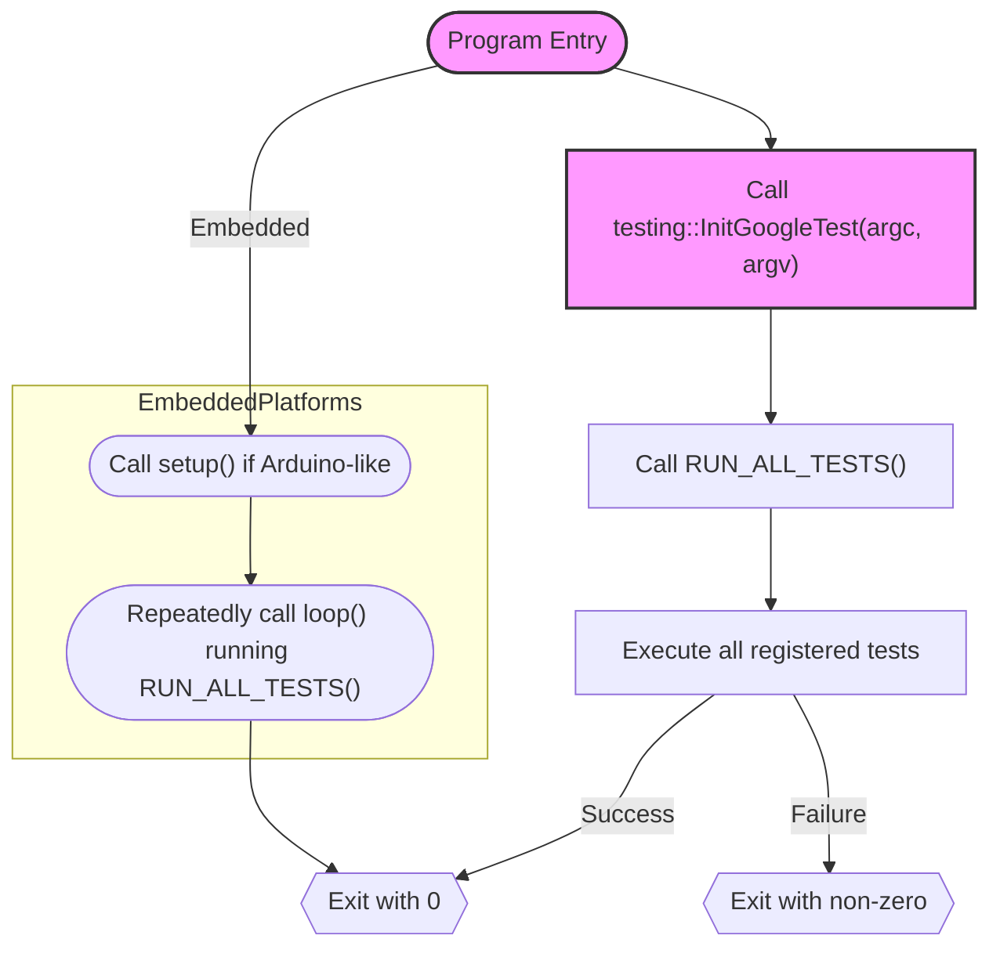

# Running Tests & Main Entry Points

This documentation explains how to run tests using GoogleTest and GoogleMock, detailing the available main entry points, command line flags to customize runs, and integration options for automated and embedded test environments. Whether you are setting up test executables, handling different platforms, or embedding tests in environments without the standard `main()` function, this guide provides the essential information to run your tests efficiently.

---

## Overview of Test Execution in GoogleTest

GoogleTest provides a streamlined way to define, register, and run tests without requiring manual enumeration. After writing tests with the `TEST()` or `TEST_F()` macros, you can simply execute your test binary to run all tests.

The core mechanism to trigger test execution is the `RUN_ALL_TESTS()` macro:

- **Purpose:** Runs all registered tests.
- **Return Value:** Returns 0 if all tests pass, non-zero if any test fails.
- **Usage Note:** You must return the value of `RUN_ALL_TESTS()` from your `main()` function to signal success or failure to automated systems.

To initialize the test framework and parse command line options, call `testing::InitGoogleTest()` early in your `main()` function, passing it the arguments from your program's entry point.

### Typical `main()` Function Pattern

Most users don't need to write `main()` manually and can link against the `gtest_main` or `gmock_main` libraries which provide a default entry point.

If you do write your own `main()`, it should follow this pattern:

```cpp
#include <gtest/gtest.h>

int main(int argc, char** argv) {
  testing::InitGoogleTest(&argc, argv);
  return RUN_ALL_TESTS();
}
```

This ensures command line flags are parsed correctly and all tests execute.

---

## GoogleTest and GoogleMock Main Entry Points

### 1. `gtest_main` Library

- Provides a ready-to-use `main()` that calls `InitGoogleTest()` and `RUN_ALL_TESTS()`.
- Suitable if you write only GoogleTest tests without mocks.
- You link your test executable with `gtest_main` instead of `gtest`.

### 2. `gmock_main` Library

- Similar to `gtest_main` but includes the initialization for GoogleMock.
- Calls `testing::InitGoogleMock()` internally, which initializes GoogleTest as well.
- Use this when your tests include mocks.

### 3. Custom `main()` for Embedded or Special Environments

GoogleTest supports platforms where the program entry point is not a traditional `main()`. Examples include embedded systems like Arduino or QuRT OS.

- For Arduino-like platforms (ESP8266, ESP32, NRF52):
  - `setup()` function calls `InitGoogleTest()` or `InitGoogleMock()`.
  - `loop()` repeatedly calls `RUN_ALL_TESTS()`, which usually runs tests once.

- For QuRT, the `main()` has no parameters; GoogleTest is initialized and tests run accordingly.

This flexibility allows you to integrate your tests into platforms with different lifecycle models.

---

## Running Tests with Command Line Flags

GoogleTest supports multiple command line flags that customize test execution behavior. `InitGoogleTest()` parses these flags and removes them from argument lists:

- `--gtest_filter=<pattern>`: Run only tests matching the pattern.
- `--gtest_repeat=<n>`: Run tests n times.
- `--gtest_shuffle`: Randomize test order.
- `--gtest_break_on_failure`: Break into debugger on failure.
- `--gtest_output=xml`: Output test result in XML format.
- `--gtest_color=(yes|no|auto)`: Control colored output.

Refer to the [Running Tests & Interpreting Results Guide](/guides/getting-started/running-tests) for a complete list and usage examples.

---

## Integration in Automated Test Environments

Automated build and test systems expect:

- The test executable to exit with a zero status on success, non-zero on failure.
- Test output to be parseable for reporting.

Because `RUN_ALL_TESTS()` returns success or failure status, make sure your `main()` function returns this value unaltered to integrate seamlessly.

### Using `gtest_main` or `gmock_main` for Automation

Linking with these libraries reduces boilerplate and ensures consistent entry point behavior.

### Embedding Tests in Larger Apps

If GoogleTest is embedded inside a larger application, you can:

- Call `InitGoogleTest()` at the appropriate time.
- Execute `RUN_ALL_TESTS()` when you want to run registered tests.

This allows tests to run on demand or under controlled conditions.

---

## Example Scenarios

### Example: Simple Standalone Test Executable

```cpp
#include <gtest/gtest.h>

TEST(MyTestSuite, SimpleTest) {
  EXPECT_EQ(1, 1);
}

int main(int argc, char** argv) {
  testing::InitGoogleTest(&argc, argv);
  return RUN_ALL_TESTS();
}
```

Compile and link with `gtest` or better with `gtest_main` for automatic main.


### Example: GoogleMock with Custom `main()`

```cpp
#include <gmock/gmock.h>

int main(int argc, char** argv) {
  ::testing::InitGoogleMock(&argc, argv);
  return RUN_ALL_TESTS();
}
```

Link with `gmock` or `gmock_main`.


### Example: Arduino-like Embedded Platform

```cpp
#include <gtest/gtest.h>

void setup() {
  ::testing::InitGoogleTest();
}

void loop() {
  RUN_ALL_TESTS();
}
```

---

## Common Pitfalls and Troubleshooting

<Tip>
Always check that your `main()` function returns the result of `RUN_ALL_TESTS()`. Failure to do so can cause your CI/CD pipeline to incorrectly mark tests as passing.
</Tip>

<Warning>
If you override the `main()` function, ensure `testing::InitGoogleTest()` or `InitGoogleMock()` is called before `RUN_ALL_TESTS()`. Otherwise, test filters and flags won't be processed.
</Warning>

<Note>
Linking with `gtest` or `gmock` alone requires providing your own `main()`. If you only link with `gtest_main` or `gmock_main`, the entry is already provided.
</Note>

<Check>
Embedded platforms may require special entry points (`setup()`, `loop()`). Verify compatibility before embedding tests.
</Check>

---

## How Global Test Environments Affect Running Tests

GoogleTest allows you to define global test environments deriving from `testing::Environment` that run setup and teardown code around all tests.

- Set up with `AddGlobalTestEnvironment()`.
- Controlled via `SetUp()` and `TearDown()` methods.
- Their success or failure can affect whether tests are run.

For example, a fatal failure in a global `SetUp()` prevents tests from running.

---

## Summary Diagram of Test Execution Flow



---

## References & Next Steps

- [Writing Your First Test](https://google.github.io/googletest/overview/getting-started-intro/writing-first-test)
- [Configuration & Integration](https://google.github.io/googletest/guides/getting-started/setup-prerequisites/configuration-integration)
- [Running Tests & Interpreting Results Guide](https://google.github.io/googletest/guides/getting-started/running-tests)
- [Mocking Framework Overview](https://google.github.io/googletest/googlemock/)
- [Test Declaration & Lifecycle API Reference](/api_reference/core_test_apis/test_declaration_lifecycle)

Use these resources to deepen your understanding of test writing and automation integration.

---

## Source Code References

- [`googletest/src/gtest_main.cc`](https://github.com/google/googletest/blob/main/googletest/src/gtest_main.cc) - Default main() implementation for GoogleTest
- [`googlemock/src/gmock_main.cc`](https://github.com/google/googletest/blob/main/googlemock/src/gmock_main.cc) - Default main() implementation when using GoogleMock
- [`googletest/test/gtest_environment_test.cc`](https://github.com/google/googletest/blob/main/googletest/test/gtest_environment_test.cc) - Tests for global test environments

---

With this knowledge, you have complete control over how your tests start, run, and report in all supported GoogleTest and GoogleMock scenarios.