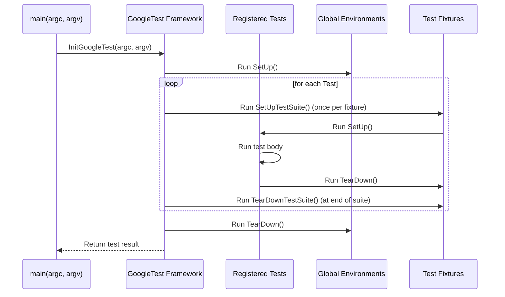

# Test Execution and Control

GoogleTest offers a robust API for managing the lifecycle of tests — from registration, setup, and execution through teardown and finalization. This page details the key interfaces and entry points that enable you to run tests programmatically, control test execution, manage fixtures and environments, and integrate GoogleTest into your build and test workflows.

---

## Overview of Test Execution

At its core, GoogleTest drives your tests by:

- Discovering and registering test cases and test methods
- Running tests and managing ordered execution
- Managing test fixtures and global environments
- Handling setup and teardown
- Reporting results and handling failures

To harness these capabilities programmatically or customize test execution, understanding the API entry points and test lifecycle hooks is essential.

---

## Test Registration

GoogleTest automatically registers all `TEST` and `TEST_F` macros during static initialization, making the test cases available for execution. Test fixtures allow you to group related tests sharing common setup and teardown behavior.

### Working with Fixtures

- Test fixtures define the environment for one or more tests.
- Use **`SetUp()`** and **`TearDown()`** for per-test-case setup and cleanup.
- Use **`SetUpTestSuite()`** and **`TearDownTestSuite()`** (C++17 and later) for per-fixture/class setup and teardown.
- Fixtures must derive from `::testing::Test`.

Example:

```cpp
class MyTestFixture : public ::testing::Test {
 protected:
  static void SetUpTestSuite() {
    // Called once before any tests in this fixture run
  }

  static void TearDownTestSuite() {
    // Called once after all tests in this fixture have run
  }

  void SetUp() override {
    // Called before each test
  }

  void TearDown() override {
    // Called after each test
  }
};

TEST_F(MyTestFixture, TestCase1) {
  // Test body
}

TEST_F(MyTestFixture, TestCase2) {
  // Test body
}
```

---

## Global Test Environments

GoogleTest supports defining global environments for setup and teardown that span the entire test program's lifecycle.

- Derive from `::testing::Environment`
- Override `SetUp()` and `TearDown()`
- Register with `::testing::AddGlobalTestEnvironment()`

Example:

```cpp
class MyGlobalEnvironment : public ::testing::Environment {
 public:
  void SetUp() override {
    // Global initialization before any tests run
  }
  void TearDown() override {
    // Global cleanup after all tests finish
  }
};

int main(int argc, char** argv) {
  ::testing::InitGoogleTest(&argc, argv);
  ::testing::AddGlobalTestEnvironment(new MyGlobalEnvironment);
  return RUN_ALL_TESTS();
}
```

Multiple global environments can be added; GoogleTest runs them sequentially in registration order.

---

## Main Entry Points

### `RUN_ALL_TESTS()`

This is the central function that runs all registered tests. Invoking it drives the full lifecycle — executing all registered test cases, handling setup/teardown, and reporting results.

Usage:

```cpp
int main(int argc, char** argv) {
  ::testing::InitGoogleTest(&argc, argv);
  return RUN_ALL_TESTS();
}
```

### Initialization

Call `InitGoogleTest()` before running tests to initialize internal structures, parse command-line flags for test control, and prepare the registered tests.

Signature:

```cpp
void InitGoogleTest(int* argc, char** argv);
```

After initialization, you can run `RUN_ALL_TESTS()` to execute the tests.

---

## Controlling Test Execution

GoogleTest offers multiple flags and APIs to fine-tune which tests run, how they run, and how results are reported.

### Command-line Flags

- `--gtest_filter=` — Filter which tests to run using wildcards.
- `--gtest_repeat=` — Repeat running tests multiple times.
- `--gtest_shuffle` — Randomizes the order of tests.
- `--gtest_break_on_failure` — Causes a debugger trap on failures.

### Programmatic Control

You can also programmatically filter tests or control the test running loop, such as:

- Using `UnitTest` instance to query tests and selectively run them
- Registering listeners for custom reporting

---

## Integration with Executable Main Functions

GoogleTest is designed to be embedded into your executable's `main()` function easily:

- Call `InitGoogleTest()` early
- Optionally add global environments
- Call `RUN_ALL_TESTS()`, returning its result

Example:

```cpp
int main(int argc, char** argv) {
  ::testing::InitGoogleTest(&argc, argv);

  // Add global environment(s) if needed
  ::testing::AddGlobalTestEnvironment(new MyGlobalEnvironment);

  return RUN_ALL_TESTS();
}
```

This approach ensures your test suite is efficiently integrated into your build and run process, supporting all the test discovery, execution, and reporting features.

---

## Practical Tips and Best Practices

- **Always call `InitGoogleTest()` before using the framework.**
- Use test fixtures to avoid repetitive setup and improve test modularity.
- Use global environments for expensive global setup and teardown to speed up tests.
- Control and filter test execution either by command-line flags or programmatically depending on your test automation needs.
- Keep test main functions simple and delegate configuration to global environments or flags.
- Leverage listeners if you need customized result reporting.

---

## Troubleshooting Common Issues

### Test Cases Not Running

- Make sure all tests are properly registered with `TEST` or `TEST_F` macros.
- Verify that `RUN_ALL_TESTS()` is called after initialization.

### Tests Running Out of Order

- By default, GoogleTest runs tests in registration order.
- Use `--gtest_shuffle` to randomize.
- Use sequences or ordering constraints for specific test ordering in mock expectations.

### Setup or Teardown Not Invoked

- Ensure you use the correct method names: `SetUp()`/`TearDown()` for per-test and `SetUpTestSuite()`/`TearDownTestSuite()` for per-fixture setup (supported in C++17 and later).

### Global Environment Not Executing

- Register the global environment *before* calling `RUN_ALL_TESTS()`.
- Check that the `Environment` subclass overrides both `SetUp()` and `TearDown()` if behavior is expected in both phases.

---

## References and Further Reading

- [GoogleTest Primer](https://google.github.io/googletest/primer.html) — Learn the basics of writing tests.
- [Test Macros and Classes Reference](https://google.github.io/googletest/reference/core_test_api/test_macros_and_classes.html) — Detailed API documentation.
- [Test Life Cycle and Execution Guide](https://google.github.io/googletest/core_test_api/test_execution_control.html) — Additional usage scenarios.
- [Writing Effective Test Fixtures](https://google.github.io/googletest/advanced.html#test-fixtures) — Best practices overview.
- [GoogleMock Cookbook](https://google.github.io/googletest/gmock_cook_book.html) — If using mocks in tests.

---

## Diagram: Test Execution Flow



This shows how the core components interact during test execution.
