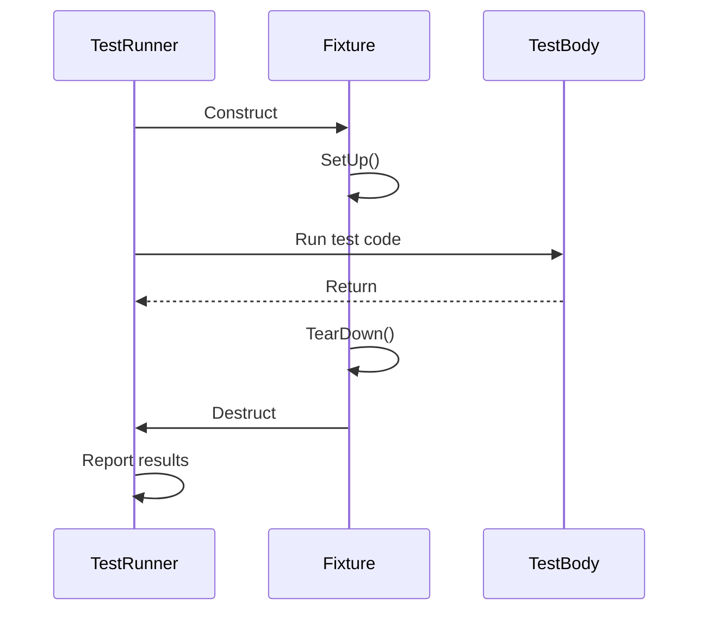

# Test Macros and Test Cases

GoogleTest is a powerful C++ testing framework that provides fundamental macros and classes to define, organize, and execute unit tests efficiently. This page details the core test-defining macros `TEST` and `TEST_F`, the structure and lifecycle of test execution, and best practices to write effective and maintainable tests.

---

## 1. Defining Tests with `TEST`

The `TEST` macro defines a simple test case that does not require any shared test fixture (setup or teardown code). It is the starting point for writing unit tests.

### Syntax
```cpp
TEST(TestSuiteName, TestName) {
  // Test code here
  EXPECT_EQ(1, func_to_test());
}
```

- **TestSuiteName** groups related tests together logically.
- **TestName** identifies the specific test.

### Characteristics
- Each `TEST` defines an independent test function.
- No shared setup or teardown; each test should be self-contained.
- Useful for simple or quick tests where no common environment is shared.

### Example
```cpp
TEST(MathTest, Sum) {
  EXPECT_EQ(4, 2 + 2);
}
```

---

## 2. Defining Tests with `TEST_F`

The `TEST_F` macro declares a test that uses a test fixture — a class that provides common setup and teardown functions as well as shared test data. It enables reusing code and managing complex test environments.

### Using a Test Fixture

1. Define a fixture class deriving from `::testing::Test`.
2. Override `SetUp()` and `TearDown()` if needed.
3. Use `TEST_F` macro to define tests that share this fixture.

### Syntax
```cpp
class MyTestFixture : public ::testing::Test {
 protected:
  void SetUp() override {
    // Code here runs before each test
  }

  void TearDown() override {
    // Code here runs after each test
  }

  // Shared data members
  int shared_data;
};

TEST_F(MyTestFixture, Test1) {
  shared_data = 5;
  EXPECT_EQ(shared_data, 5);
}
```

### Characteristics
- Setup code runs before every `TEST_F` test.
- Teardown code runs after every test.
- Shared data increases test maintainability.
- Enables DRY code in tests that operate on the same test context.

### Example
```cpp
class DatabaseTest : public ::testing::Test {
 protected:
  void SetUp() override {
    db.Connect();
  }

  void TearDown() override {
    db.Disconnect();
  }

  Database db;
};

TEST_F(DatabaseTest, ConnectsSuccessfully) {
  EXPECT_TRUE(db.IsConnected());
}
```

---

## 3. Test Lifecycle and Execution Flow

Understanding the flow of test execution is vital for effective use of GoogleTest.

### Lifecycle Steps
1. **Test Registration:** Through macros like `TEST` or `TEST_F`, tests are registered to the framework.
2. **Test Initialization:** For `TEST_F`, the fixture is constructed and `SetUp()` is called.
3. **Test Execution:** The actual test body runs.
4. **Test Cleanup:** For fixtures, `TearDown()` is invoked and then fixture destruction.
5. **Result Reporting:** GoogleTest reports success or failure.

### Example Workflow

Consider `TEST_F(MyFixture, ExampleTest)`:



---

## 4. Using Assertions in Tests

Within the test body, GoogleTest assertions express expected behavior and verify correctness.

- `EXPECT_*` assertions record failures but continue running.
- `ASSERT_*` assertions terminate the current test immediately on failure.

Example:
```cpp
TEST(MyTestSuite, AssertionExample) {
  EXPECT_EQ(foo.Bar(), 5);  // Continue even if fails
  ASSERT_TRUE(foo.IsReady()); // Abort if false
  EXPECT_LT(foo.Value(), 10);
}
```

---

## 5. Best Practices for Writing Tests

- **Name Tests Descriptively:** Choose suite and test names that clearly express intent.
- **Use Fixtures Wisely:** Group tests with shared context using `TEST_F`.
- **Keep Tests Small and Focused:** Verify one behavior per test.
- **Set Expectations Clearly:** Fail tests for unexpected behavior explicitly.
- **Avoid Side Effects:** Tests should be repeatable and isolated.
- **Use Setup and Teardown Efficiently:** Prepare and clean common resources.

---

## 6. Advanced Test Macros

### `TEST_P` and `INSTANTIATE_TEST_SUITE_P`
Allows parameterized tests for running the same test logic with multiple inputs.

### Typed Tests
Enable test reuse across multiple types.

For details, see related documentation sections on parameterized and typed tests.

---

## Troubleshooting and Common Pitfalls

- **Forgot `override`?** Omitting `override` may silently make a mock or virtual function ineffective.
- **Order of Expectations and Calls:** Set all expectations before exercising the code.
- **Test Fixture Lifetime:** Avoid retaining pointers/reference to fixtures outside test scope.
- **Naming Collisions:** Test suite and test names must be unique within a binary.

---

## Summary

| Macro     | Use Case                                    | Requires Fixture? |
| --------- | ------------------------------------------ | ----------------- |
| `TEST`    | Simple isolated tests                       | No                |
| `TEST_F`  | Tests sharing setup/teardown or common data| Yes               |

---

For comprehensive guidance on writing, organizing, and running tests using these macros, see [GoogleTest Core API: Test Macros and Test Cases](https://google.github.io/googletest/reference/core_test_api/test_macros_and_classes.html).

---

<Check>
Ensure all test expectations are set prior to running your tests to avoid undefined behaviors. Prefer `TEST_F` when you have common setup/teardown needs.
</Check>

---

<Note>
GoogleTest manages test registration, fixture lifecycle, and failure management automatically, enabling focus on test logic rather than infrastructure.
</Note>

---

## Related Documentation
- [gMock Cookbook](https://google.github.io/googletest/gmock_cook_book.html) — Mocking classes and expectations
- [GoogleTest Primer](https://google.github.io/googletest/primer.html) — Introductory guide
- [Core Testing API](https://google.github.io/googletest/reference/core_test_api/index.html) — Full API reference
- [Parameterized and Typed Tests](https://google.github.io/googletest/reference/core_test_api/parameterized_testing.html) — Advanced test reuse

---

## Source Reference
<Source url="https://github.com/google/googletest" paths={[{"path": "googletest/include/gtest/gtest.h", "range": "100-300"}]} />


