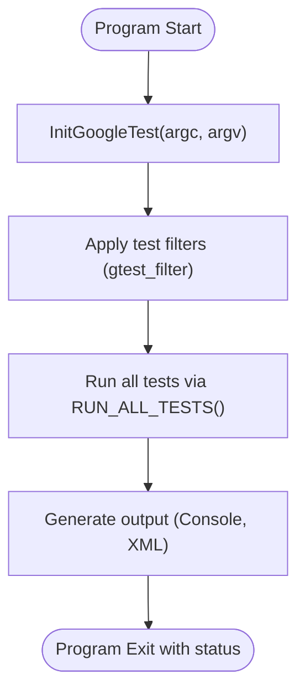

# Test Execution and Runners

Understand how to execute your tests, customize test runners, and integrate test execution with your build systems. This guide walks you through the core concepts of test discovery, execution control, result reporting, and the essentials of main entry points for running your test binaries.

---

## Overview

In GoogleTest, running your tests revolves around a clear, simple flow:

1. **Discovery:** GoogleTest automatically registers all defined tests and test fixtures within your linked test binaries, so there's no need to manually enumerate tests.
2. **Initialization:** Before running tests, the framework parses command-line flags to customize test execution.
3. **Execution:** `RUN_ALL_TESTS()` drives the lifecycle by executing all enabled tests.
4. **Reporting:** Results are printed to the console and optionally to XML files, including detailed information on passes, failures, and skips.

Understanding this flow allows you to control how and which tests run, manage test failures effectively, and integrate GoogleTest smoothly into your development process.

---

## Test Discovery and Execution

GoogleTest's execution model is highly automated and focused on developer ease:

- **Test Registration:** When you define tests using macros like `TEST()`, `TEST_F()`, or parameterized test variants, they are automatically registered in the framework.
- **Filter Control:** You can specify which tests to run via the `--gtest_filter` command-line flag, enabling selective execution based on test suite and test names.
- **Disabled Tests:** Tests prefixed with `DISABLED_` are skipped by default, but can be run explicitly if desired.

### Running All Tests

The core API function to run tests is:

```cpp
int RUN_ALL_TESTS();
```

- Returns `0` if all tests succeed, otherwise `1`.
- Must be called *once* per test program, after initialization.

### Initialization

Before running tests, you must initialize the framework with:

```cpp
void testing::InitGoogleTest(int* argc, char** argv);
```

- Parses and removes GoogleTest-specific flags from command-line arguments.
- Must be called before `RUN_ALL_TESTS()`.

### Typical Main Function

```cpp
#include <gtest/gtest.h>

int main(int argc, char **argv) {
  testing::InitGoogleTest(&argc, argv);
  return RUN_ALL_TESTS();
}
```

This basic boilerplate ensures:
- Proper command-line argument handling
- Complete test execution
- Appropriate program exit status reflecting test outcomes

<Info>
Most users should link with `gtest_main` or `gmock_main` libraries that provide these main functions for you, so you usually do not need to write your own main.
</Info>

---

## Customizing Test Runs

### Filtering Tests

You can run a subset of tests by using the `--gtest_filter` flag:

```bash
test_binary --gtest_filter=TestSuiteName.TestName
```

- Supports wildcards `*`.
- Use `-` prefix to exclude tests.

Example:

```bash
test_binary --gtest_filter=FactorialTest.*:-FactorialTest.HandlesZeroInput
```
Runs all tests in `FactorialTest` except `HandlesZeroInput`.

### Running Disabled Tests

Disabled tests are those whose names start with `DISABLED_`. To include them, run with:

```bash
test_binary --gtest_also_run_disabled_tests
```

### Repeating Tests

Repeat tests multiple times for robustness:

```bash
test_binary --gtest_repeat=10
```

### Sharding Tests

Distribute tests across multiple shards/instances:

```bash
test_binary --gtest_shard_index=0 --gtest_total_shards=2
```

Runs the first shard of two total shards.

---

## Test Result Reporting

GoogleTest provides detailed reporting:

- **Console Output:** Shows progress and individual test status.
- **XML Output:** Enable with `--gtest_output=xml:<path>` to generate reports consumable by CI systems.
- **Test Properties and Metadata:** Tests and suites can log key properties, visible in XML reports.

You can add extra properties in your test code with:

```cpp
testing::Test::RecordProperty("key", "value");
```

---

## Controlling the Test Runner

GoogleTest allows runtime control over test runners through:

- **Event Listeners:** Implement `TestEventListener` to customize event handling such as test start/end, failures, and results.
- **Global Environments:** Define subclasses of `testing::Environment` to set up and tear down resources before all tests run.

### Example of Adding a Global Environment

```cpp
class MyEnv : public testing::Environment {
 public:
  void SetUp() override {
    // Global setup code
  }
  void TearDown() override {
    // Global cleanup code
  }
};

int main(int argc, char** argv) {
  testing::InitGoogleTest(&argc, argv);
  testing::AddGlobalTestEnvironment(new MyEnv);
  return RUN_ALL_TESTS();
}
```

---

## Special Considerations for Embedded and Platform-Specific Environments

GoogleTest adapts to non-standard entry points on embedded platforms, such as Arduino.

- On select embedded targets, entry points are **`setup()`** and **`loop()`** instead of `main()`.
- On these platforms, call `InitGoogleTest()` inside `setup()`, and `RUN_ALL_TESTS()` inside `loop()`. Example:

```cpp
void setup() {
  testing::InitGoogleTest();
}
void loop() {
  RUN_ALL_TESTS();
}
```

---

## Troubleshooting Common Issues

### Not Running Tests

- Verify that you call `InitGoogleTest` before `RUN_ALL_TESTS`.
- Check `--gtest_filter` to make sure your tests are not being excluded.
- Disabled tests will not run unless enabled explicitly.

### No Tests Discovered

- Ensure you are linking to your test object files.
- Make sure your `TEST()` or `TEST_F()` macros are not inside conditional compilation blocks that exclude them.

### Understanding Return Status

- Returning the result of `RUN_ALL_TESTS()` from `main` is critical as CI systems rely on the exit code.

---

## Summary of Main APIs

| API                 | Purpose                               |
|---------------------|-------------------------------------|
| `testing::InitGoogleTest(int* argc, char** argv)` | Initialize the framework and parse flags |
| `RUN_ALL_TESTS()`    | Executes all enabled tests and returns status |
| `testing::AddGlobalTestEnvironment(Environment* env)` | Register global environment setup/teardown |

---

## Example: Complete Minimal Test Program

```cpp
#include <gtest/gtest.h>

TEST(MathTest, Addition) {
  EXPECT_EQ(2 + 2, 4);
}

int main(int argc, char **argv) {
  testing::InitGoogleTest(&argc, argv);
  return RUN_ALL_TESTS();
}
```

Run this binary, and GoogleTest will discover and execute `MathTest.Addition`.

---

## Diagram: Test Execution Flow



---

## Best Practices

- Use the standard main function provided by linking `gtest_main` or `gmock_main` unless customization is required.
- Always handle the return value of `RUN_ALL_TESTS()` to correctly signal test success/failure.
- Use filtering flags to focus on relevant tests during development.
- Register global environments for setup tasks shared across your test suite.
- Use test event listeners to integrate test execution with custom logging or reporting.

---

## Related Documentation

- [GoogleTest Primer](../primer.md) — Learn the foundations of writing and running tests.
- [Assertions and Failures API Reference](./assertions_and_failures.md) — Understand how to verify conditions in tests.
- [Continuous Integration & Build System Integration Guide](../../guides/real-world-integration/ci-build-integration.md) — Best practices for integrating tests in build pipelines.
- [Basic Configuration Setup](../../getting_started/configuration_initial_success/basic_configuration_setup.md) — How to configure your project to build tests.
- [Mock Object Creation (gMock)](../mocking_and_matchers/mock_object_creation.md) — For tests requiring mocks, learn setup and execution.

---

## Additional Resources

- Official sample test: `googletest/test/gtest_main.cc` and `googlemock/src/gmock_main.cc` illustrate main entry points.
- Command-line flags documentation offers details about customizing test execution.

---

Empower your testing workflow by mastering test execution and runners, enabling reliable, maintainable, and efficient C++ tests with GoogleTest.

---
