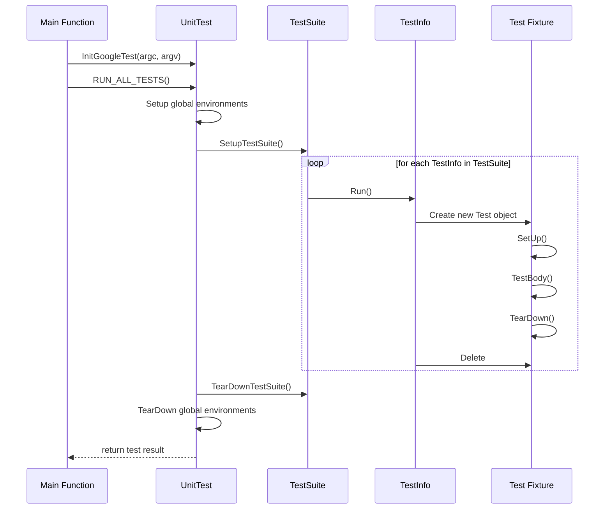

# Test Macros and Fixtures

Detailed guide to GoogleTest's macros for declaring tests (`TEST`, `TEST_F`), test fixtures, and suite organization. Covers the `Test`, `TestSuite`, and `UnitTest` classes, their lifecycle, and common usage patterns for structuring robust C++ unit tests.

---

## Overview

GoogleTest enables developers to write, organize, and run C++ test code effectively using various macros and fixture classes. This page focuses specifically on the mechanics and best practices for defining tests and fixtures — key building blocks of test programs — translating user intent into powerful, maintainable test suites.

You will learn:

- How to write simple tests with `TEST()`
- How to structure reusable code across tests with fixtures and `TEST_F()`
- The lifecycle of tests, suites, and the overall test program
- The roles of `TestSuite`, `TestInfo`, and `UnitTest` classes in test registration and execution

---

## 1. Simple Test Definitions (`TEST` Macro)

### Purpose
The `TEST(TestSuiteName, TestName)` macro defines a single, independent test function that verifies a particular behavior or outcome.

### What You Achieve
You declare a test named *TestName* inside a test suite *TestSuiteName*. Each test is a function that runs once when you run all tests.

### Usage
```cpp
TEST(FactorialTest, HandlesZeroInput) {
  EXPECT_EQ(Factorial(0), 1);
}

TEST(FactorialTest, HandlesPositiveInput) {
  EXPECT_EQ(Factorial(3), 6);
}
```

### Naming Rules
- Both `TestSuiteName` and `TestName` must be valid C++ identifiers, containing **no underscores** — underscores are reserved and can cause ambiguity.
- Tests in different suites can have the same test name.

### Behavior
When run, GoogleTest executes each `TEST()` function independently and reports results based on contained assertions.

<Info>
The naming convention ensures generated test classes do not clash or violate C++ rules. Keep tests descriptive yet concise.
</Info>

---

## 2. Test Fixtures (`TEST_F` Macro)

### Why Use Fixtures?
When multiple tests need to share the same setup, teardown, or helper functions and data, fixtures package this shared code into a class. This avoids code duplication and makes tests cleaner and easier to maintain.

### How to Define a Fixture
1. Derive a class from `testing::Test`. Begin your member declarations with `protected:`.
2. Define data members needed by multiple tests.
3. Override `SetUp()` to configure the common test state before each test runs.
4. Override `TearDown()` if needed for cleanup.

### Using Fixtures in Tests
Tests using fixtures are declared with `TEST_F(FixtureName, TestName)`, which gives tests access to fixture members directly.

```cpp
class QueueTest : public testing::Test {
 protected:
  QueueTest() {
    q1_.Enqueue(1);
    q2_.Enqueue(2);
    q2_.Enqueue(3);
  }

  Queue<int> q0_;
  Queue<int> q1_;
  Queue<int> q2_;
};

TEST_F(QueueTest, IsEmptyInitially) {
  EXPECT_EQ(q0_.size(), 0);
}

TEST_F(QueueTest, DequeueWorks) {
  int* n = q1_.Dequeue();
  ASSERT_NE(n, nullptr);
  EXPECT_EQ(*n, 1);
  delete n;
}
```

### Notes
- GoogleTest creates a fresh fixture object per test to maintain test isolation.
- If a test modifies fixture state, it must restore it or expect isolated state resets.
- Use `TEST_F` when you require test setup beyond basic `TEST()` capabilities.

<Warning>
The class must have a default constructor accessible by GoogleTest. If you explicitly define non-default constructors, also define a default one.
</Warning>

---

## 3. Test and Test Suite Classes & Lifecycle

GoogleTest organizes tests into structured hierarchies managed via core classes:

### `Test`
- Abstract base class for all test instances.
- Defines hook methods such as `SetUp()`, `TearDown()`, and runs the individual test body.

### `TestInfo`
- Stores metadata about a registered test (name, file, line, fixture, and result).
- Invokes the test body when executed.

### `TestSuite`
- Groups multiple `TestInfo` objects logically.
- Manages shared setup and teardown across tests via static fixture methods.
- Keeps track of aggregate test result data.

### `UnitTest`
- Manages all registered test suites.
- Controls global test execution, environment setup/teardown, filtering, and reporting.

### Lifecycle Overview

1. Tests are registered during program initialization (via macros or dynamic registration).
2. When `RUN_ALL_TESTS()` is called, `UnitTest` triggers:
   - Global environment setup
   - Each `TestSuite`’s static `SetUpTestSuite()`
   - Each `TestInfo`'s `Run()` which calls the fixture setup and test body
   - Each `TestSuite`’s static `TearDownTestSuite()`
   - Global environment teardown

<Steps>
<Step title="Register Tests">
Tests and fixtures are registered with GoogleTest pre-run. You can also dynamically register tests programmatically.
</Step>
<Step title="Initialize and Parse Flags">
GoogleTest processes flags that influence test execution, filtering, and output.
</Step>
<Step title="Run Tests">
The `RUN_ALL_TESTS()` macro launches execution of all registered tests respecting filters and suites.
</Step>
<Step title="Aggregate and Report Results">
Aggregated results from test suites and environments are recorded and reported with summaries and optional XML/JSON output.
</Step>
</Steps>

---

## 4. Naming Conventions and Best Practices

### Test Suites and Tests
- Avoid underscores (`_`) in test suite and test names to prevent naming collisions or compilation errors.
- Use PascalCase or camelCase identifiers.

### Test Fixture Classes
- Name fixtures representing the tested class with suffix `Test`. For example, for class `Foo`, fixture can be `FooTest`.
- Keep fixture classes focused and cohesive.

### Test Names
- Make test names descriptive yet concise, e.g., `HandlesZeroInput`, `ThrowsOnNegative`, `IgnoresEmptyString`.

### Test Organization
- Group logically related tests into test suites or fixture classes.
- Use `TEST()` for simple tests and `TEST_F()` when sharing setup or helpers.

---

## 5. Advanced Usage Patterns

### Using `TEST_P` and Parameterized Tests
Explore use of value-parameterized tests with `TEST_P`, fixed in fixture class inheritance, and instantiated via `INSTANTIATE_TEST_SUITE_P` to test various inputs across the same code path. See [Parameterized and Typed Tests](parameterized_and_typed_tests.md).

### Typed and Type-Parameterized Tests
Use typed tests when you want to run the same test logic across multiple types. Use the `TYPED_TEST` macros and corresponding type lists.

### Dynamic Test Registration
You can also register tests at runtime using `RegisterTest()`, which allows building tests programmatically.

<Note>
See the following pages for more on these topics:
- [Testing Reference](reference/testing.md#TEST)
- [Parameterized and Typed Tests](parameterized_and_typed_tests.md)
- [Advanced GoogleTest Topics](advanced.md)
</Note>

---

## 6. Sample Code

### Define a Simple Test

```cpp
// Tests factorial of 0.
TEST(FactorialTest, HandlesZeroInput) {
  EXPECT_EQ(Factorial(0), 1);
}

// Tests factorial of positive numbers.
TEST(FactorialTest, HandlesPositiveInput) {
  EXPECT_EQ(Factorial(3), 6);
  EXPECT_EQ(Factorial(8), 40320);
}
```

### Define a Fixture and Use It

```cpp
class QueueTest : public testing::Test {
 protected:
  QueueTest() {
    q1_.Enqueue(1);
    q2_.Enqueue(2);
    q2_.Enqueue(3);
  }

  Queue<int> q0_;
  Queue<int> q1_;
  Queue<int> q2_;
};

TEST_F(QueueTest, IsEmptyInitially) {
  EXPECT_EQ(q0_.size(), 0);
}

TEST_F(QueueTest, DequeueWorks) {
  int* n = q1_.Dequeue();
  ASSERT_NE(n, nullptr);
  EXPECT_EQ(*n, 1);
  delete n;
}
```

### Writing the main() Function

Typically, you don't need to write a main function because GoogleTest provides one.
But for custom setup, do this:

```cpp
int main(int argc, char** argv) {
  testing::InitGoogleTest(&argc, argv);
  return RUN_ALL_TESTS();
}
```

---

## 7. Troubleshooting Common Issues

<AccordionGroup title="Common Issues in Test Macros and Fixtures">
<Accordion title="Compilation errors regarding test fixture constructors">
Ensure your test fixture classes have a default constructor. If you declare any non-default constructors, also declare a default constructor explicitly.
</Accordion>
<Accordion title="Test suite fixture mismatch errors">
Do not mix `TEST()` and `TEST_F()` with the same test suite name; all tests in one suite must share the same fixture class.
</Accordion>
<Accordion title="Underscores in test suite or test names cause errors">
Avoid underscores in test suite and test names to prevent ambiguous symbols and compiler errors.
</Accordion>
</AccordionGroup>

---

## 8. See Also

- [GoogleTest Primer](primer.md) — Basic introduction to writing tests
- [Testing Reference](reference/testing.md) — Detailed macro and class reference
- [Advanced GoogleTest Topics](advanced.md) — Test organization, trace, and other advanced usage
- [Assertions and Predicates](assertions_and_predicates.md) — For understanding test verification
- [Parameterized and Typed Tests](parameterized_and_typed_tests.md) — For data-driven testing

---

### Diagram: Test Execution Flow


---

## Practical Tips
- Always use `ASSERT_*` when test continuation after failure is meaningless; otherwise prefer `EXPECT_*`.
- Use fixtures (`TEST_F`) to avoid duplication when multiple tests share setup/teardown.
- Keep tests independent to ensure repeatability and reliable debugging.
- Avoid underscores in names to keep things simple and avoid collisions.
- Ensure any global set up or tear down is done via `Environment` classes or static fixture methods.

---

## Summary
This documentation covers GoogleTest's core macros for defining tests and using fixtures, including the lifecycle of test objects and suites, naming conventions, and best practices for structuring robust unit tests. It also guides on writing `main()` for running tests and practical troubleshooting advice.

