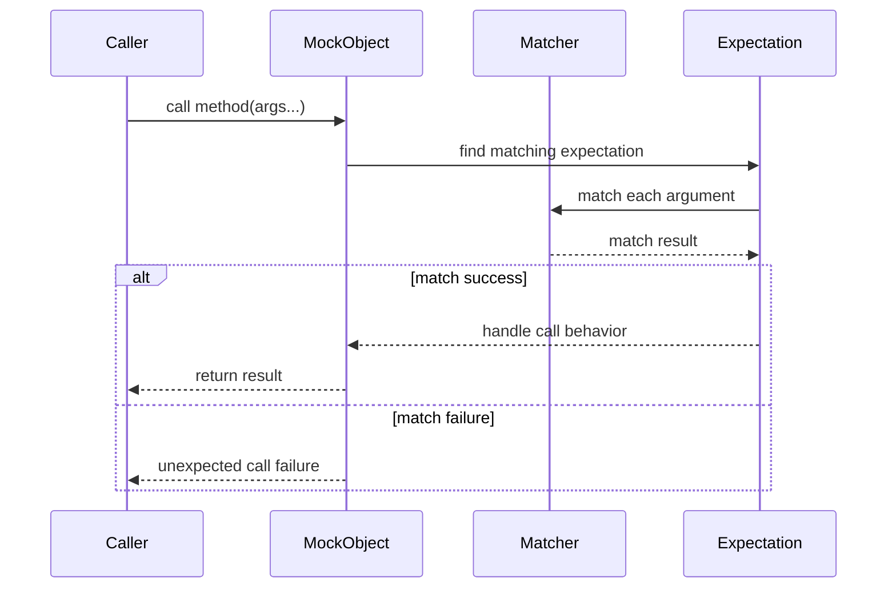

# Argument Matching

GoogleMock empowers you to specify *precise criteria* for the arguments passed to mock methods, enabling fine-grained control over the behavior and verification of your mocks. This document deep-dives into the extensive ecosystem of argument matchers available in GoogleMock, ranging from simple built-in matchers to custom user-defined ones, polymorphic matchers, and advanced multi-argument matchers.

---

## Why Argument Matching Matters

Imagine you have a mock object representing a dependency with methods that are called multiple times during your test execution. You want to assert not only that these methods were called but also *how* they were called—specifically, with what arguments. GoogleMock’s argument matchers allow you to:

- Specify exact values that must be passed.
- Set flexible conditions (e.g., values greater than 10).
- Combine multiple matchers for complex criteria.
- Validate tuples of arguments together.
- Match based on properties or fields inside objects.

Proper use of argument matchers sharpens your tests, making them robust and expressive, accurately representing your expectations about interactions.

---

## Categories of Argument Matchers

GoogleMock provides a rich variety of matchers for different use cases. Understanding categories helps you select the right tools.

### 1. Built-in Basic Matchers

These matchers cover common comparisons and wildcard usages that you’ll use most often.

| Matcher                        | Description                                   |
|-------------------------------|-----------------------------------------------|
| `_`                           | Matches any argument of the correct type (wildcard). |
| `A<T>()` or `An<T>()`         | Matches any value of type `T`.                  |
| `Eq(value)` or simple `value` | Matches arguments equal to `value` via `operator==`. |
| `Ne(value)`                   | Matches arguments not equal to `value`.         |
| `Lt(value)`, `Le(value)`, etc.| Matches arguments less than, less or equal, etc.| 
| `IsNull()`                    | Matches null raw or smart pointers.           |
| `NotNull()`                   | Matches non-null raw or smart pointers.       |

**Example:** Expecting `Foo(5, _)` means the first argument must equal 5; the second can be anything.
```cpp
EXPECT_CALL(mock, Foo(5, _));
```

---

### 2. Parameterized Matchers

Define matchers with parameters to express more complex predicates.

```cpp
MATCHER_P(IsDivisibleBy, n, "") { return (arg % n) == 0; }
...
EXPECT_CALL(mock, Bar(IsDivisibleBy(7)));
```

You can also define multi-parameter matchers with `MATCHER_P2`, `MATCHER_P3`, ….

---

### 3. Polymorphic Matchers

These matchers can be used with multiple argument types without explicit type annotation.

Example:
```cpp
EXPECT_CALL(mock, Bar(IsNull()));
EXPECT_CALL(mock, Bar(NotNull()));
```

They work by templated `MatchAndExplain` methods allowing seamless matching across pointer types.

---

### 4. Composite Matchers

Combine matchers logically:

- `AllOf(m1, m2, ...)`: True if *all* matchers match.
- `AnyOf(m1, m2, ...)`: True if *any* matcher matches.
- `Not(m)`: Negates matcher `m`.

**Example:**
```cpp
EXPECT_CALL(mock, Foo(AllOf(Ge(5), Ne(10))));
```

This expects a call to `Foo` where the argument is at least 5 and not equal to 10.

---

### 5. Container and Collection Matchers

For mock methods that take containers, GoogleMock provides matchers such as:

- `ElementsAre(...)`: Matches container with elements exactly matching in order.
- `UnorderedElementsAre(...)`: Matches container with elements matching some permutation.
- `Contains(element_or_matcher)`: Container contains at least one matching element.
- `Each(m)`: All elements in container match matcher `m`.
- `SizeIs(m)`: Matches container size with matcher `m`.

**Example:**
```cpp
EXPECT_CALL(mock, ProcessVector(ElementsAre(1, Gt(2), _)));
```

---

### 6. Member and Property Matchers

Match fields or properties of objects passed as arguments.

- `Field(&Class::field, matcher)`: Matches an object whose `field` matches `matcher`.
- `Property(&Class::property, matcher)`: Matches object whose property getter returns a value matching `matcher`.

If the argument is a pointer, the matcher dereferences and matches accordingly.

**Example:**
```cpp
EXPECT_CALL(mock, SetFoo(Field(&Foo::value, Ge(5))));
```

---

### 7. Pointers and Smart Pointers Matchers

- `Pointee(m)`: Matches a pointer pointing to a value matching `m` (fails on null).
- `Pointer(m)`: Matches a pointer whose raw pointer matches `m`.
- `Address(m)`: Matches if object’s address satisfies matcher `m`.

You can stack `Pointee()` for multiple levels of indirection.

---

### 8. Tuple and Multi-argument Matchers

Sometimes you want to match *multiple arguments as a whole*. For those cases,
GoogleMock allows matching argument tuples as a unit.

- `With(m)`: Restricts expectation to calls whose entire argument tuple matches `m`.
- `AllArgs(m)`: Synonym for the above.
- `Args<N1, N2, ..., Nk>(m)`: Matches only the subset of arguments at the specified indices.

GoogleMock ships with matchers on tuples such as `Eq()`, `Lt()`, etc., for comparing two-argument tuples.

**Example:**
```cpp
EXPECT_CALL(mock, Foo(_, _))
    .With(Lt());  // Matches only when arg0 < arg1
```

You can also compose these for complex conditions.

---

## How to Write Custom Matchers Quickly

GoogleMock provides powerful macros to define your own matchers with minimal code:

- `MATCHER(name, description) { ... }`
- `MATCHER_P(name, param, description) { ... }`

Inside the matcher body, `arg` refers to the value to match, and you can stream additional diagnostics to `*result_listener`. The special variable `negation` helps define the description dynamically.

Example:
```cpp
MATCHER(IsEven, "") {
  return (arg % 2) == 0;
}
```

Use this matcher in an expectation:
```cpp
EXPECT_CALL(mock, Bar(IsEven()));
```

When a match fails, GoogleMock automatically prints clear messages using the description.

---

## Practical Guidelines and Best Practices

- Use `_` matcher for arguments you don't care about to avoid brittle expectations.
- Use `With()` and tuple matchers to match multiple arguments as a whole.
- Combine matchers with `AllOf`, `AnyOf`, and `Not` to encode complex logic.
- To match objects based on one or more fields, use `Field()` or `Property()`.
- Use `Pointee()` to specify conditions on the value pointed to by pointer arguments.
- Keep matchers pure: no side effects and no state changes.
- For overloaded functions, disambiguate using explicit matcher types or `Const()` wrappers.

---

## Common Pitfalls to Avoid

- Using raw values instead of matchers (e.g., use `Eq(5)` instead of just `5` if overload is ambiguous).
- Forgetting to specify `RetiresOnSaturation()` when expectations need deactivation.
- Over-specifying matchers leading to brittle tests.
- Using `std::ref()` improperly in matchers which can confuse value copies.
- Incorrectly matching pointers without considering nulls — prefer `Pointee(m)` over `AllOf(NotNull(), Pointee(m))`.

---

## Example: Matching Arguments in EXPECT_CALL

```cpp
class MockFoo {
 public:
  MOCK_METHOD(void, Process, (int n, const std::string& s), (override));
};

MockFoo mock;

// Expects Process called with any int and string starting with "Error:"
EXPECT_CALL(mock, Process(_, StartsWith("Error:")));

// Expects Process called with n > 10 and n less than 100
EXPECT_CALL(mock, Process(AllOf(Gt(10), Lt(100)), _));

// Using With() to ensure first arg < second arg (assuming two ints)
EXPECT_CALL(mock, Process(_, _))
    .With(Lt());
```

If an expectation fails, GoogleMock prints an informative message explaining what was expected and what was actually received, helping you quickly diagnose test failures.

---

## Summary

Argument matchers are the heart of specifying rich, precise mock expectations in GoogleMock. They enable you to express the intended contract of mock methods with clarity and power — from any-argument wildcards to complex multi-argument constraints, from basic value comparisons to field-level inspections and pointer dereferencing.

Mastering argument matchers lets you write tests that are expressive, maintainable, and reliable, providing clear feedback on unexpected mock invocations.

See the official tutorial on [Matchers Reference](https://google.github.io/googletest/reference/matchers.html) and the [gMock Cookbook](https://google.github.io/googletest/gmock_cook_book.html#matching-arguments) for deeper insight and examples.

---

## Related Documentation

- [MOCK_METHOD Macro](https://google.github.io/googletest/reference/mocking.html#MOCK_METHOD)
- [EXPECT_CALL Macro and Modifiers](https://google.github.io/googletest/reference/mocking.html#EXPECT_CALL)
- [gMock Cookbook — Writing New Matchers](https://google.github.io/googletest/gmock_cook_book.html#NewMatchers)
- [Matchers Reference](https://google.github.io/googletest/reference/matchers.html)
- [Assertions Reference - Using Matchers with EXPECT_THAT](https://google.github.io/googletest/reference/assertions.html#EXPECT_THAT)
- [ON_CALL and EXPECT_CALL Syntax](reference/mocking.md#ON_CALL)

---

## Troubleshooting Tips

- When matchers behave unexpectedly, check whether you have ambiguous overloads on your mocked methods and disambiguate argument types.
- If your tests fail because of unexpected argument values, enable verbose logging with `--gmock_verbose=info` to trace argument match attempts.
- Avoid side effects in matcher implementations; stateful matchers may cause unpredictable test results.
- Use `.RetiresOnSaturation()` to make expectations retire once the expected number of calls is met, preventing upper-bound violations.
- For pointer arguments, be cautious about null pointers when using `Pointee()`.

---

## Visual Guide: Matching Flow



This flow illustrates how argument matchers participate in identifying expectations and enabling mock behaviors.
