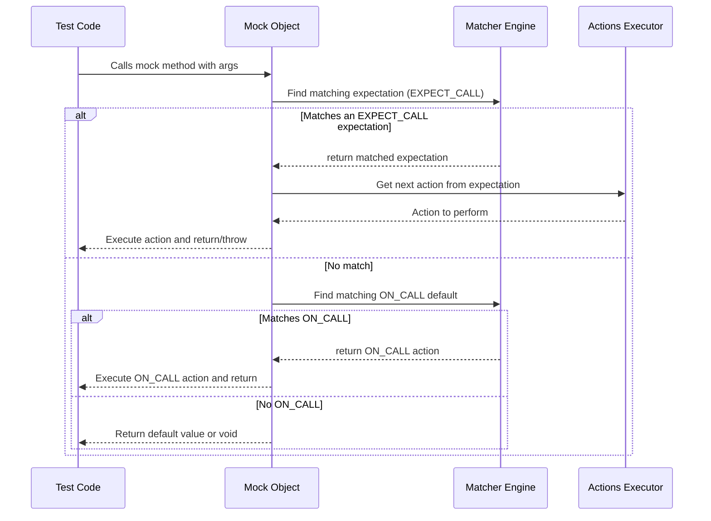

# Expectations and Actions

Set up expectations for mock method calls using `ON_CALL` and `EXPECT_CALL`. Learn about specifying sequences, actions (return, throw, invoke), and configuring test flows with actions, default behaviors, and parameter capture.

---

## Overview

When writing tests with GoogleMock, correctly setting expectations and configuring actions for mock method calls is foundational. This page guides you through the mechanisms to:

- Define default behaviors using `ON_CALL` without enforcing invocation expectations.
- Set strict or flexible call expectations using `EXPECT_CALL`.
- Specify call sequences and ordering.
- Use actions to specify what mock methods do when invoked, including returning values, throwing exceptions, or invoking functions.
- Capture and reuse function parameters within actions.

Understanding these allows you to craft precise and maintainable tests that accurately verify interactions and behaviors.

---

## Key Concepts

### ON_CALL vs EXPECT_CALL

- **`ON_CALL(mock, method(matchers))`**: Sets **default behavior** for a mock method but does **not** enforce that the call must happen. Use this to provide common or fallback responses.
- **`EXPECT_CALL(mock, method(matchers))`**: Sets an **expectation** that a mock method will be called with specified arguments, potentially multiple times, with specified ordering, and defines what actions to take when it is called.

**Best Practice:** Prefer `ON_CALL` to define typical default mock behavior and use `EXPECT_CALL` sparingly only when you want to verify that a call actually occurs.

---

## Setting Default Behavior with ON_CALL

Use `ON_CALL` to define how a mock method behaves when invoked in tests, without requiring that the call happens.

### Syntax

```cpp
ON_CALL(mock_object, Method(arg_matchers...))
    [.With(multi_argument_matcher)]
    .WillByDefault(action);
```

- `Method`: The mock method.
- `arg_matchers`: Optional argument matchers for targeting specific calls.
- `.With()`: Optional multi-argument matcher for matching the full arguments tuple.
- `.WillByDefault()`: Specifies the action to perform for matching calls.

### Important Rules

- `.With()` can appear at most once per `ON_CALL`, and must precede `.WillByDefault()`.
- `.WillByDefault()` is mandatory.
- The default action is used if no matching `EXPECT_CALL` is defined for a call.

### Example

```cpp
using ::testing::Return;
using ::testing::_;

MockFoo foo;

ON_CALL(foo, GetValue(_))
    .WillByDefault(Return(42));

// foo.GetValue(x) now returns 42 unless overridden by EXPECT_CALL
```

<Tip>
Using `ON_CALL` extensively in test fixtures or mock constructors to provide reasonable default behaviors results in cleaner and more resilient tests.
</Tip>

---

## Setting Expectations with EXPECT_CALL

`EXPECT_CALL` defines strict or flexible call expectations on mock methods. It allows verifying how often, in what order, and with which arguments a mock method is called.

### Syntax

```cpp
EXPECT_CALL(mock_object, Method(arg_matchers...))
    [.With(multi_argument_matcher)]
    [.Times(cardinality)]
    [.InSequence(sequences...)]
    [.After(expectations...)]
    [.WillOnce(action)]...
    [.WillRepeatedly(action)]
    [.RetiresOnSaturation()];
```

### Chainable Clauses Explained

- `.With(matcher)`: Matches the full arguments tuple.
- `.Times(cardinality)`: Specifies how many times the call is expected.
  - Cardinalities include `Exactly(n)`, `AtLeast(n)`, `AnyNumber()`, etc.
  - If omitted, the cardinality is inferred based on `.WillOnce`/`.WillRepeatedly`.
- `.InSequence(sequences...)`: Enforces that calls occur in a specified sequence.
- `.After(expectations...)`: Specifies that the call must happen after the given expectations.
- `.WillOnce(action)`: Specifies the behavior of the call for the next matching invocation.
- `.WillRepeatedly(action)`: Specifies the behavior for all matching calls after exhausting all `.WillOnce` clauses.
- `.RetiresOnSaturation()`: Automatically retires the expectation once it reaches its invocation limit.

### Example: Simple Expectation

```cpp
using ::testing::Return;
using ::testing::_;

EXPECT_CALL(foo, Compute(5))
    .Times(2)
    .WillRepeatedly(Return(10));

// foo.Compute(5) expected to be called twice, returning 10 each time
```

### Example: Ordered Calls with Sequence

```cpp
using ::testing::InSequence;

{
  InSequence s;  // All EXPECT_CALLs in this scope must occur in order

  EXPECT_CALL(foo, Initialize());
  EXPECT_CALL(foo, Process(_, _)).Times(3);
  EXPECT_CALL(foo, Finalize());
}
```

### Notes

- Expectation statements **must** be made before mock methods are invoked.
- Multiple expectations on the same method are considered in reverse order; later expectations override earlier ones.
- The use of sequences and `.After()` clauses helps avoid brittle tests by making ordering explicit.

<Tip>
For calls that may occur multiple times with varied parameters, combine `.Times()`, `.WillOnce()`, and `.WillRepeatedly()` to describe a realistic call pattern.
</Tip>

---

## Specifying Actions for Mock Calls

Actions describe what happens when a mock method is called. You can combine actions on both `ON_CALL` and `EXPECT_CALL` clauses.

### Common Built-in Actions

| Action                 | Description                                                                                 |
|------------------------|---------------------------------------------------------------------------------------------|
| `Return(value)`        | Return the specified value.                                                                |
| `ReturnRef(variable)`  | Return a reference to the given variable.                                                  |
| `ReturnPointee(ptr)`   | Return the value pointed to by pointer, evaluated at call time.                             |
| `Throw(exception)`     | Throw the given exception instance (must be copyable).                                     |
| `Invoke(function)`     | Calls the given function, method, functor, or lambda with mock call arguments.              |
| `DoAll(a1, a2, ..., an)` | Perform all actions in order, returning the result of the last action.                      |
| `SetArgPointee<N>(value)` | Sets the value pointed to by the Nth argument before returning.                             |
| `IgnoreResult(a)`      | Executes action `a` but ignores its returned value.                                         |

### Examples

#### Returning a Value

```cpp
EXPECT_CALL(foo, GetCount())
    .WillOnce(Return(5));
```

#### Throwing an Exception

```cpp
EXPECT_CALL(foo, DoWork())
    .WillOnce(Throw(std::runtime_error("fail")));
```

#### Invoking a Callback

Suppose a mock method receives a callback as argument, invoke it as follows:

```cpp
EXPECT_CALL(foo, RegisterCallback(_))
    .WillOnce(InvokeArgument<0>(42));  // Calls the 0th argument (a function) with parameter 42
```

#### Chaining Actions

```cpp
EXPECT_CALL(foo, Process(_, _))
    .WillOnce(DoAll(SetArgPointee<1>(10), Return(true)));
```

This sets the output argument before returning true.

### Using Lambdas and Functors

You can specify complex or custom behavior using lambdas:

```cpp
EXPECT_CALL(foo, Compute(_))
    .WillRepeatedly([](int x) { return x * 2; });
```

### Default Actions

If no action is specified, GoogleMock uses built-in default actions:

- Functions returning `void` just return.
- Functions returning pointer or numeric types return zero/null.
- Functions returning default-constructible types return a default-constructed value.

Use `ON_CALL` to customize these behaviors.

---

## Managing Call Sequences and Orders

Control the order in which mocked methods must be called using:

### `InSequence`

Wrap expectations inside an `InSequence` block to enforce strict call order:

```cpp
{
  InSequence s;
  EXPECT_CALL(foo, FirstCall());
  EXPECT_CALL(foo, SecondCall());
}
```

### `Sequence` and `.InSequence()`

Declare named sequences:

```cpp
Sequence seq1, seq2;
EXPECT_CALL(foo, Call1()).InSequence(seq1, seq2);
EXPECT_CALL(bar, Call2()).InSequence(seq1);
EXPECT_CALL(baz, Call3()).InSequence(seq2);
```

This enforces that `foo.Call1()` must happen before `bar.Call2()` and `baz.Call3()`, but no ordering is specified between `bar.Call2()` and `baz.Call3()`.

### `.After()` Clause

Set partial order dependencies beyond sequences:

```cpp
Expectation e1 = EXPECT_CALL(foo, Init());
EXPECT_CALL(bar, DoStuff()).After(e1);
```

Call to `bar.DoStuff()` can only happen after `foo.Init()` has been called.

---

## Parameter Capture and Verification

Use save actions in combination with expectations to capture arguments for later assertions.

```cpp
int captured_value;
EXPECT_CALL(mock, Process(_))
    .WillOnce(SaveArg<0>(&captured_value));

// ... trigger mock.Process(x) ...
EXPECT_EQ(captured_value, expected_value);
```

This approach helps separate call counting from argument verification.

---

## Default Behaviors and Mocks Strictness

GoogleMock uses default mock behaviors:

- **Naggy mocks** (default): warn on uninteresting calls.
- **Nice mocks:** suppress warnings for uninteresting calls.
- **Strict mocks:** fail on uninteresting calls.

Use `NiceMock<T>`, `NaggyMock<T>`, or `StrictMock<T>` wrappers to control this.

---

## Common Pitfalls

- **Ordering of Calls:** Set all expectations before exercising the code under test. Setting expectations late results in undefined behavior.
- **Too Many or Too Few Actions:** When using multiple `WillOnce()` clauses, ensure their count matches the cardinality specified with `Times()` to avoid warnings.
- **Overly Strict Expectations:** Over-specifying call parameters or call order can lead to brittle tests. Use wildcards (`_`) or omit argument matchers when appropriate.
- **Uninteresting Call Warnings:** Use `NiceMock` or add a catch-all `EXPECT_CALL(mock, Method(_)).Times(AnyNumber())` to suppress warnings for calls you do not care about.

---

## Practical Example

```cpp
#include <gmock/gmock.h>
using ::testing::AtLeast;
using ::testing::Return;
using ::testing::_;

class MockDatabase {
 public:
  MOCK_METHOD(bool, Connect, (), ());
  MOCK_METHOD(int, Query, (const std::string& query), ());
};

TEST(DatabaseTest, QuerySucceeds) {
  MockDatabase mock_db;

  // Set up default behavior.
  ON_CALL(mock_db, Connect())
      .WillByDefault(Return(true));

  // Expect Connect() to be called once.
  EXPECT_CALL(mock_db, Connect())
      .Times(1);

  // Expect Query() called with any string, returning 42 always.
  EXPECT_CALL(mock_db, Query(_))
      .WillRepeatedly(Return(42));

  // Exercise code that uses these mocks ...
  ASSERT_TRUE(mock_db.Connect());
  EXPECT_EQ(42, mock_db.Query("SELECT * FROM table"));
}
```

---

## Troubleshooting

### Uninteresting Call Warnings

If you encounter "Uninteresting mock function call" warnings:

- Confirm if you actually want to expect calls to that method.
- Suppress warnings with `NiceMock` or add a generic expectation:

```cpp
EXPECT_CALL(mock, SomeMethod(_)).Times(testing::AnyNumber());
```

### Unexpected Calls Errors

If a call is unexpected (called but no matching `EXPECT_CALL` is set), GoogleMock will report an error.

Review call arguments and expectations to fix mismatches.

### Incorrect Call Order

Use `InSequence` or `.After()` clauses to enforce call ordering when needed.

### Multiple `WillOnce` Clauses and Cardinality Mismatch

Make sure the number of `WillOnce()` clauses matches the calls expected via `Times()`, or add `.RetiresOnSaturation()` to prevent upper-bound violations.

---

## Summary

Setting expectations and actions with `ON_CALL` and `EXPECT_CALL` provides powerful, flexible control over mocked methods. Use sequences and ordering constraints to specify realistic call flows. Define actions to simulate desired behaviors and side effects. By mastering these features, tests become expressive, resilient, and maintainable.

---

## See Also

- [gMock Cookbook (google.github.io)](https://google.github.io/googletest/gmock_cook_book.html#knowing-when-to-expect-useoncall)
- [Mocking Reference](https://google.github.io/googletest/reference/mocking.html#EXPECT_CALL)
- [Actions Reference](https://google.github.io/googletest/reference/actions.html)
- [Matchers Reference](https://google.github.io/googletest/reference/matchers.html)
- [Mocking Best Practices Guide](../guides/scenarios-patterns/mocking-best-practices.md)
- [Strict, Naggy, and Nice Mocks](../api_reference/mocking_and_matchers/strictness_and_nice_mocks.md)

---

<Accordion title="ON_CALL and EXPECT_CALL Internals Overview">
`ON_CALL` and `EXPECT_CALL` are macros that expand to invocations on a mock class's generated method for setting default behaviors and expectations respectively. They rely on the `MockSpec` and `FunctionMocker` classes that:

- Track expectations with precise argument matchers.
- Support chaining clauses like `.With()`, `.Times()`, `.InSequence()`, `.After()`, `.WillOnce()`, `.WillRepeatedly()`, `.RetiresOnSaturation()`.
- Manage call matching and action invocation with thread-safe synchronization.
- Report informative failures upon unmet expectations or unexpected calls.

This organized system ensures efficient and concurrent use of mocks in tests.
</Accordion>

<AccordionGroup title="More Example Patterns">
<Accordion title="Using Sequences for Call Ordering">
```cpp
Sequence s1, s2;
EXPECT_CALL(mock, Step1()).InSequence(s1, s2);
EXPECT_CALL(mock, Step2()).InSequence(s1);
EXPECT_CALL(mock, Step3()).InSequence(s2);
```
</Accordion>
<Accordion title="Per-Call Behavior Overrides">
```cpp
EXPECT_CALL(mock, GetNext())
  .WillOnce(Return(1))
  .WillOnce(Return(2))
  .WillRepeatedly(Return(3));
```
</Accordion>
<Accordion title="Using ON_CALL for Default Behavior">
```cpp
ON_CALL(mock, IsReady())
  .WillByDefault(Return(true));
```
</Accordion>
</AccordionGroup>

<Note>
Always set expectations before triggering mock methods to ensure proper verification.
</Note>

<Check>
Use `RetiresOnSaturation()` on sticky expectations to avoid unexpected call overflow errors.
</Check>

### Mermaid Diagram: Call Flow for Expectations and Actions

