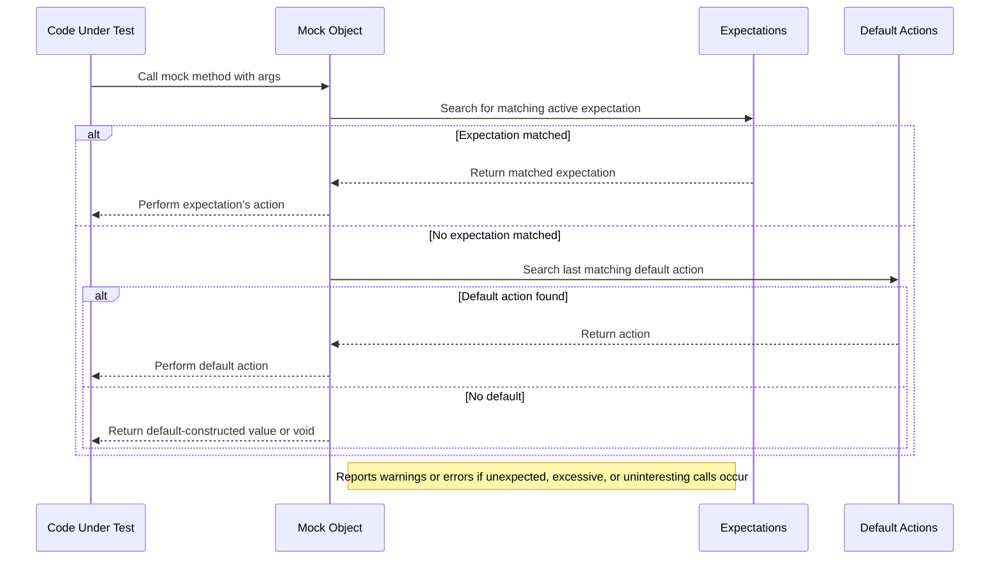

# Setting Expectations and Actions

This page details how to use GoogleMock's primary mechanisms for specifying mock behavior and verifying interactions: setting expectations (`EXPECT_CALL`) and default actions (`ON_CALL`). It explains how to define precise mock method behaviors, control call cardinality and ordering, and leverage custom actions to model complex test scenarios. This focused documentation covers the syntax, common usage patterns, and best practices essential for writing robust and maintainable tests with GoogleMock.

---

## Overview of Expectations and Actions

In GoogleMock, the core way to specify how a mock method behaves and what interactions are expected from the tested code is through:

- **`EXPECT_CALL`**: Sets an *expectation* that a mock method will be called and defines its behavior.
- **`ON_CALL`**: Sets a *default action* for the mock method to perform when called, but does not require that it must be called.

Many test failures and warning messages emanate from these constructs, so understanding how to use them effectively is critical.

### Defining Expectations with `EXPECT_CALL`

`EXPECT_CALL(mock_object, method(matchers...))` establishes an expectation on a mock method:

- Specifies the arguments it should be called with (via matchers).
- Sets how many times it should be called (cardinality).
- Specifies what it does when called (actions).

The syntax chains optional clauses to refine behavior:

```cpp
EXPECT_CALL(mock_obj, Method(arg_matchers...))
    .With(multi_arg_matcher)     // Optional tuple matcher on all arguments
    .Times(cardinality)          // How many times it's expected
    .InSequence(sequences...)    // Sequence ordering constraints
    .After(expectations...)      // Partial order constraints
    .WillOnce(action)            // Action for one call (can be repeated)
    .WillRepeatedly(action)      // Action for repeated calls
    .RetiresOnSaturation();      // Retire after saturation
```

GoogleMock searches the list of expectations in reverse order to match calls, preferring the most recently declared matching expectation.

### Setting Default Actions with `ON_CALL`

`ON_CALL(mock_object, method(matchers...))` specifies a default action for matching calls but does not impose any expectation that the method must actually be called.

Its syntax supports:

```cpp
ON_CALL(mock_obj, Method(arg_matchers...))
    .With(multi_arg_matcher)   // Optional
    .WillByDefault(action);    // Mandatory
```

This is best used to specify common default behaviors in fixtures or test setup and reduce test brittleness.

---

## Using `EXPECT_CALL` Effectively

### Matchers: Specifying Expected Arguments

- Use explicit matchers or concrete values to specify precisely what argument values are expected.
- Use the wildcard matcher `_` to match any argument.
- Omit the argument list entirely to expect any arguments (only for non-overloaded methods).

Example:

```cpp
EXPECT_CALL(turtle, Forward(Ge(100)));  // Only forward moves >= 100
EXPECT_CALL(turtle, GoTo(50, _));        // x=50, y=any
EXPECT_CALL(turtle, Turn);                // Any args (non-overloaded only)
```

### Cardinalities: Controlling How Often Calls Occur

`Times(cardinality)` sets how many times the call is expected. Some common cardinalities:

- `Exactly(n)` or just `n`: exactly `n` times.
- `AtLeast(n)`: at least `n` times.
- `AtMost(n)`: at most `n` times.
- `Between(m, n)`: between `m` and `n` inclusive.
- `AnyNumber()`: any number of times.

If omitted, GoogleMock infers cardinality:

- No `WillOnce` or `WillRepeatedly`: expect exactly 1 call.
- `n` times `WillOnce` and no `WillRepeatedly`: expect exactly `n` calls.
- `n` times `WillOnce` and one `WillRepeatedly`: expect at least `n` calls.

Example:

```cpp
EXPECT_CALL(foo, Bar()).Times(2);                    // Exactly twice
EXPECT_CALL(foo, Bar()).Times(AtLeast(1));           // One or more times
EXPECT_CALL(foo, Bar()).Times(AnyNumber());           // No limit
```

### Actions: Defining What Happens When Called

By default, GoogleMock returns default-constructed values (like `0` for `int`, `false` for `bool`). To override behavior:

- Use `.WillOnce(action)` to specify the action for individual calls.
- Use `.WillRepeatedly(action)` to specify the action for subsequent calls.

Examples:

```cpp
EXPECT_CALL(foo, GetValue())
    .WillOnce(Return(10))
    .WillOnce(Return(20))
    .WillRepeatedly(Return(30));
```

This returns 10 on first call, 20 on second call, 30 on all further calls.

### Ordering Calls

- By default, calls can occur in any order.
- Use `.InSequence(sequence...)` to require calls be made in a specified order.
- Use `.After(expectation)` to specify partial order dependencies.
- Create sequences by instantiating `Sequence` objects and assigning expectations to them.

Example:

```cpp
Sequence s1, s2;
EXPECT_CALL(foo, A()).InSequence(s1, s2);
EXPECT_CALL(bar, B()).InSequence(s1);
EXPECT_CALL(bar, C()).InSequence(s2);
```

This requires `A()` before both `B()` and `C()`, and `C()` before any later call in `s2`.

### Managing Expectation Lifetimes

- Expectations are "sticky" by default — even when saturated, they remain active.
- Use `.RetiresOnSaturation()` to make an expectation retire (become inactive) immediately after its expected calls are fulfilled.
- Retiring is useful to allow fallback expectations or to model sequential behaviors accurately.

Example to sequence multiple calls:

```cpp
{
  InSequence seq;
  EXPECT_CALL(foo, DoThis()).WillOnce(Return(1)).RetiresOnSaturation();
  EXPECT_CALL(foo, DoThis()).WillOnce(Return(2)).RetiresOnSaturation();
}
```

---

## Using `ON_CALL` for Default Behavior

### Purpose of `ON_CALL`

- Set up default behaviors shared by many tests.
- Does not enforce that calls must occur.
- Allows code under test to call mocked methods without test failure or warnings (unless configured otherwise).

### Syntax and Usage

```cpp
ON_CALL(mock_obj, Method(matchers...))
  .With(multi_arg_matcher)       // optional
  .WillByDefault(action);        // required
```

- Multiple `ON_CALL`s can be set for different argument patterns.
- The last matching `ON_CALL` defines the behavior.
- `ON_CALL`s can coexist with `EXPECT_CALL`s. An `EXPECT_CALL` matching a call takes precedence.

### Common Usage Pattern

Often placed in test fixture `SetUp()`:

```cpp
void SetUp() override {
  ON_CALL(mock_, SomeMethod(_))
      .WillByDefault(Return(true));
}
```

This sets a general default action, reducing boilerplate in individual tests.

---

## Common Patterns and Best Practices

- Prefer using `ON_CALL` to set default behaviors in fixtures or common setup.
- Use `EXPECT_CALL` sparingly only to verify specific calls relevant to test intent.
- Use wildcard matchers `_` unless you are verifying argument values.
- For overloaded methods, always specify argument matchers to resolve ambiguity.
- Use `Times(0)` on `EXPECT_CALL` to *forbid* certain method calls explicitly.
- For repetitive calls, use sequences and `.RetiresOnSaturation()` to control expectation activation.
- Avoid over-specification by verifying only what is meaningful for the test.

---

## Actions Available in GoogleMock

GoogleMock provides built-in actions to control what happens when a mock method is invoked:

### Returning Values

| Action                   | Description                               |
|--------------------------|-------------------------------------------|
| `Return(value)`          | Return a value (evaluated at expectation set time). |
| `ReturnRef(variable)`    | Return a reference to a variable.         |
| `ReturnPointee(ptr)`     | Return the value pointed to by ptr (evaluated at call time). |
| `ReturnNew<T>(args...)`  | Return a new heap-allocated `T` object each time. |
| `ReturnNull()`           | Return a null pointer.                    |
| `ReturnRoundRobin({a1,...,an})` | Return each value in turn, looping.   |

### Side Effects

| Action                            | Description                            |
|----------------------------------|----------------------------------------|
| `SetArgPointee<N>(value)`         | Sets the value pointed by argument N. |
| `SaveArg<N>(pointer)`             | Saves a copy of argument N to pointer. |
| `Assign(&variable, value)`        | Assigns value to variable.             |
| `DeleteArg<N>()`                  | Deletes pointer argument N.            |
| `Throw(exception)`                | Throws exception.                      |

### Using Callables

| Action                                  | Description                           |
|----------------------------------------|---------------------------------------|
| `Invoke(f)`                            | Calls function/functor `f` with mock arguments. |
| `InvokeWithoutArgs(f)`                 | Calls nullary `f`, ignoring mock arguments.    |
| `InvokeArgument<N>(args...)`           | Invokes N-th argument as callable with `args`. |
| `IgnoreResult(a)`                      | Calls action `a` but ignores return value.     |
| `DoAll(a1, a2, ..., an)`               | Executes actions in order, returns last's result. |
| `WithArg<N>(a)` / `WithArgs<N1,...>(a)` | Selects mock call arguments to pass to inner action.

---

## Common Pitfalls & Troubleshooting

- **Uninteresting Calls Warning:** If a mock method is called without an `EXPECT_CALL()` or matching `ON_CALL()`, a warning "Uninteresting mock function call" is printed.
  - Use `NiceMock<T>` to suppress these warnings.
  - Or add a catch-all expectation with `EXPECT_CALL(mock, Method(_)).Times(AnyNumber());`.
- **Unexpected Calls:** If a method is called but no expectation matches arguments, it is an error.
- **Over-saturated Calls:** Calling a method more times than expected triggers failure.
- **Order Violations:** Violations in `.InSequence(...)` order will fail the test.
- **Missing `WillByDefault()`:** `ON_CALL()` statements must specify `.WillByDefault()`.
- **Value Return Errors:** If return type is non-default constructible and no action or default value is provided, expect run-time or compilation errors.

---

## Sequencing Mock Calls

GoogleMock supports precise ordering semantics:

- **`InSequence` helper:** A scoped object placing all expectations in a sequence enforcing strict order.

```cpp
{
  InSequence seq;
  EXPECT_CALL(foo, A());
  EXPECT_CALL(foo, B());
}
```

- **`Sequence` objects:** Create named sequences, assign expectations with `.InSequence(seq)` allowing multiple sequences per expectation.
- **`After` clause:** Specify partial ordering requirements on expectations. Can accept up to five expectations or expectation sets.

### Partial Orders & Directed Acyclic Graphs

You can express complex call orders via multiple `Sequence` objects and `.After()` constraints, modeling DAGs where calls must satisfy ordering dependencies without requiring total ordering.

Example:

```cpp
Sequence s1, s2;
EXPECT_CALL(foo, A()).InSequence(s1);
EXPECT_CALL(bar, B()).After(A);
EXPECT_CALL(baz, C()).InSequence(s2);
EXPECT_CALL(foo, D()).After(bar, baz);
```

---

## Example Usage

```cpp
using ::testing::_;
using ::testing::Return;
using ::testing::Sequence;

class MockFoo {
 public:
  MOCK_METHOD(int, Bar, (int));
};

TEST(FooTest, Example) {
  MockFoo mock;
  Sequence seq;

  EXPECT_CALL(mock, Bar(1))
      .InSequence(seq)
      .WillOnce(Return(10));
  EXPECT_CALL(mock, Bar(2))
      .InSequence(seq)
      .WillOnce(Return(20))
      .RetiresOnSaturation();
  EXPECT_CALL(mock, Bar(_))
      .WillRepeatedly(Return(0));

  EXPECT_EQ(mock.Bar(1), 10);  // matches first expectation
  EXPECT_EQ(mock.Bar(2), 20);  // matches second expectation
  EXPECT_EQ(mock.Bar(3), 0);   // matches third expectation
  EXPECT_EQ(mock.Bar(2), 0);   // second expectation retired, falls back to third
}
```

---

## Further Reading and References

- [gMock Cookbook: Knowing When to Expect (`ON_CALL` vs `EXPECT_CALL`)](../gmock_cook_book.md#UseOnCall)
- [Mocking API: `EXPECT_CALL` Reference and Usage](reference/mocking.md#EXPECT_CALL)
- [Actions Reference](reference/actions.md): full list of available actions.
- [Matchers Reference](api_reference/mocking_api/matchers_reference): advanced argument matchers.
- [Mock Behaviors and Strategies](api_reference/mocking_api/mock_behaviors_and_strategies): setting mock modes (Nice, Naggy, Strict).
- [GoogleTest Primer](guides/core-workflows/authoring-unit-tests) for context on test writing.

---

<Tip>
Use `ON_CALL` to establish default mock behaviors in your test fixtures for cleaner and less brittle tests. Reserve `EXPECT_CALL` for explicit expectations verifying critical interactions.
</Tip>

<Warning>
Do not omit `.WillByDefault()` in `ON_CALL`, or your tests will fail to run as expected.
</Warning>

<Note>
Remember, the last matching expectation or default action takes precedence, so order your `EXPECT_CALL`s carefully to avoid unintentional shadowing.
</Note>

---

## Mermaid Diagram of Typical Call Flow


