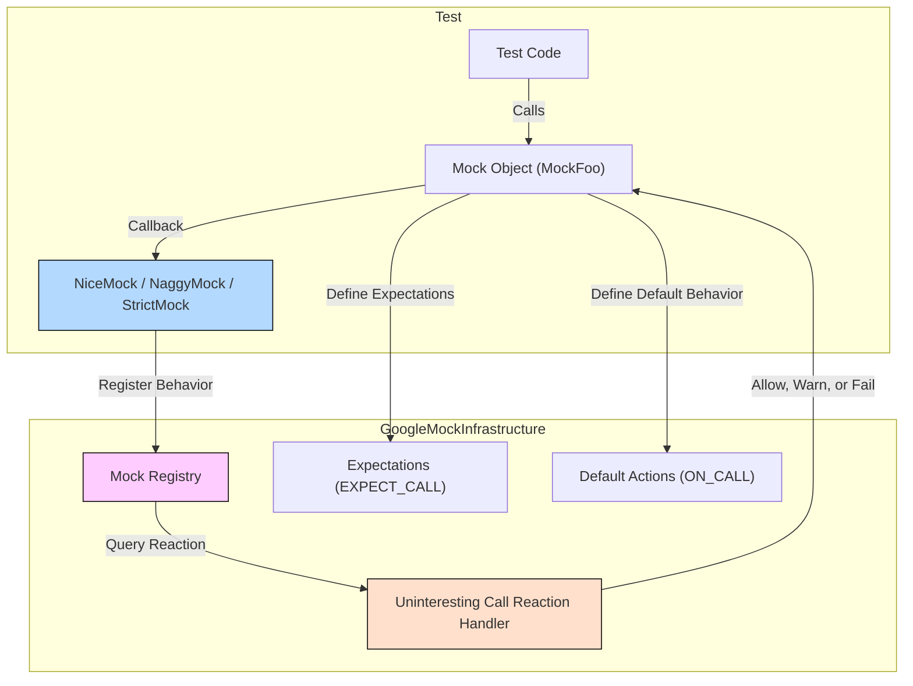

# Mock Behaviors: Nice, Strict, and Custom

This page documents how to control and customize the behavior of mocks regarding uninteresting (unexpected or uninteresting) calls using Google Mock's `NiceMock`, `NaggyMock`, and `StrictMock` wrappers. It guides you through their usage, explains extension options, and offers guidelines on integrating strictness policies effectively in your tests.

---

## Overview

In typical Google Mock usage, when a mock method is called without an explicit expectation set via `EXPECT_CALL()`, that call is considered *uninteresting*. By default, such calls generate a warning to alert you that the method was invoked without instructions on how to behave.

Google Mock provides three distinct wrapper templates to control the strictness level of uninteresting calls on a per-mock-object basis:

- **`NiceMock<T>`**: Suppresses warnings about uninteresting calls, allowing them silently.
- **`NaggyMock<T>`** (default behavior): Generates warnings for uninteresting calls but lets the test continue.
- **`StrictMock<T>`**: Treats uninteresting calls as test errors (failures).

These wrappers subclass your mock classes, inheriting constructors seamlessly, so you use them as drop-in replacements to adjust mock strictness without modifying your mock classes.

---

## Why Use These Wrappers?

Choosing how strictly to handle uninteresting calls affects the balance between test maintenance effort and bug detection:

- Using **`NiceMock`** reduces noise from warnings, making tests more robust to code changes that do not affect externally visible behavior.
- Using **`NaggyMock`** (the current default) helps warn about potentially missed or forgotten expectations, aiding test coverage.
- Using **`StrictMock`** enforces rigorous checking, causing tests to fail on any unexpected mock method invocation, which is useful when ensuring API contracts are strictly adhered to.

Google recommends:

- Use **`NiceMock`** most of the time during routine tests.
- Use **`NaggyMock`** when developing or debugging tests to catch missing expectations.
- Use **`StrictMock`** sparingly as a last resort or when very strict validation is required.

---

## Using NiceMock, NaggyMock, and StrictMock

Suppose you have a mock class `MockFoo`. Here's how to adapt it:

```cpp
using ::testing::NiceMock;
using ::testing::NaggyMock;
using ::testing::StrictMock;

// Using Default (NaggyMock) behavior
NaggyMock<MockFoo> naggy_foo;
EXPECT_CALL(naggy_foo, DoThis());
naggy_foo.DoThis();

// Using NiceMock suppresses warnings for uninteresting calls
NiceMock<MockFoo> nice_foo;
EXPECT_CALL(nice_foo, DoThis());
nice_foo.DoThis();

// Using StrictMock treats uninteresting calls as errors
StrictMock<MockFoo> strict_foo;
EXPECT_CALL(strict_foo, DoThis());
strict_foo.DoThis();  // Errors if unexpected methods called
```

All three accept constructor arguments identical to those of `MockFoo`:

```cpp
NiceMock<MockFoo> nice_foo(5, "hello");  // Calls MockFoo(5, "hello")
```

You can freely replace instances of `MockFoo` with any of these wrappers wherever needed.

---

## How They Work Internally

These wrappers internally register the mock object with Google Mock to control its handling of uninteresting calls:

- `NiceMock` allows uninteresting calls silently.
- `NaggyMock` generates warnings (the default for bare mocks).
- `StrictMock` treats uninteresting calls as failures.

This behavior applies only to **uninteresting calls**, defined as calls to methods with no matching `EXPECT_CALL`. It does *not* affect unexpected calls, which occur when a method is called but no `EXPECT_CALL` matches the exact arguments. Unexpected calls always cause errors regardless of the wrapper used.

### Limitations

- These wrappers only affect mock methods declared *directly* in the mock class using `MOCK_METHOD`. Methods inherited from base classes may not obey strictness modifiers.
- Nested wrappers such as `NiceMock<StrictMock<MockFoo>>` are unsupported.
- Proper functioning assumes your mock class has a virtual destructor.

---

## Practical Usage Tips

- **Suppressing warnings** on uninteresting calls by default via `NiceMock` can make tests easier to maintain when many irrelevant calls occur.
- **Using `NaggyMock`** helps catch potentially missed expectations while developing tests but can produce noisy output.
- **Switching to `StrictMock`** is a useful safety net when you want to prohibit any unexpected call altogether.

### Example: Ignoring Uninteresting Calls

If you do not care about some method calls for your test, wrap the mock in `NiceMock` to silence warnings:

```cpp
class MockFoo {
 public:
  MOCK_METHOD(void, LogEvent, (int event_code));
  MOCK_METHOD(void, SendData, (const char* buffer, size_t size));
};

TEST(FooTest, SkipsIrrelevantCalls) {
  NiceMock<MockFoo> mock;

  EXPECT_CALL(mock, SendData);
  // No expectation on LogEvent

  mock.LogEvent(5);    // No warning
  mock.SendData("hi", 2);  // Verified call
}
```

---

## Integration Guidance

### Balancing Strictness and Test Maintenance

While `StrictMock`s enforce rigor, they can make tests brittle, especially during refactoring, because any new uninteresting call triggers a failure. Use nice or naggy mocks when flexibility and low noise are priorities.

### Constructor Arguments Forwarding

All wrappers perfectly forward constructor arguments to your mock class. You do not need to write boilerplate forwarding constructors.

### Diagnosing Unexpected Calls

Unexpected calls are mismatches in expected arguments. These always fail regardless of strictness wrappers. To reduce false positives, be sure to use `EXPECT_CALL` with correct matchers.

### Managing Non-Default-Constructible Return Types

Be aware that uninteresting calls returning types without a default constructor (e.g., `NiceMock<T>`) will throw exceptions or cause test failures if no default behavior is provided. Consider setting default actions explicitly with `ON_CALL` to prevent this.

### Allowing Explicit Leaks

You can allow mocks wrapped inside these wrappers to be intentionally leaked by calling `Mock::AllowLeak()`. This suppresses leak-check failures.

---

## Troubleshooting

### Uninteresting Call Warnings Still Appear

- Confirm you are wrapping the correct mock object.
- Verify your mock methods are declared using `MOCK_METHOD` directly.
- Check verbosity flags; some warnings can be controlled via `--gmock_verbose`.

### Tests Failing Unexpectedly with `StrictMock`

- Add explicit `EXPECT_CALL` expectations for all method calls.
- Use a less strict wrapper if you do not need strict verification.

### Issues With Non-Virtual Destructor

Wraps may not behave correctly if your mock class lacks a virtual destructor. Make destructors virtual in your mock base classes to ensure proper destruction and behavior.

---

## See Also

- [Mocking Reference: `EXPECT_CALL` and `ON_CALL`](../mocking_api/expectations_and_actions.md)
- [Mock Object & Method Definitions](../mocking_api/mock_object_basics.md)
- [gMock Cookbook - The Nice, the Strict, and the Naggy](../gmock_cook_book.md#NiceStrictNaggy)
- [Matchers Reference](../mocking_api/matchers_reference.md)

---

## Summary

The `NiceMock`, `NaggyMock`, and `StrictMock` wrappers control how Google Mock treats uninteresting mock calls, enabling flexible test behavior customization. Use them to suppress warnings, generate warnings (default), or treat uninteresting calls as errors, respectively. They are essential tools for managing test strictness, minimizing noise, and enforcing API usage in unit tests.

---

## Internal Architecture Diagram



This simplified diagram shows how `NiceMock`, `NaggyMock`, and `StrictMock` operate by registering with a central mock registry to define how uninteresting calls on wrapped mocks are handled, enabling per-object strictness policies.
