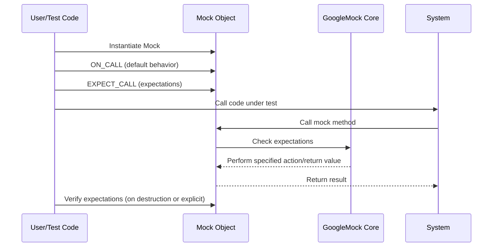

# Mock Object Creation & Usage

This page explains how to declare and use mock classes in C++, leveraging the core GoogleMock macros to specify method signatures, handle argument types, and substitute real implementations for testing purposes.

---

## Introduction to Mock Classes

Mock objects simulate the behavior of real objects in tests. They provide an interface mimicking the real class and let you specify and verify how methods are called, with which arguments, and how often. GoogleMock offers the `MOCK_METHOD` macros for defining mock classes easily.

Key points:

- A mock class inherits from the interface or base class you want to mock.
- Use `MOCK_METHOD` to declare mock methods corresponding to the virtual methods in the base class.
- Mock methods must be declared in the `public:` section even if the original method was `protected` or `private`.

### Example: Defining a Mock Class

Given an interface like:

```cpp
class Turtle {
 public:
  virtual ~Turtle() {}
  virtual void PenUp() = 0;
  virtual void PenDown() = 0;
  virtual void Forward(int distance) = 0;
  virtual int GetX() const = 0;
};
```

You define a mock class by inheriting from Turtle and using `MOCK_METHOD`:

```cpp
#include <gmock/gmock.h>

class MockTurtle : public Turtle {
 public:
  MOCK_METHOD(void, PenUp, (), (override));
  MOCK_METHOD(void, PenDown, (), (override));
  MOCK_METHOD(void, Forward, (int distance), (override));
  MOCK_METHOD(int, GetX, (), (const, override));
};
```

This creates mock implementations that you can later specify expectations on.


## MOCK_METHOD Macro Details

The main macro to define a mock method is:

```cpp
MOCK_METHOD(return_type, method_name, (args...), (specs...));
```

- `return_type`: The method's return type.
- `method_name`: The name of the mock method.
- `args...`: Parameter list enclosed in parentheses.
- `specs...`: Optional qualifiers such as:
  - `const` for a const method.
  - `override` to mark overriding a virtual method.
  - `noexcept`, `Calltype(...)`, `ref(&)`, etc.

### Handling Commas in Types

Sometimes the return type or arguments include commas (e.g., `std::pair<bool, int>`). To prevent macro parsing errors, you can:

- Wrap the type in parentheses:

  ```cpp
  MOCK_METHOD((std::pair<bool, int>), GetPair, ());
  MOCK_METHOD(bool, CheckMap, ((std::map<int, double>), bool));
  ```

- Or use type aliases:

  ```cpp
  using BoolAndInt = std::pair<bool, int>;
  MOCK_METHOD(BoolAndInt, GetPair, ());
  using MapIntDouble = std::map<int, double>;
  MOCK_METHOD(bool, CheckMap, (MapIntDouble, bool));
  ```


### Placement

- Declare `MOCK_METHOD` in the `public:` section of the mock class, regardless of the original method's access level.
- This ensures `ON_CALL` and `EXPECT_CALL` macros can operate without access issues.

## Using the Mock Class in Tests

Once defined, you instantiate mock objects and set expectations on their methods.

### Typical Workflow

1. Create the mock object.
2. Optionally use `ON_CALL` to specify default behaviors.
3. Use `EXPECT_CALL` to declare expected calls, argument matchers, call counts, and actions.
4. Exercise your code under test which uses the mock.
5. The mock will automatically verify expectations upon destruction, or you can call explicit verification.

### Example Usage

```cpp
#include <gmock/gmock.h>
#include <gtest/gtest.h>

using ::testing::Return;
using ::testing::_;

TEST(PainterTest, DrawsCircle) {
  MockTurtle turtle;

  // Set default action: GetX() returns 100 unless overridden
  ON_CALL(turtle, GetX()).WillByDefault(Return(100));

  // Expect PenDown() to be called at least once
  EXPECT_CALL(turtle, PenDown()).Times(::testing::AtLeast(1));

  // Exercise code that uses Turtle
  Painter painter(&turtle);
  painter.DrawCircle(0, 0, 10);
}
```

## Mocking Special Cases

### Mocking Overloaded Methods

If the original class has overloaded methods, mock them all explicitly with matching signatures:

```cpp
class MockFoo {
 public:
  MOCK_METHOD(int, Add, (Element x), (override));
  MOCK_METHOD(int, Add, (int times, Element x), (override));

  MOCK_METHOD(Bar&, GetBar, (), (override));
  MOCK_METHOD(const Bar&, GetBar, (), (const, override));
};
```

To resolve ambiguity, use the `Const()` helper:

```cpp
using ::testing::Const;
EXPECT_CALL(Const(mockFoo), GetBar()).WillOnce(ReturnRef(bar));
```

### Mocking Non-Virtual Methods

While GoogleMock primarily mocks virtual methods, you can mock non-virtual methods by declaring methods with the same signature in an unrelated mock class and using dependency injection templates to swap real and mock implementations at compile-time.

### Mocking Template Classes

Templates can be mocked like normal classes:

```cpp
template <typename T>
class MockStack : public StackInterface<T> {
 public:
  MOCK_METHOD(int, GetSize, (), (const, override));
  MOCK_METHOD(void, Push, (const T& x), (override));
};
```

### Mocking Move-Only Types

GoogleMock supports move-only types (`std::unique_ptr`, etc.) directly in mock methods using `MOCK_METHOD`.

Remember:
- Use lambdas or callable objects in actions like `WillOnce` to generate values at call time.
- Avoid `Return(std::move(...))` in `WillRepeatedly()` as it causes runtime errors.

### Mocking Private and Protected Methods

Always declare mock methods as `public`, even if the overridden methods are `protected` or `private`, to allow GoogleMock to generate accessible mocks.


## Default Behaviors and Expectations

### ON_CALL - Setting Default Behavior

Use `ON_CALL` to specify what a mock method should do when called, without enforcing any expectation on call count.

Example:

```cpp
ON_CALL(mock, Method(_)).WillByDefault(Return(42));
```

`ON_CALL` can take matchers for arguments, like `EXPECT_CALL`.

### EXPECT_CALL - Setting Expectations and Behaviors

Set expectations on how a mock method should be called, how many times, and what to do:

```cpp
EXPECT_CALL(mock, Method(5))
    .Times(2)
    .WillOnce(Return(10))
    .WillRepeatedly(Return(20));
```

If no `.Times()` is specified, gMock infers:

- If no `WillOnce()` or `WillRepeatedly()`, expects exactly one call.
- If multiple `WillOnce()`, expects calls equal to that count.
- If also `WillRepeatedly()`, expects calls at least equal to the number of `WillOnce()` calls.

### Important Expectation Modifiers

- `.With(matcher)` matches all arguments as a tuple (can be specified once and must be first).
- `.InSequence(...)` enforces call order using `Sequence` objects.
- `.After(...)` specifies expectations that must have been satisfied before this one.
- `.RetiresOnSaturation()` deactivates expectations after reaching their call limit to avoid over-saturation errors.


## Using NiceMock, NaggyMock, StrictMock

GoogleMock offers wrappers around mocks to define default behaviors for uninteresting calls:

- `NiceMock<T>`: suppresses warnings on uninteresting calls.
- `NaggyMock<T>`: default behavior, warns on uninteresting calls.
- `StrictMock<T>`: fails tests on uninteresting calls.

Example:

```cpp
NiceMock<MockFoo> mock_foo;
StrictMock<MockFoo> strict_foo;
```


## Best Practices and Tips

- Use `ON_CALL` for setting expected behavior; use `EXPECT_CALL` only for behaviors you want to verify.
- Avoid over-specifying expectations to keep tests robust.
- Use `RetiresOnSaturation()` for expectations that are expected to be met a fixed number of times.
- Prefer `NiceMock` during development to reduce noise.
- Always put `MOCK_METHOD` macros in the `public:` section, no matter the access level in base.
- Use type aliases or parentheses if your types contain commas to avoid macro parsing errors.
- Use sequences or `After()` clauses to control call ordering explicitly.
- Use lambdas or functors as actions in `WillOnce()` or `WillRepeatedly()` for complex mock behaviors.


## Related Concepts

- **Matchers:** Use matchers like `_`, `Eq`, or custom matchers to control argument matching.
- **Actions:** Define what a mock method returns or does on invocation, e.g., `Return()`, `Invoke()`, `DoAll()`, etc.
- **Cardinalities:** Use cardinality specifiers like `Times()`, `AtLeast()`, `Exactly()`, `AnyNumber()` to control call counts.


## Troubleshooting Common Issues

- Mock methods must be virtual unless explicitly mocked via template-based techniques.
- Overloads require explicit disambiguation.
- Missing virtual destructors cause memory issues.
- Uninteresting calls generate warnings by default; suppress via `NiceMock` or explicit `EXPECT_CALL(...).Times(AnyNumber())`.
- Macro redefinition conflicts can happen with Windows headers; ensure method names are correctly expanded.


## Additional Resources

- See [gMock Cookbook](gmock_cook_book.md) for recipes and patterns.
- Refer to [Mocking Reference](mocking.md) for detailed macro usage.
- See [gMock Cheat Sheet](gmock_cheat_sheet.md) for quick reference.
- Legacy issues and FAQs are addressed in [Legacy gMock FAQ](gmock_faq.md).

---

### Typical User Flow Diagram


