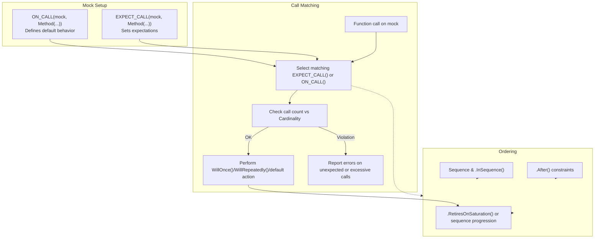

# Expectations and Cardinalities

This page details how to precisely specify, verify, and order expectations of function calls on mock objects in GoogleMock. It covers the use of `ON_CALL` and `EXPECT_CALL` to define mock behavior and expectations, explains how to specify call counts using cardinalities, and demonstrates controlling call ordering and behavior modes (strict, nice, and naggy). Through concrete examples, user flows, and best practices, you will learn how to enforce the correct number and sequence of mock method calls and handle uninteresting versus unexpected calls effectively.

---

## 1. Overview of Setting Expectations on Mocks

Mocking revolves around specifying what function calls on mock objects are expected during test execution, how often they will occur, in what order, and what they should do when invoked.

- `ON_CALL`: Defines the default action when a method is called but does not set any requirement on whether it must be called.
- `EXPECT_CALL`: Sets an expectation that the method will be invoked with specific arguments (matched by matchers), a specified number of times, in a given order, and defines behavior upon such calls.

The right use of these macros ensures your tests not only simulate desired behaviors but also validate that your code interacts with dependencies correctly.

## 2. Specifying Mock Behavior and Expectations

### 2.1 ON_CALL

Use `ON_CALL(mock, Method(matchers...))` to specify what should happen when the mocked method is called without requiring the call to occur.

- Supports optional argument matchers; defaults to wildcard `_` matching anything.
- Must be followed by exactly one `.WillByDefault(action)` clause specifying the default behavior.

Example:

```cpp
ON_CALL(foo, GetSize())
    .WillByDefault(Return(42));
```

This means when `GetSize()` is called on `foo` and there are no `EXPECT_CALL`s matching it, return 42 by default.

### 2.2 EXPECT_CALL

Use `EXPECT_CALL(mock, Method(matchers...))` to set a strict expectation that the method must be called matching those `matchers`.

It supports chaining clauses in this precise order:

- `.With(multi_argument_matcher)` (optional, once)
- `.Times(cardinality)` (optional, once)
- `.InSequence(s1, s2, ...)` (any number)
- `.After(e1, e2, ...)` (any number)
- `.WillOnce(action)` (any number)
- `.WillRepeatedly(action)` (optional, once)
- `.RetiresOnSaturation()` (optional, once, last)

Example:

```cpp
EXPECT_CALL(foo, Describe(5))
    .Times(3)
    .WillRepeatedly(Return("Category 5"));
```

This expects `Describe(5)` to be called exactly 3 times, returning "Category 5" each time.

## 3. Cardinalities: Specifying Call Counts

Cardinalities control how many times a mock method is expected to be called.

GoogleMock provides expressive cardinalities:

| Cardinality           | Meaning                                      |
|----------------------|----------------------------------------------|
| `AnyNumber()`         | Any number of calls (including zero).        |
| `AtLeast(n)`          | At least *n* calls.                           |
| `AtMost(n)`           | At most *n* calls.                            |
| `Between(m, n)`       | Between *m* and *n* calls (inclusive).       |
| `Exactly(n)` or `n`   | Exactly *n* calls. If `n` is 0, call should not happen. |

### 3.1 Inferred Cardinality

If `.Times()` is omitted, GoogleMock infers it based on the presence of `.WillOnce` and `.WillRepeatedly`:

- No `WillOnce` or `WillRepeatedly`: `Times(1)`
- N `WillOnce`s and no `WillRepeatedly`: `Times(N)`
- N `WillOnce`s and one `WillRepeatedly`: `Times(AtLeast(N))`

### 3.2 Using Cardinalities with Examples

```cpp
// Expect called at least twice
EXPECT_CALL(foo, DoSomething()).Times(AtLeast(2));

// Expect never called
EXPECT_CALL(foo, UnusedMethod()).Times(0);

// Expect exactly 3 calls
EXPECT_CALL(foo, Process(_)).Times(3);

// Expect any number of calls
EXPECT_CALL(foo, Reset()).Times(AnyNumber());
```

### 3.3 Custom Cardinalities

You can implement your own cardinality by implementing the `CardinalityInterface` (see [Writing New Cardinalities](#Writing-New-Cardinalities)).

## 4. Ordering of Expectations

Expectation order controls when and how your mock methods should be called relative to each other.

### 4.1 Default Behavior

By default, calls can happen in any order, as long as they match some expectation.

### 4.2 Strict Ordering with Sequences

Use `Sequence` and `.InSequence(seq)` clauses to specify a strict order.

```cpp
Sequence s;
EXPECT_CALL(foo, Reset()).InSequence(s);
EXPECT_CALL(foo, Start()).InSequence(s);

// Calls must be Reset() then Start()
```

You can assign multiple sequences to a single expectation. All expectations in the same sequence must be matched in defined order.

### 4.3 Partial Order with After Clause

Use `.After(expectation_or_set)` to specify that an expectation should only occur after one or more other expectations complete:

```cpp
Expectation init = EXPECT_CALL(foo, Init());
EXPECT_CALL(foo, Process()).After(init);
```

### 4.4 Implicit Ordering with `InSequence` Object

You can create a block with an `InSequence` object to make all `EXPECT_CALL`s in scope part of the same anonymous sequence.

```cpp
{
  InSequence seq;

  EXPECT_CALL(foo, A());
  EXPECT_CALL(foo, B());
}
```

Calls to `foo.A()` and `foo.B()` must happen in sequence.

### 4.5 Retirement of Expectations

Expectations remain active ("sticky") even after being saturated unless:

- Explicitly marked with `.RetiresOnSaturation()` which makes them inactive after their upper limit is reached.
- They reside in a sequence, and a later expectation in the sequence is met.

This controls which expectations can match following calls.

## 5. Handling Uninteresting, Unexpected, and Excessive Calls

### 5.1 Uninteresting Calls

Calls to mock methods **without any** matching `EXPECT_CALL` are uninteresting calls. By default, GoogleMock prints a warning and executes the default action or the `ON_CALL` defined behavior.

You can control this behavior using:

- `NiceMock<T>`: Suppresses warnings for uninteresting calls.
- `NaggyMock<T>`: Default behavior, warns on uninteresting calls.
- `StrictMock<T>`: Treats uninteresting calls as errors.

### 5.2 Unexpected Calls

Calls that match the mock method but don't fit any expectation (e.g., arguments don't match or already saturated) are **unexpected calls** and always make the test fail.

### 5.3 Excessive Calls

If a method is called more times than allowed by the expectation's cardinality, GoogleMock reports an error for unexpected calls or uninteresting calls depending on mock type.

### 5.4 Catch-All Expectations

You can allow calls that don't meet more specific expectations by defining an `EXPECT_CALL(...).Times(AnyNumber())` with wildcard argument matcher (`_`), usually placed before more specific expectations for precedence.

## 6. Practical User Flows

### 6.1 Setting Up Default Behavior and Expectations

```cpp
MockFoo foo;

// Default behavior (no requirement to call)
ON_CALL(foo, GetValue()).WillByDefault(Return(10));

// Expect exactly one call
EXPECT_CALL(foo, GetValue()).Times(1).WillOnce(Return(20));

// Default call returns 10, expect call returns 20 once
```

### 6.2 Specifying Call Sequence

```cpp
Sequence seq;
EXPECT_CALL(foo, Init()).InSequence(seq);
EXPECT_CALL(foo, Process()).InSequence(seq);
EXPECT_CALL(foo, Finish()).InSequence(seq);

// Calls must occur in the above order, or test fails.
```

### 6.3 Verifying Interactions Early

If your mock object might not be destroyed promptly, you can trigger verification manually:

```cpp
ASSERT_TRUE(Mock::VerifyAndClearExpectations(&foo));
```

This checks all expectations and clears them early.

### 6.4 Allowing Leaks Explicitly

Use `Mock::AllowLeak(&foo)` to suppress leak detection and delay verification until destruction.

## 7. Common Pitfalls and Best Practices

- **Set expectations before exercising code:** Always call `EXPECT_CALL()` before the mock method is invoked.
- **Avoid over-specifying:** Use `ON_CALL` to set defaults and only `EXPECT_CALL` when enforcing requirements.
- **Use sequences and `RetiresOnSaturation()` for ordered calls that have limited repetitions.**
- **Don't set new expectations after verification:** Adding expectations after `VerifyAndClear` is undefined behavior.
- **Suppress uninteresting call warnings wisely:** Use `NiceMock` or explicit catch-all `EXPECT_CALL`.

## 8. Summary Table of EXPECT_CALL Clauses

| Clause             | Purpose                               | Usage                          |
|--------------------|-------------------------------------|--------------------------------|
| `.With(matcher)`   | Match arguments as a whole tuple     | At most once, must be first clause |
| `.Times(card)`     | Specify how many times expected       | At most once                    |
| `.InSequence(seq...)` | Expect calls in specified sequences  | Multiple times                 |
| `.After(exp...)`   | Expect calls after other expectations | Multiple times                 |
| `.WillOnce(action)`| Action for one invocation             | Any number                    |
| `.WillRepeatedly(action)` | Action for subsequent invocations | At most once                  |
| `.RetiresOnSaturation()` | Retire expectation after saturated call | At most once, last clause    |

## 9. Illustrative Code Example

```cpp
using ::testing::Sequence;
using ::testing::Return;
using ::testing::_;

class MockFoo {
 public:
  MOCK_METHOD(int, Bar, (int n), ());
};

TEST(FooTest, Example) {
  MockFoo foo;

  Sequence s;

  // Expect Bar(1) once, then Bar(2) twice, in order
  EXPECT_CALL(foo, Bar(1))
      .Times(1)
      .InSequence(s)
      .WillOnce(Return(100));
  EXPECT_CALL(foo, Bar(2))
      .Times(2)
      .InSequence(s)
      .WillRepeatedly(Return(200));

  EXPECT_EQ(foo.Bar(1), 100);
  EXPECT_EQ(foo.Bar(2), 200);
  EXPECT_EQ(foo.Bar(2), 200);
}
```

## 10. Troubleshooting Common Issues

<AccordionGroup title="Troubleshooting Expectations and Cardinalities">
<Accordion title="Too few or too many WillOnce() actions specified">
If your `EXPECT_CALL` specifies a cardinality but provides too many or too few `WillOnce()` clauses, GoogleMock will print warnings. For example, if you expect 2 calls but provide only 1 `WillOnce()`, a warning advises you about too few actions.

**Solution:** Add or remove `WillOnce()` clauses to match your expected cardinality or use `WillRepeatedly()` for remaining calls.
</Accordion>
<Accordion title="Mock function called more times than expected">
If a mock function is called more times than specified by your expectation's `Times()` clause, GoogleMock will report a failure mentioning the over-saturation.

**Solution:** Review your expectation cardinality or sequence of calls to ensure alignment.
</Accordion>
<Accordion title="Unexpected mock function calls">
Calls that don't match any active expectation will cause errors.

**Check:** Argument matchers, sequences, or unsatisfied pre-requisites might cause this.

**Tip:** Use `EXPECT_CALL(mock, Method(_)).Times(AnyNumber())` to catch unexpected calls if appropriate.
</Accordion>
<Accordion title="Uninteresting mock function calls">
Calls to methods without any `EXPECT_CALL` generate warnings by default.

**To silence warnings:** Use `NiceMock` or set a catch-all `EXPECT_CALL` with `Times(AnyNumber())`.
</Accordion>
</AccordionGroup>

## 11. Related Concepts and References

For further reading and a broader understanding of mocking in GoogleTest, see:

- [GoogleMock Cookbook](https://github.com/google/googletest/blob/main/docs/gmock_cook_book.md) for practical recipes.
- [Mocking Reference](reference/mocking.md) for detailed API insight.
- [Matchers Reference](api_reference/core_assertions_matchers/matchers_reference) to understand argument matchers.
- [Actions Reference](api_reference/mocking_framework/actions_and_invocations.md) for defining behavior.
- [Using Mocks in Tests](guides/getting-started/introduction-to-mocking.mdx) for end-to-end mocking workflow.

---

### Summary Diagram



---

This page is your definitive guide for mastering expectations and cardinalities in GoogleMock to empower robust, precise, and maintainable C++ mock testing.
