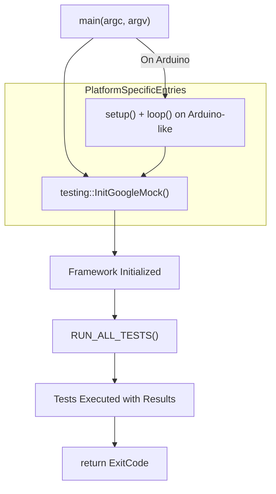

# Main Entry Points & Initialization

This page documents the critical entry points and initialization routines you use when running tests with GoogleTest and GoogleMock. It covers `gtest_main`, `gmock_main`, their provided `main()` functions, how to customize initialization, and integration guidance with common build tools.

---

## Overview

GoogleTest and GoogleMock provide standard entry points in the form of prebuilt libraries (`gtest_main` and `gmock_main`) that contain a `main()` function. These standard `main()` implementations initialize the testing framework and invoke all registered tests automatically.

By using these libraries, you can avoid writing your own `main()` just to launch tests, focusing instead on writing the tests themselves. However, if your testing needs require custom bootstrapping (such as additional setup before tests run), you can write your own `main()` that calls the necessary initialization functions explicitly.

---

## Standard Entry Libraries: `gtest_main` and `gmock_main`

### `gtest_main`

- Provides a default `main()` function for GoogleTest-only test suites.
- Performs initialization by calling `testing::InitGoogleTest()`
- Runs all tests via `RUN_ALL_TESTS()` and returns the result.

### `gmock_main`

- Provides a default `main()` function for tests that use GoogleMock (which depends on GoogleTest).
- Calls `testing::InitGoogleMock()`, which initializes both GoogleMock and GoogleTest.
- Calls `RUN_ALL_TESTS()` to execute all registered tests.

These libraries are intended to be linked into your test binaries to simplify starting your tests with minimal custom code.

---

## Custom `main()` Functions

If your test program requires special initialization—perhaps to parse additional command-line flags, perform environment setup, or integrate with other frameworks—you can provide your own `main()` function instead of linking with `gtest_main` or `gmock_main`. When doing so:

1. Call `testing::InitGoogleTest()` (for GoogleTest) or `testing::InitGoogleMock()` (for GoogleMock) early in your `main()`, passing it the `argc` and `argv` parameters.
2. After initializing, call `RUN_ALL_TESTS()` to execute all registered tests.
3. Return the result of `RUN_ALL_TESTS()` from your `main()`.

### Example of a Custom GoogleTest `main()`

```cpp
#include "gtest/gtest.h"

int main(int argc, char** argv) {
  testing::InitGoogleTest(&argc, argv);
  // Custom initialization can go here
  return RUN_ALL_TESTS();
}
```

### Example of a Custom GoogleMock `main()`

```cpp
#include "gmock/gmock.h"

int main(int argc, char** argv) {
  testing::InitGoogleMock(&argc, argv);
  // Additional setup if needed
  return RUN_ALL_TESTS();
}
```

**Tip:** The `InitGoogleMock()` call includes GoogleTest initialization, so you don't need to call `InitGoogleTest()` separately.

---

## Platform-Specific Entry Points

GoogleTest and GoogleMock handle platform-specific entry conventions internally:

- On Arduino-like platforms (ESP8266, ESP32, NRF52 with Arduino), the entry points are `setup()` and `loop()` functions instead of `main()`.
- On Windows Mobile, a `_tmain` function is used.
- For most platforms, the usual `main(int argc, char** argv)` signature applies.

This means you can write portable tests that run across many different environments without changing your test entry logic.

---

## Integration with Build Systems

### CMake Integration

- GoogleMock and GoogleTest come with `CMakeLists.txt` files that define targets including `gtest_main` and `gmock_main`.
- When configuring your CMake project, link your test executable against these targets:

```cmake
add_executable(my_tests my_tests.cc)
target_link_libraries(my_tests gtest_main)  # Or gmock_main for mock tests
add_test(NAME my_tests COMMAND my_tests)
```

- This approach automatically includes the standard `main()` and the necessary initialization calls.

### Manual Linking

- If not using CMake or the provided build scripts, you can manually link the object file containing `gtest_main` or `gmock_main`'s `main()`.
- For example, link against the library `-lgtest_main` or `-lgmock_main` depending on your needs.

### Notes on Using Your Own `main()`

- You should only provide your own `main()` if you have explicit reasons for custom initialization.
- Linking with `gtest_main` or `gmock_main` is simpler and recommended for ease of use.

---

## Initialization Details

### Initialization Functions

- `testing::InitGoogleTest(&argc, argv)` initializes GoogleTest by parsing its command-line flags and setting up internal state.
- `testing::InitGoogleMock(&argc, argv)` initializes both GoogleMock and GoogleTest.

Both functions remove GoogleTest-related flags from `argc/argv` so you can still parse your own program-specific arguments after initialization.

### Running Tests

- After initialization, call `RUN_ALL_TESTS()` which:
  - Executes all registered test cases and test suites.
  - Returns 0 if all tests passed, or 1 if any test failed.

**Important:** Always return the value from `RUN_ALL_TESTS()` in your `main()` function to correctly signal success or failure in automated environments.

---

## Writing Custom Test Runners

If your testing needs demand fine-grained control over test execution (e.g., integration with another framework or custom lifecycle management), you can build your own test runner:

1. Initialize GoogleTest/GoogleMock normally.
2. Use the GoogleTest API to:
   - Access test suites and test cases programmatically.
   - Trigger individual tests or groups selectively.
   - Customize test event listeners for reporting test results differently.
3. Avoid calling `RUN_ALL_TESTS()` directly if you control execution flow.

This pattern is advanced and typically unnecessary for most users.

---

## Common Pitfalls & Troubleshooting

<AccordionGroup title="Common Issues with Main Entry Points">
<Accordion title="Linker errors about duplicated main()">
Your executable may be linking both your own `main()` and `gtest_main` or `gmock_main` library, which also define `main()`. To fix:

- Choose one: either write your own `main()` or link with one of the main libraries, but not both.
</Accordion>
<Accordion title="Tests are not running or detected">
- Ensure `testing::InitGoogleTest()` or `testing::InitGoogleMock()` is called before `RUN_ALL_TESTS()`.
- Verify your test files are linked into the executable.
- Check command-line filters that might skip tests.
</Accordion>
<Accordion title="Command-line flags not recognized">
- Pass `argc` and `argv` from `main()` to `InitGoogleTest()` / `InitGoogleMock()`; they must not be altered beforehand.
- Make sure your build includes the standard main libraries or your own initialization.
</Accordion>
</AccordionGroup>

---

## Summary

You have multiple options for initializing and running tests with GoogleTest and GoogleMock:

- Use the provided `gtest_main` or `gmock_main` libraries that include a `main()` function.
- Write a custom `main()` calling `InitGoogleTest()` or `InitGoogleMock()` and `RUN_ALL_TESTS()`.
- Rely on platform-specific entry points where applicable.
- Integrate smoothly with CMake or other build systems by linking the appropriate main target.

This flexibility balances ease of use with user control and enables you to create robust test executables tailored to your project needs.

---

## References & Further Reading

- [GoogleTest Primer](https://google.github.io/googletest/primer.html) — For foundational understanding including writing tests and `main()` usage.
- [GoogleMock Readme](https://github.com/google/googletest/blob/main/googlemock/README.md) — Context on how `gmock_main` integrates with GoogleMock.
- [Getting Started: Setup and Build Integration](https://google.github.io/googletest/guides/getting-started/setup-build-integration.html) — Covers build system details including linking main libraries.
- [GoogleTest `main()` source code in `gtest_main.cc`](https://github.com/google/googletest/blob/main/googletest/src/gtest_main.cc) and [GoogleMock's `gmock_main.cc`](https://github.com/google/googletest/blob/main/googlemock/src/gmock_main.cc).

---

## Appendix: Example Code for Custom `main()`

```cpp
#include "gmock/gmock.h"  // Includes GoogleMock and GoogleTest

int main(int argc, char** argv) {
  // Initialize GoogleMock & GoogleTest with command-line flags
  testing::InitGoogleMock(&argc, argv);

  // Insert custom setup code here if needed

  // Run all registered tests
  return RUN_ALL_TESTS();
}
```

---

## Diagram: Flow of Test Initialization and Execution


