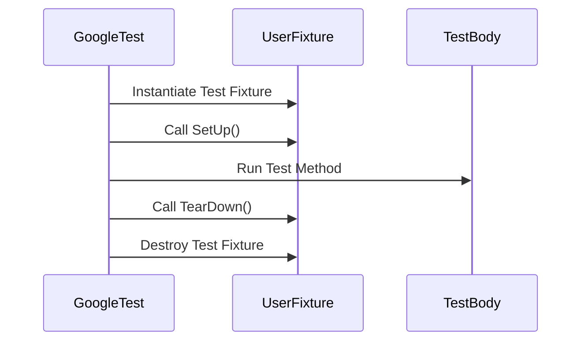

# Test Case & Suite Management

Manage your tests efficiently using GoogleTest's macros to define, group, and organize test cases and test suites. This reference covers usage of the `TEST` and `TEST_F` macros, fixture management, lifecycle hooks, setup and teardown flows, organizational patterns for complex projects, and details about how GoogleTest discovers and registers tests automatically.

---

## 1. Defining and Grouping Tests

### TEST Macro

Use the `TEST(TestSuiteName, TestName)` macro to define an individual test without shared fixture state. Each `TEST` defines a distinct test case within a test suite:

```cpp
TEST(MathTest, Addition) {
  EXPECT_EQ(2 + 2, 4);
}
```

- **TestSuiteName** groups related tests.
- **TestName** identifies the individual test.

### TEST_F Macro

`TEST_F(FixtureClass, TestName)` defines tests that share common setup/teardown or state via a test fixture class:

```cpp
class CalculatorTest : public ::testing::Test {
 protected:
  void SetUp() override {
    calculator_ = new Calculator();
  }

  void TearDown() override {
    delete calculator_;
  }

  Calculator* calculator_;
};

TEST_F(CalculatorTest, Subtraction) {
  EXPECT_EQ(calculator_->Subtract(5, 3), 2);
}
```

- The fixture class derives from `::testing::Test`.
- GoogleTest creates a fresh fixture instance per test.
- `SetUp()` and `TearDown()` are called before and after each test.

<Tip>
Use `TEST_F` when multiple tests require common objects, data, or configuration.
</Tip>

### Differences Between TEST and TEST_F

| Aspect                  | TEST                         | TEST_F                              |
|-------------------------|------------------------------|----------------------------------|
| Shared data             | No                          | Yes                              |
| Setup/Teardown support  | No                          | Yes                              |
| Requires fixture class  | No                          | Yes                              |
| Use case                | Simple tests without common setup | Group of related tests sharing setup |

---

## 2. Test Fixtures and Lifecycle

### Defining a Test Fixture

- Derive your fixture class from `::testing::Test`.
- Declare member variables to share across tests.
- Override `SetUp()` for preparation logic and `TearDown()` for cleanup.
- The constructor and destructor can also be used if no test-failure assertions are needed there.
  
Example:

```cpp
class DatabaseTest : public ::testing::Test {
 protected:
  void SetUp() override {
    db_ = new DatabaseConnection("config.json");
  }

  void TearDown() override {
    delete db_;
  }

  DatabaseConnection* db_;
};
```

### Test Execution Flow with Fixtures

For each `TEST_F`:

1. GoogleTest constructs the fixture object.
2. Calls `SetUp()`.
3. Runs the test body.
4. Calls `TearDown()`.
5. Destructs the fixture object.

Each test runs with a fresh fixture instance, ensuring isolation.

---

## 3. Setup and Teardown Patterns

### Constructors and Destructors vs SetUp and TearDown

Prefer **constructor and destructor** for simple initialization and cleanup.

Use **SetUp()** and **TearDown()** for:
- Code that can fail and report errors using assertions.
- Virtual function dispatch.
- Cases where you want to control setup/teardown order especially when subclassing fixtures.

<Tip>
Keep `SetUp()` and `TearDown()` lightweight to avoid slowing tests.
</Tip>

### Sharing Setup Across Derived Fixtures

Create a base fixture with common setup, then derive specialized fixtures:

```cpp
class BaseTest : public ::testing::Test { ... };
class DerivedTestA : public BaseTest { ... };
class DerivedTestB : public BaseTest { ... };
```

Tests can then be defined with `TEST_F(DerivedTestA, TestName)` or similar.

---

## 4. Organizing Tests in Larger Codebases

### Test Suites as Logical Groupings

- Group related tests using the same test suite name in `TEST`.
- Use fixtures (`TEST_F`) to share common state and setup within a suite.

### Avoiding Underscores in Test and Suite Names

Underscores in test suite or test names may cause naming conflicts internally and are discouraged. Use camel case or Pascal case instead.

### Naming Conventions

- Use descriptive, clear names reflecting what the test validates.
- Keep names concise but meaningful.

---

## 5. Test Discovery and Registration

- GoogleTest automatically discovers all tests declared via `TEST` and `TEST_F` macros.
- Tests are registered in static initialization, so no user action is needed.
- The full test name is `TestSuiteName.TestName`.

### Running Tests

- Use `RUN_ALL_TESTS()` in `main()` to execute all registered tests.
- Filter tests using `--gtest_filter` command-line flag.

<Tip>
To run tests from a specific suite or with certain substrings:
```
./test_binary --gtest_filter=SuiteName.*
```
or
```
./test_binary --gtest_filter=SuiteName.TestName
```
</Tip>

---

## 6. Example: Defining and Running Tests with Fixtures

```cpp
#include <gtest/gtest.h>

class StackTest : public ::testing::Test {
 protected:
  void SetUp() override {
    stack_.push(1);
    stack_.push(2);
  }

  std::stack<int> stack_;
};

TEST_F(StackTest, TopIsLastPushed) {
  EXPECT_EQ(stack_.top(), 2);
}

TEST_F(StackTest, PopReducesSize) {
  stack_.pop();
  EXPECT_EQ(stack_.size(), 1);
}

int main(int argc, char **argv) {
  ::testing::InitGoogleTest(&argc, argv);
  return RUN_ALL_TESTS();
}
```

---

## 7. Troubleshooting

### Common Issues

- **No default constructor error:** Your fixture class needs a default constructor since GoogleTest creates a new instance for each test. Define one if necessary.

- **SetUp() not called:** Verify that you spelled `SetUp()` with a capital `U`. Incorrect spelling will prevent GoogleTest from recognizing the method.

- **Underscore in test names causing conflicts:** Remove underscores or rename test suites/tests to avoid internal clashes.

- **Tests silently not run:** Ensure tests are registered via the macros and `RUN_ALL_TESTS()` is called in `main()`.

---

## 8. Best Practices

- Use fixtures (`TEST_F`) when multiple tests share setup and state.
- Name your test suites and tests meaningfully and avoid underscores.
- Keep per-test setup light.
- Group logically related tests for maintainability.
- Use `SetUp()` and `TearDown()` for setup code that can fail or requires virtual dispatch.

---

## 9. Related Resources

- [GoogleTest Primer](../getting-started/primer.md) — for basics on writing tests.
- [Writing Your First Unit Test](../guides/core-workflows/authoring-unit-tests.mdx) — step-by-step guide.
- [Core Concepts & Terminology](../overview/intro-core-concepts/core-terminology.mdx) — key terminology including fixtures.
- [Assertions API Reference](../api_reference/test_framework_api/assertions.mdx) — deep dive into assertion macros.

---

## 10. Summary Diagram: Test Lifecycle Flow



---

## 11. Summary

This page guides users to structure their tests efficiently using GoogleTest's `TEST` and `TEST_F` macros. It covers fixture lifecycle management (construction, setup, teardown), organizational strategies for suites, naming guidelines, and test discovery details essential for scaling testing in C++ projects. With concrete code examples and troubleshooting advice, users learn to write maintainable and robust test suites.


---