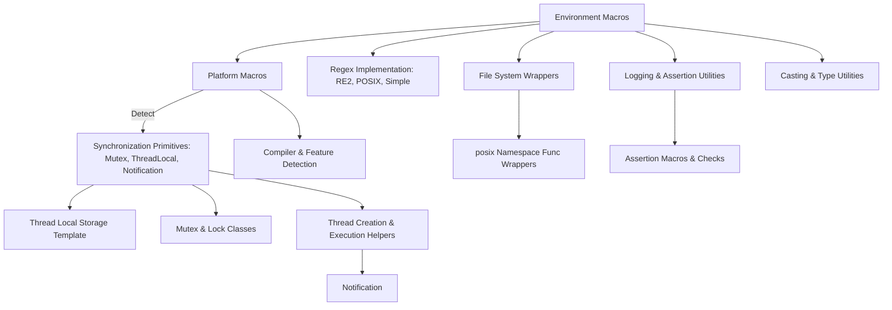

# Platform Abstractions and Internal Utilities

Reference the low-level platform abstractions, internal helpers, and core utilities behind test execution and mocking—useful for porting, extending, or deeply integrating GoogleTest and GoogleMock in complex environments.

---

## Overview

This section of the GoogleTest and GoogleMock codebase provides foundational abstractions and internal utility components that make cross-platform support, thread safety, synchronization, and low-level operations possible. These are essential for adapting GoogleTest and GoogleMock to diverse environments and for advanced users who need to port or integrate the frameworks beyond typical use cases.

Unlike the user-facing test APIs, this part is *not* generally for direct consumption in tests. However, understanding these abstractions benefits developers aiming to extend, embed, or deeply modify GoogleTest or GoogleMock.

---

## Key Components and Concepts

### Environment-Describing Macros

The low-level platform abstractions begin with environment flags that describe the compilation environment to GoogleTest and GoogleMock. These macros detect:

- Compiler capabilities
- Operating system details
- Feature support such as threading, exceptions, RTTI, filesystem access, stream redirection, and more

GoogleTest tries to automatically determine these, but they may need to be overridden in your build environment for correctness.

These macros affect the behavior and availability of utilities throughout the suite.

### Platform-Indicative Macros

GoogleTest defines macros identifying the precise OS platform it is compiled on, such as `GTEST_OS_LINUX`, `GTEST_OS_WINDOWS`, `GTEST_OS_MAC`, among others. These macros help conditionally compile platform-specific code fragments.

### Synchronization and Thread Safety

GoogleTest and GoogleMock provide robust synchronization primitives essential for safe multi-threaded test execution:

- `Mutex` classes abstract over platform-specific mutex APIs, such as Windows Critical Sections or pthread mutexes.
- `MutexLock` types provide scoped lock management.
- `ThreadLocal<T>` templates provide thread-local storage abstractions that are implemented differently depending on platform capabilities.
- `Notification` objects allow threads to wait for specific signals, useful for orchestrating test concurrency.

Thread support is enabled when GoogleTest detects threading libraries like pthreads or Windows threading APIs. Otherwise, dummy implementations are used to allow compilation but without real thread safety.

### Portable File System Wrappers

The internal `posix` namespace wraps platform differences in basic filesystem APIs:

- File descriptor retrieval (`FileNo`) and file stat (`Stat`)
- Directory operations (`RmDir`, `IsDir`)
- Functions like `FOpen`, `FReopen` with Unicode support on Windows
- Error string retrieval and environment variable access

Providing these abstractions makes test code and framework internals uniformly portable.

### Regular Expression Abstraction

GoogleTest abstracts regular expression support through the `RE` class, which:

- Wraps RE2 when Abseil is available
- Falls back to POSIX Extended regular expressions if available
- Otherwise uses a simple built-in regex implementation

This abstraction supports internal matching needs, such as pattern matching in death tests and filtering.

### Logging and Assertions

Low-level logging utilities provide severity-based logging (`INFO`, `WARNING`, `ERROR`, `FATAL`) that integrate with test failures.

Assertion mechanisms (`GTEST_CHECK_`, `GTEST_CHECK_POSIX_SUCCESS_`) are implemented for internal validation, guaranteeing process abortion on critical failures.

### Utility Templates and Casts

Templates such as `ConstRef<T>` and functions like `ImplicitCast_` and `CheckedDowncastToActualType<Base, Derived>()` help with safe type conversions and object handling in a portable way.

### Thread Management Classes

For testing GoogleTest's own multi-threading, templated thread runners (`ThreadWithParam<T>`) allow running user-defined functions in new threads with optional notifications for coordinated starts.

### Platform-Specific Definitions

Details like default path separators, mutex implementations, and behaviors for various compilers and OSes are carefully factored in via inline functions, macros, and typedefs.

### Feature Detection and Version Requirements

Strict C++17 standard enforcement, detection of support for features like exceptions, RTTI, thread-safety, and advanced compiler attributes are embedded early to conditionally enable or disable advanced features.

---

## Usage and Extension Guidance

### For Porting

When porting GoogleTest or GoogleMock to new platforms, this layer is where adaptation should occur. Adjustments to platform macros, thread management, file system access, and regex implementations are typical.

### For Extending and Integrating

Deep integration scenarios (embedding GoogleTest/Mock into complex test shells or custom runners) may require understanding these abstractions.

Use synchronization primitives provided here to guarantee thread safety when manipulating internal test state.

### Internal Testing

Some classes like `Notification` and `ThreadWithParam` live primarily for testing the threading infrastructure of GoogleTest itself.

### Recommendations

- Avoid using internal macros or classes directly in user tests; rely on the public API.
- If you must extend or modify platform utilities, carefully scope changes to avoid cross-platform breaks.
- Use thread-local storage and mutex classes here for managing concurrency in custom extensions.

---

## Example: ThreadLocal Usage

```cpp
// Create a thread-local variable holding an int initialized to 42.
testing::internal::ThreadLocal<int> tls(42);

// In thread A
int* ptrA = tls.pointer();  // Each thread gets its own copy
*ptrA = 100;

// In thread B
int valB = tls.get();  // valB == 42 initially
```

ThreadLocal internally uses platform-specific implementations ensuring that each thread sees independent values.

---

## Troubleshooting Common Issues

- **Compilation errors about missing C++17 features:** Ensure your compiler supports C++17 and the build environment passes the correct flags.
- **Threading not enabled:** If tests behave unexpectedly under concurrency, check platform macros and thread library availability.
- **File system calls failing or unsupported:** On embedded platforms or minimal OSes, missing file APIs may cause failures. Substitute or disable related tests.
- **Regular expressions unsupported:** If regex functionality is not behaving, verify that the correct library (RE2 or POSIX RE) is detected.

---

## Further Exploration

- Explore the public [`Mocking Reference`](docs/reference/mocking.md) for understanding mocking.
- See the [`gMock Cookbook`](docs/gmock_cook_book.md) for practical mocking recipes.
- Review [`gtest-port.h`](googletest/include/gtest/internal/gtest-port.h) source for exact macro and type definitions.
- Learn about synchronization primitives and thread support in the [`gtest-port.h`](googletest/include/gtest/internal/gtest-port.h) file.

---

## Diagram: Internal Utilities and Platform Abstractions Relationship


```

---

## Source

<Source url="https://github.com/google/googletest" paths=[{"path": "googletest/include/gtest/internal/gtest-port.h", "range": "1-700"},{"path": "googletest/include/gtest/internal/gtest-internal.h", "range": "1-550"}] branch="main" />

---