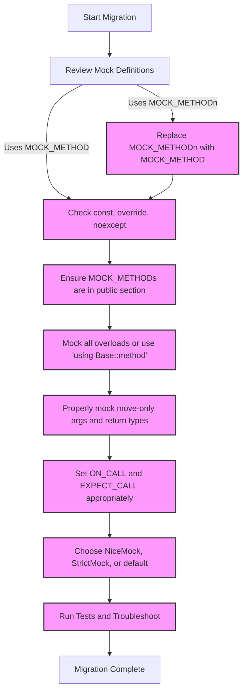

# Upgrade & Migration Guides

Practical, step-by-step instructions to upgrade your GoogleTest and GoogleMock usage between significant versions. This guide helps you adapt to API changes, deprecated features, and new behaviors, ensuring your test suites remain stable and maintainable.

---

## 1. Overview of Upgrade Strategy

When moving between major or minor versions of GoogleTest and GoogleMock, it is crucial to plan your migration carefully. Changes may include API adjustments, behavior modifications, and deprecations that can impact your tests. This guide focuses purely on helping you migrate smoothly, minimize disruptions, and leverage new capabilities responsibly.

### Why Upgrade?
- **Ensure compatibility** with recent C++ standards and platforms.
- **Leverage new features** that simplify test writing and mocking.
- **Fix known bugs and security issues**.
- **Avoid deprecated APIs** and ensure forward compatibility.

### Planning your upgrade
- Review relevant release notes and changelogs for your upgrade path.
- Identify *breaking changes* that require code modifications.
- Check for *deprecated* APIs and prepare replacements.
- Run tests frequently during migration to catch issues early.

---

## 2. Preparing for Migration

### 2.1 Check your environment
- Ensure your compiler supports at least C++17 as required from version 1.17.0 onwards.
- Validate platform support using [Supported Platforms & Toolchains](../overview/integration-and-ecosystem/supported-platforms.md).

### 2.2 Backup and Version Control
- Use a branch or similar version control mechanism to isolate migration work.
- Backup existing test code and confirm that tests pass in your current environment before changes.

### 2.3 Automated testing
- Integrate test runs into your CI to detect regressions early during migration.
- Enable verbose logging if debugging complex failures.

---

## 3. Key Migration Areas

### 3.1 Mock Method Declaration Updates
- Transition from old `MOCK_METHODn` macros to the modern, generic `MOCK_METHOD` macro.

Example:
```cpp
// Old style
MOCK_METHOD1(Foo, bool(int));

// New style
MOCK_METHOD(bool, Foo, (int));
```
- For `const` or `override` specifications, append in the fourth parameter:
```cpp
MOCK_METHOD(bool, Foo, (int), (const, override));
```
- This change enhances clarity and reduces macro complexity.

### 3.2 Access Levels for Mock Methods
- Place all mock methods defined with `MOCK_METHOD` in the `public` section of your mock class regardless of their base class access modifiers.
  This allows `EXPECT_CALL` and `ON_CALL` to access them correctly.

Example:
```cpp
class MockFoo : public Foo {
public:
  MOCK_METHOD(bool, Transform, (Gadget* g), (override));
  MOCK_METHOD(void, Resume, (), (override));  // protected in base
  MOCK_METHOD(int, GetTimeOut, (), (override));  // private in base
};
```

### 3.3 Handling Overloaded Methods
- Mock all overloaded versions explicitly to avoid compiler warnings about hidden base methods.
- Use `using Base::methodName;` to bring in versions you do not intend to mock.

```cpp
class MockFoo : public Foo {
public:
  using Foo::Add;  // bring overloads into scope
  MOCK_METHOD(int, Add, (Element x), (override));
  // Intentionally not mocking other overloads
};
```

### 3.4 Dealing with Move-Only Types
- Mock methods returning or accepting move-only types like `std::unique_ptr` using the modern `MOCK_METHOD` macro.
- Use lambdas or callable objects for setting actions that produce fresh instances.

```cpp
EXPECT_CALL(mock, MakeBuzz("hello"))
    .WillRepeatedly([](StringPiece text) {
      return std::make_unique<Buzz>(AccessLevel::kInternal);
    });
```
- Avoid `Return(std::move(...))` in `WillRepeatedly()` as the source is consumed on first call.

### 3.5 Handling Non-virtual and Free Functions
- Directly mocking non-virtual functions is not supported; instead use interface abstraction.
- For free functions, wrap calls via an interface and mock the interface instead.

### 3.6 Expectation and Default Behavior Updates
- Use `ON_CALL()` for default behaviors without imposing call count expectations.
- Use `EXPECT_CALL()` to specify calls you expect, including cardinalities and sequences.
- Beware to only write `EXPECT_CALL()` for calls you intend to verify to avoid brittle tests.

### 3.7 Strict and Nice Mock Behavior Changes
- Use `NiceMock<>` to suppress warnings on uninteresting calls without failing tests.
- Use `StrictMock<>` to treat uninteresting calls as failures.

Example:
```cpp
NiceMock<MockFoo> mock_foo;
EXPECT_CALL(mock_foo, DoThis());  // ignores other calls without warnings
```

### 3.8 Mock Destructors
- You cannot mock destructors with `MOCK_METHOD` directly.
- Define a mock method such as `Die()` and call it explicitly in the destructor.

Example:
```cpp
class MockFoo : public Foo {
public:
  MOCK_METHOD(void, Die, ());
  ~MockFoo() override { Die(); }
};

EXPECT_CALL(mock_foo, Die());
```

---

## 4. Step-by-step Migration Example

### Scenario: Updating MockFoo from old style to new style

**Before:**
```cpp
class MockFoo : public Foo {
public:
  MOCK_CONST_METHOD1(FooFunc, bool(int));
};
```

**After:**
```cpp
class MockFoo : public Foo {
public:
  MOCK_METHOD(bool, FooFunc, (int), (const, override));
};
```

Then, update `EXPECT_CALL` and `ON_CALL` statements accordingly and rerun your tests.

---

## 5. Troubleshooting Migration Issues

### Common Pitfalls
- Missing `public:` section for mock methods causing access errors.
- Forgetting `override` or `const` qualifiers leading to compilation errors.
- Using `Return` improperly with move-only types.
- Not handling overloaded methods, resulting in hidden base function warnings.
- Misusing `EXPECT_CALL` when `ON_CALL` is more appropriate, making tests brittle.

### Tips
- Use the `--gmock_verbose=info` flag to get detailed insights into expectation matching.
- Make incremental migration changes and run tests frequently.
- Consult the [Mocking FAQ](../faq/gmock_faq.md) for common gotchas.
- Use `NiceMock` during migration to avoid excessive warnings.

---

## 6. Best Practices for Migration

- Favor `MOCK_METHOD` with explicit qualifiers over legacy macros.
- Mock only what you need; prefer interface abstractions over mocking concrete classes.
- Clearly separate default behavior (`ON_CALL`) from expected calls (`EXPECT_CALL`).
- Use modern C++ features and lambda-based actions for clear, concise tests.
- Remove deprecated APIs promptly to keep tests future-proof.
- Share your mocks and matchers to avoid repetitive boilerplate.

---

## 7. Additional Resources

- [Mock Object Definition](../api-reference/mocking-apis/mock-object-definition.md)
- [Setting Expectations & Call Strictness](../api-reference/mocking-apis/expectations-and-strictness.md)
- [Mocking Cookbook](../docs/gmock_cook_book.md)
- [Breaking Changes Documentation](../changelog/break-migrate-deprecate/breaking-changes.md)
- [Deprecations and End-of-Life Notices](../changelog/break-migrate-deprecate/deprecations.md)
- [GoogleTest Primer](../getting-started/first-test-and-validation/quickstart-primer.md)
- [Troubleshooting Common Issues](../guides/advanced-and-integrations/troubleshooting-common-issues.md)

---

## 8. Summary

Upgrading GoogleTest and GoogleMock involves adapting to modern mock method macros, properly handling qualifiers and overloads, managing move-only types correctly, and understanding the changes in expectation handling and strictness. Careful planning, incremental changes, and effective use of tooling and documentation will ensure a smooth migration and maintain test stability throughout.


<Check>
Effective upgrade planning and adherence to modern API usage will prevent most migration headaches.
Use richer diagnostics and CI to catch issues early.
</Check>

---

## Mermaid Diagram: Mock Method Migration Flow


---

## References
- [GoogleTest Primer](../getting-started/first-test-and-validation/quickstart-primer.md)
- [Mocking Cookbook](../docs/gmock_cook_book.md)
- [Breaking Changes](../changelog/break-migrate-deprecate/breaking-changes.md)
- [Deprecations](../changelog/break-migrate-deprecate/deprecations.md)
- [Mock Object Definition](../api-reference/mocking-apis/mock-object-definition.md)
- [Expectations & Call Strictness](../api-reference/mocking-apis/expectations-and-strictness.md)

---

<Info>
Keep this guide at hand during your upgrade to accelerate your migration and maintain robust, maintainable unit tests.
</Info>
