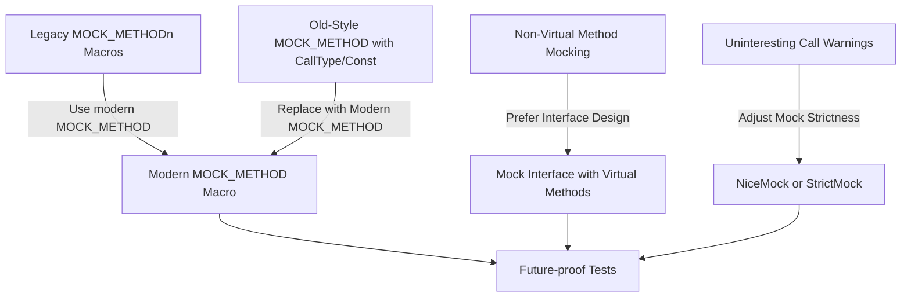

# Deprecation Notices

This page highlights the APIs and features within GoogleMock that have been marked for deprecation, including timelines for their removal and recommended alternatives. It guides you in future-proofing your tests and integrations by making informed choices about which features to continue using and which to replace.

---

## Understanding Deprecation in GoogleMock

Deprecation means that certain APIs or features are scheduled for removal in future releases and should no longer be used. Continuing to use deprecated features can lead to compatibility issues and breakages when upgrading. This page helps you plan migration paths and update your tests gradually.

GoogleMock prioritizes providing clear deprecation notices in its changelogs and documentation to minimize disruption.


## Key Deprecated APIs and Features

### 1. Legacy `MOCK_METHODn` Macros

GoogleMock originally provided a series of macros like `MOCK_METHOD0`, `MOCK_METHOD1`, ..., collectively known as the `MOCK_METHODn` family. These macros have been superseded by the generic `MOCK_METHOD` macro introduced in 2018. 

**Deprecation Details:**
- These macros are still supported but discouraged.
- Future versions may remove them.

**Recommended Action:**
Switch all legacy macros to the modern `MOCK_METHOD` syntax which provides better flexibility, clarity, and support for qualifiers. For example:

```cpp
// Legacy
MOCK_METHOD1(Foo, bool(int));

// Modern
MOCK_METHOD(bool, Foo, (int));
```


### 2. Non-Virtual Method Mocking Approach

Previously, mocking non-virtual methods required special workarounds involving compile-time selection. GoogleMock now recommends using interface-based designs for mocking.

**Deprecation Details:**
- The non-virtual mocking technique is supported but considered an advanced and less recommended pattern.

**Recommended Action:**
Adopt interface-based design patterns; mock interfaces with virtual methods instead of mocking non-virtual concrete classes.


### 3. Old-Style `MOCK_METHOD` Macros with Call Types and Const Qualifiers

Older macro forms include `MOCK_CONST_METHODn`, `MOCK_METHODn_WITH_CALLTYPE`, etc.

**Deprecation Details:**
- Use `MOCK_METHOD` with appropriate specifiers instead.

Example Replacement:

```cpp
// Old macro
MOCK_CONST_METHOD1(Foo, bool(int));

// New style
MOCK_METHOD(bool, Foo, (int), (const));
```


### 4. Uninteresting Call Behavior and Reporting

GoogleMock has default behaviors about what happens when mock methods are called without explicit expectations.

- The current default behavior is "naggy": it allows uninteresting calls but prints warnings.
- You can opt into "nice" mocks to suppress warnings, or "strict" mocks to treat them as errors.

**Note:** This feature may undergo further refinement; be aware of mock strictness settings and update your tests accordingly.


## Scheduled Removal and Timeline

While GoogleMock maintains backward compatibility for deprecated features during transition periods, these are planned to be removed in upcoming major releases.

- **Legacy macros removal:** Planned after more than 2 years of dual support.
- **Non-virtual mocking support:** Will remain supported but discouraged.

Please refer to the detailed release notes and breaking changes documentation for version-specific deadlines and migration timelines.


## Migration and Alternatives

### Moving from Legacy `MOCK_METHODn` Macros

- Convert each use of `MOCK_METHODn` to `MOCK_METHOD` with appropriate parameters and qualifiers.
- Remove reliance on macro suffixes like `_T` or `_WITH_CALLTYPE`.

### Refactoring to Interface-Based Design

- If your code mocks non-virtual concrete classes directly, consider extracting abstract interfaces.
- Mock these interfaces instead to simplify tests and leverage full gMock capabilities.

### Adjusting Mock Behavior Strictness

- Use `NiceMock<T>` to suppress warnings on uninteresting calls when appropriate.
- Use `StrictMock<T>` to enforce stricter testing guarantees.

Example:
```cpp
using ::testing::NiceMock;
NiceMock<MockFoo> mock;
```


## Practical Tips for Future-Proof Testing

- Regularly review release notes and breaking changes pages to keep awareness of upcoming removals.
- Favor modern `MOCK_METHOD` macro usage in new mock classes.
- Prefer interface-driven mocking designs for better test maintainability.
- Manage mock strictness to balance test sensitivity and stability.


## Troubleshooting Deprecation Issues

- If your tests generate warnings about deprecated usage, identify the macros or patterns being used and update them.
- Use compiler diagnostics and GoogleMock verbose flags (e.g., `--gmock_verbose=info`) to trace problematic calls.
- Consult the detailed migration guides for step-by-step instructions.


## Further Reading and Resources

- [Modern `MOCK_METHOD` Usage](docs/gmock_cook_book.md#mock-method-macro)
- [Dealing with Uninteresting Calls and Mock Strictness](docs/gmock_cook_book.md#NiceStrictNaggy)
- [Breaking Changes and Migration Guides](changelog/breaking-changes-and-migrations/breaking-changes)
- [gMock Cookbook](docs/gmock_cook_book.md) for advanced mocking techniques


---

*This page is part of the Breaking Changes & Migration Guides section in the GoogleTest and GoogleMock documentation.*


---

### Related Pages

- [Mocking Reference](docs/reference/mocking.md): Detailed information on mock setup and behaviors.
- [gMock Cookbook](docs/gmock_cook_book.md): Practical recipes and examples for using gMock effectively.
- [Breaking Changes](changelog/breaking-changes-and-migrations/breaking-changes): Detailed info about changes affecting backward compatibility.
- [Migration Guides](changelog/breaking-changes-and-migrations/migration-guides): Step-by-step instructions to upgrade to newer versions.


---

### Summary Diagram: Deprecation Flow



---