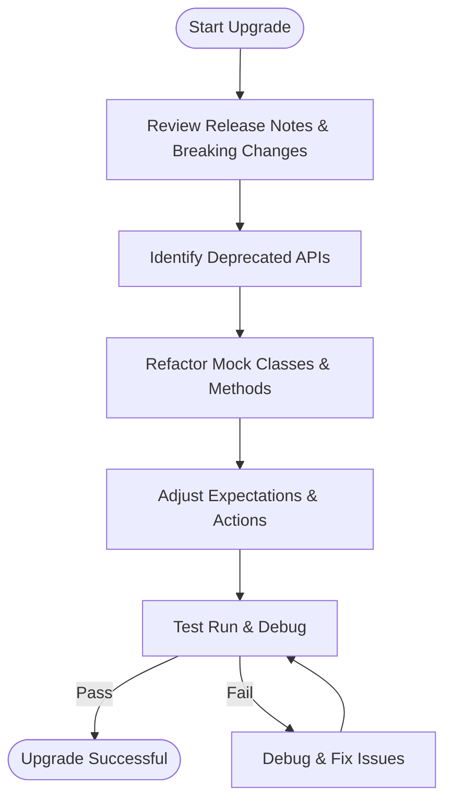

# Upgrade & Migration Guides

GoogleTest and GoogleMock continuously evolve to improve usability, compatibility, and performance. This page provides detailed, step-by-step upgrade guidance for significant releases, helping you adapt your existing test code and mocks smoothly. It maps older usage patterns to new best practices and offers solutions to common migration challenges.

## Why Use Upgrade & Migration Guides?
Upgrading a testing framework can be daunting, especially in large C++ codebases where mocking and testing conventions are deeply entrenched. This guide empowers you to:

- Understand behavioral and API changes impacting your tests
- Learn how to map deprecated features to supported alternatives
- Resolve common issues encountered during migration
- Minimize test breakage and maintenance overhead

By following these instructions, your upgrade will be efficient and low-risk.

## General Approach to Upgrading

### Step 1: Review Release Notes and Breaking Changes
Start by reviewing the release notes of the versions you plan to upgrade through. Pay special attention to any listed breaking changes, deprecated functionality, or new recommended practices for mocks and test structure.

### Step 2: Identify Deprecated or Changed APIs in Your Codebase
Use static analysis or manual review to find uses of APIs or macros that have changed, such as legacy mocking macros or outdated call expectations.

### Step 3: Update Mock Classes and Expectations
Refactor your mock classes to leverage the modern `MOCK_METHOD` macro instead of older variants. Replace deprecated features with supported alternatives as specified below.

### Step 4: Adjust Behavior Verification and Ordering Clauses
When upgrading, ensure your expectations respect any changed default behaviors around invocation ordering, cardinalities, and strictness semantics.

### Step 5: Test Thoroughly and Enable Verbose Mock Logging
Run your test suite with `--gmock_verbose=info` to observe mock calls and verify expectations. Use this to debug mismatches or surprising behavior.

### Step 6: Consult the Cookbook and Cheat Sheet
Leverage the [gMock Cookbook](gmock_cook_book.md) and [Mocking Cheat Sheet](gmock_cheat_sheet.md) for recipes on rewritten or enhanced patterns.

## Mapping Old Usage to New Best Practices

| Legacy Usage or Problem                | Recommended Modern Solution                                       |
|-------------------------------------|------------------------------------------------------------------|
| Using `MOCK_METHODn` macros          | Replace with `MOCK_METHOD` macro with full signature and optional qualifiers. Example:
```cpp
// Old:
MOCK_METHOD1(Foo, bool(int));
// New:
MOCK_METHOD(bool, Foo, (int), (override));
```
|
| Mocking non-virtual methods          | Use the Hi-perf dependency injection technique described in the [MockingNonVirtualMethods](gmock_cook_book.md#MockingNonVirtualMethods) section.
|
| Expectation sticky behavior unexpected| Explicitly call `.RetiresOnSaturation()` to prevent stale expectations from matching future calls.
|
| Expectation ordering confusion       | Use `InSequence` blocks or `Sequence` objects with `.InSequence()` clauses for deterministic call order.
|
| Default actions not matching mocks    | Use `ON_CALL()` to define default behavior; reserve `EXPECT_CALL()` for behavioral verification.
|
| Uninteresting calls generate warnings | Use `NiceMock<T>` to suppress warnings or explicitly define catch-all `EXPECT_CALL(...).Times(AnyNumber())`.
|
| Mock method with multiple actions    | Chain `.WillOnce(...)` calls followed by `.WillRepeatedly(...)` for sequential behaviors.
|
| Using deprecated `MOCK_CONST_METHODn` macros | Refactor to `MOCK_METHOD` with `(const, override)` qualifiers.
|

## Resolving Common Migration Issues

### Problem: Compiler warnings about const parameters on mock methods
**Cause:** Microsoft Visual C++ produces warning C4301 or C4373 due to `const` modifier in parameter declarations.

**Solution:**
Replace parameters declared as `const int i` with just `int i` in both interface and mock class declarations. The top-level `const` has no semantic difference but resolves the compiler issue.

### Problem: Mock method calls trigger unexpected warnings about uninteresting calls

**Cause:** Calls to mock methods without matching `EXPECT_CALL` can generate warnings, though they are permitted.

**Solution:**
- Use `NiceMock` wrapper for mocks to suppress warnings.
- Add explicit permissive expectations with `EXPECT_CALL(mock, Method(_)).Times(AnyNumber());`

### Problem: Tests report duplicated unsatisfied expectation errors

**Cause:** Multiple unsatisfied expectations at different points in execution may produce repetitive output.

**Solution:** This is expected behavior; use the verbose logging feature to pinpoint which expectations failed and when.

### Problem: Incompatibilities with legacy `MOCK_METHODn` macros and new gMock versions

**Cause:** Newer versions encourage use of `MOCK_METHOD` for improved flexibility, different syntax, and qualifiers.

**Solution:** Rapidly migrate all mocks to the new macro:

```cpp
// Before
MOCK_CONST_METHOD1(Foo, bool(int));
// After
MOCK_METHOD(bool, Foo, (int), (const, override));
```

### Problem: Mocked methods with move-only parameters or return types cause compilation failures

**Cause:** Early gMock did not support move-only semantics fully.

**Solution:**
- Upgrade to gMock versions after April 2017 for native support.
- For legacy code, use delegation to non-move mocks as an intermediate solution.

### Problem: Confusing behavior from multiple `EXPECT_CALL` with overlapping matchers

**Cause:** gMock matching order is back-to-front (newer expectations override older)

**Solution:** Order your expectations from most general first to most specific last. Use sequences or combined matchers to organize expectations clearly.

## Practical Tips and Best Practices

- Always place `EXPECT_CALL` *before* calling the mock to avoid undefined behavior.
- When mocking overloaded methods, specify argument types or use `using Base::Method;` to bring overloads into scope.
- Use `ON_CALL` to specify default behaviors shared by multiple tests.
- Use `RetiresOnSaturation()` to retire expectations after they are fulfilled, particularly in loops.
- For legacy mockers, update to the modern macro to improve compiler support and clarity.
- Leverage verbose mocking flags and stack traces for troubleshooting during migration.

## Frequently Referenced Resources

- [gMock for Dummies](gmock_for_dummies.md): Beginner-friendly introduction to mocks, expectations, and usages.
- [gMock Cookbook](gmock_cook_book.md): Recipes for advanced mocking patterns, delegation, custom matchers, and actions.
- [Mocking Cheat Sheet](gmock_cheat_sheet.md): Quick overview of matchers, actions, and cardinalities.
- [Legacy gMock FAQ](docs/gmock_faq.md): Answers to common legacy compatibility questions.

## Troubleshooting Migration

If tests fail after migration:

- Run tests with `--gmock_verbose=info` to trace mock calls.
- Confirm your mock class methods have the correct override qualifiers.
- Check for hidden overloads or missing `using` declarations causing ambiguous calls.
- Verify ordering of `EXPECT_CALL` and actual mock method calls aligns with requirements.
- Make sure to handle new ownership/model semantics for move-only types.

## Summary Diagram of the Upgrade Flow



## Additional Support

For further assistance and community tips, explore:

- [GoogleTest User's Guide](docs/index.md)
- [FAQ: Getting Started & Troubleshooting](faq/getting-started-faq/first-steps-troubleshooting.mdx)
- [Community-Created Documentation](docs/community_created_documentation.md)

For source code, issue tracking, and updates, visit the GitHub repository:

- [googletest on GitHub](https://github.com/google/googletest)

## Call to Action

Consult this guide when planning significant upgrades to GoogleTest and GoogleMock. Follow the outlined steps to ensure smooth migration. Leverage the linked references and community guides to stay current with best practices and new capabilities.

---

*End of Upgrade & Migration Guides*