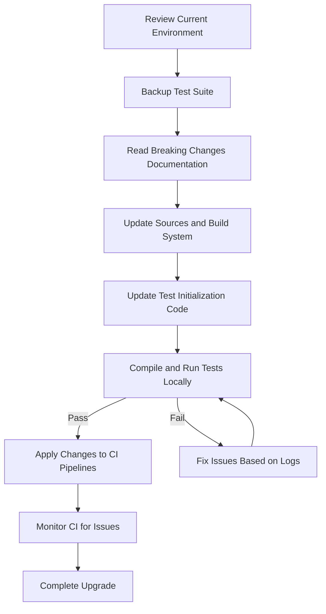

# Migration & Upgrade Guide

This guide provides thorough, step-by-step instructions for upgrading GoogleTest across major versions. It focuses on what users need to know and do to transition smoothly, including handling breaking changes, adapting continuous integration (CI) workflows, complying with updated platform and compiler requirements, and troubleshooting common upgrade issues.

---

## 1. Understanding Major Version Upgrades

Major version upgrades in GoogleTest introduce new features, improvements, and sometimes breaking changes that require action to maintain test suite stability and correctness.

### Key Aspects of Major Upgrades

- **Breaking Changes and Deprecations:** Some APIs and behaviors may change and require migration.
- **Compiler and Platform Requirements:** Newer versions may enforce C++17 or later and updated supported platforms.
- **Continuous Integration Adjustments:** CI scripts and environment configurations may need updates.
- **Test Behavior and Stability:** Tests may expose or require adjustments due to altered default behaviors.

<Tip>
Always review the specific Breaking Changes and Deprecations documentation associated with the version you are upgrading to.
</Tip>

---

## 2. Preparing for the Upgrade

### 2.1 Assessing Your Current Environment

- Verify your current GoogleTest version with `RUN_ALL_TESTS()`. GoogleTest output typically includes your version number.
- Check your compiler version. GoogleTest 1.17.x branches and above require at least C++17.
- Confirm that your build system (CMake, Bazel, or others) supports C++17 or later.

### 2.2 Reviewing Release Notes and Breaking Changes

- Consult the [Breaking Changes & Deprecations](https://github.com/google/googletest/blob/main/docs/changelog/breaking-changes-guidance/breaking-changes.md) page.
- Identify any changes affecting your tests or build system.
- Take note of deprecated macros, renamed functions, or changes in test registration modes.

### 2.3 Backup and Test Snapshots

- Create a stable snapshot or branch of your current tests.
- Run all tests and ensure they pass before upgrading.

---

## 3. Performing the Upgrade

### 3.1 Updating GoogleTest Sources or Packages

- For manual source inclusion, download the latest release from [GoogleTest Releases](https://github.com/google/googletest/releases).
- For package managers (vcpkg, Conan), update the version specification to the target upgrade version.
- For system-wide or CI installations, update Docker images or build scripts accordingly.

### 3.2 Modifying Build System and Compiler Settings

- Ensure that you compile with `-std=c++17` or higher.
- Update CMakeLists.txt or Bazel BUILD files if they specify older standards.

Example (CMake):
```cmake
set(CMAKE_CXX_STANDARD 17)
set(CMAKE_CXX_STANDARD_REQUIRED ON)
```

### 3.3 Adjusting Test Code

#### Registering Tests

- If you used dynamic registration or custom test factories, verify compatibility with new APIs.

#### Flags Initialization

- The `InitGoogleTest()` function now enforces stricter flag parsing rules. It removes recognized flags related to GoogleTest and GoogleMock from `argv`.
- GoogleMock flags are parsed via `InitGoogleMock()` internally when GoogleMock is included.

### 3.4 Updating CI Pipelines

- Modify CI scripts to:
  - Use the upgraded testing framework version.
  - Update compiler toolchains to versions supporting C++17.
  - Ensure environment variables and flags align with new requirements.

<Tip>
Test upgrades first locally before applying changes in CI to prevent cascading failures.
</Tip>

---

## 4. Addressing Breaking Changes

### 4.1 Test Suite and Test Name Restrictions

- Test suite names and test names must conform to updated format restrictions (avoid special characters and reserved keywords).
- Rename any disallowed test suites or tests.

### 4.2 Assertion and Macro Changes

- Some assertion macros are deprecated or changed in behavior; update your code accordingly.

### 4.3 Death Test Naming Rules

- Death tests require unique and valid names; adhere to the latest naming conventions.

### 4.4 Migration Examples

Before:
```cpp
TEST(MySuite, TestCase) { ... }
```

After (if needed for API changes):
```cpp
TEST(MySuite, TestCase) { ... }
```

(Note: Usually no code change is required unless using deprecated features.)

<Tip>
Consult the [Breaking Changes guidance](https://github.com/google/googletest/blob/main/docs/changelog/breaking-changes-guidance/breaking-changes.md) for detailed examples.
</Tip>

---

## 5. Sample Code for Upgrading Initialization

### Before (Older Versions)
```cpp
int main(int argc, char** argv) {
  ::testing::InitGoogleTest(&argc, argv);
  return RUN_ALL_TESTS();
}
```

### After (Current Recommended Approach)
```cpp
#include "gmock/gmock.h"  // Includes GoogleMock and GoogleTest.

int main(int argc, char** argv) {
  ::testing::InitGoogleMock(&argc, argv);  // Initializes both GoogleTest and GoogleMock
  return RUN_ALL_TESTS();
}
```

---

## 6. Platform and Compiler Requirements

- Minimum C++ standard: **C++17**
- Supported platforms: Refer to the [Supported Platforms & Toolchains](https://github.com/google/googletest/blob/main/docs/changelog/support-compatibility/supported-platforms-updates.md)
- Ensure your toolchain supports required compiler flags and language features.

---

## 7. Troubleshooting Common Upgrade Issues

### 7.1 Compilation Errors

- Confirm `-std=c++17` or later compiler flag is set.
- Update any deprecated macros or changed APIs.

### 7.2 Test Discovery Failures

- Confirm that `InitGoogleMock()` or `InitGoogleTest()` is called before `RUN_ALL_TESTS()`.
- Check for improper use of test registration macros.

### 7.3 CI Failures

- Inspect logs for environment mismatches.
- Update Docker images or build environments accordingly.

### 7.4 GoogleMock Flag Parsing Issues

- GoogleMock flags are now removed from `argv` during `InitGoogleMock()`. Ensure your application or test runner can handle the updated `argv` if you parse it manually.

<Warning>
Do not call both `InitGoogleTest()` and `InitGoogleMock()` separately; use `InitGoogleMock()` when using GoogleMock features.
</Warning>

---

## 8. Further Resources

- [Breaking Changes & Deprecations](https://github.com/google/googletest/blob/main/docs/changelog/breaking-changes-guidance/breaking-changes.md)
- [Supported Platforms and Toolchains](https://github.com/google/googletest/blob/main/docs/changelog/support-compatibility/supported-platforms-updates.md)
- [GoogleTest Primer](https://google.github.io/googletest/primer.html)
- [GoogleMock Guide](https://github.com/google/googletest/blob/main/googlemock/README.md)

---

## 9. Summary Diagram: Upgrade Flow Overview



---

This guide ensures your transition between GoogleTest major versions is smooth, minimizing disruptions and maximizing the benefits of the latest framework improvements and standards compliance.

---

_For detailed breaking changes and migration steps for each version, please visit the official GoogleTest changelog and breaking changes documentation._
