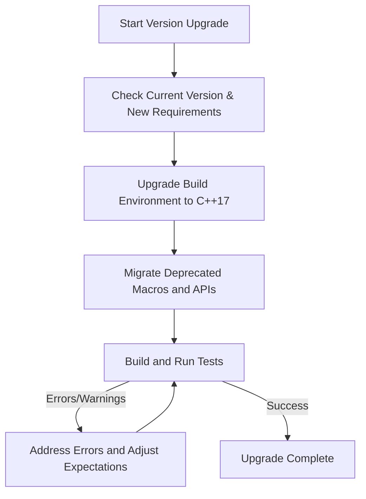

# Migration Guides & Upgrade Tips

Welcome to the Migration Guides & Upgrade Tips page, your dedicated resource to navigating major version upgrades of GoogleTest and GoogleMock. Here, you'll find clear, step-by-step instructions and practical advice to ensure your transition between versions is as smooth and friction-free as possible.

---

## 1. Understanding Version Upgrade Requirements

Upgrading between major GoogleTest versions may involve critical changes including updated C++ standards, changes in dependencies, or modifications in APIs. This section ensures you are fully prepared before initiating an upgrade.

### C++ Standard Requirements

- Since version 1.17.0, GoogleTest requires a minimum of **C++17** support. Verify your compiler and project build settings support this standard.
- Older codebases using earlier standards will need adjustment, such as updating compiler flags, to compile GoogleTest successfully post-upgrade.

### Dependency Updates

- GoogleTest and GoogleMock have aligned dependencies that may have been updated to newer versions.
- Ensure that dependent tools (like Bazel, CMake) and libraries used alongside GoogleTest are compatible with the new versions.

### Build and Integration Adjustments

- Upgrade your build configurations (e.g., CMakeLists, Bazel WORKSPACE/BUILD files) to link against the updated GoogleTest/GoogleMock libraries.
- Adjust to changes in entry points or initialization functions if any, as documented in your release notes.

<Tip>
Always back up your current build configurations and test code before starting an upgrade.
</Tip>

---

## 2. Code Migration Techniques

Major renovations in GoogleMock, especially around the mocking macros and behavioral changes, require careful code updates.

### Migrating from Old MOCK_METHODn Macros

GoogleMock has deprecated the older, count-specific macros such as `MOCK_METHOD0`, `MOCK_CONST_METHOD1`, and so forth. The recommended move is towards the generic, single `MOCK_METHOD` macro.

#### Migration Example:

```cpp
// Old style:
MOCK_METHOD1(Foo, bool(int));
MOCK_CONST_METHOD2(Bar, int(const std::string&, bool));

// New style:
MOCK_METHOD(bool, Foo, (int));
MOCK_METHOD(int, Bar, (const std::string&, bool), (const));
```

- Notice the change in parameter placement and syntax.
- If your code has extensive use of old macros, consider automated refactoring or incremental migration.

### Strictness and Behavior Changes in ON_CALL and EXPECT_CALL

- With updates in strictness behavior (e.g., interactions with `NiceMock`, `StrictMock`), review your use of `ON_CALL` and `EXPECT_CALL`.
- Explicitly set expectations to avoid warnings about "uninteresting calls".

### Handling Overloads and Specifiers

- New macro syntax supports qualifiers like `const`, `noexcept`, `override`, and calling conventions `Calltype(...)` explicitly.
- When mocking overloaded methods, use `using` declarations to expose base class overloads to avoid hiding them unintentionally.

### Dealing with Move-Only Types

- Support for move-only types (like `std::unique_ptr`) in mocked method arguments and return types is now native.
- Past legacy workarounds are no longer needed.

---

## 3. Practical Upgrade Steps

This section provides an actionable, user-centric flow to guide your upgrade process.

<Steps>
<Step title="Review Current GoogleTest Version">
Identify the current version in use and note all areas of GoogleTest/GoogleMock utilized by your tests.
</Step>
<Step title="Consult Release Notes & Migration Guides">
Read the latest release notes and migration guides for breaking changes and deprecated features.
</Step>
<Step title="Update Build Environment">
Upgrade your compiler to support C++17 if required, and adjust build scripts to link against the new GoogleTest libraries.
</Step>
<Step title="Modify Test Code According to Changed Macros">
Replace deprecated MOCK_METHODn macros with the generic MOCK_METHOD. Adjust usage of `ON_CALL` and `EXPECT_CALL` as needed.
</Step>
<Step title="Run Build and Initial Tests">
Build your test suite and run tests. Expect compilation errors from deprecated macros and warnings about uninteresting calls.
</Step>
<Step title="Resolve Errors and Warnings">
Iteratively fix errors by refining mock expectations, adjusting method qualifiers, and updating code to new APIs.
</Step>
<Step title="Leverage New Features and Best Practices">
Adopt improvements such as better support for move-only types and enhanced strictness control for tests’ reliability.
</Step>
</Steps>

---

## 4. Common Pitfalls and Troubleshooting

### Problem: Compilation Fails Due to C++ Standard

- Verify compiler flags include `-std=c++17` or equivalent.
- Ensure your build tools invoke compatible compilers.

### Problem: Unexpected Warnings About Uninteresting Mock Calls

- Use `NiceMock` for mocks where these warnings are undesirable.
- Define expectations explicitly using `EXPECT_CALL`.

### Problem: Deprecated Mock Macros Still in Use

- Replace every old `MOCK_METHODn` macro with `MOCK_METHOD` syntax.
- Use regular expressions or automated refactoring tools to assist.

### Problem: Confusing Behavior When Mocking Overloads

- Add `using BaseClass::MethodName;` in mock classes to unhide all overloads.
- Use matcher wrappers like `Const()` to specify const overloads.

### Problem: Handling Move-Only Types in Mocks

- Use lambda-based actions for mocking methods with move-only parameters or return types.
- Avoid legacy delegation workarounds; update to recent GoogleMock versions.

<Tip>
Refer to the [gMock Cookbook](../gmock_cook_book.md) for concrete examples of mocking patterns and migration help.
</Tip>

---

## 5. References and Additional Resources

- **GoogleTest Release Notes & Version Timeline:** Track all releases to stay updated. [All Releases & Version Timeline](./all-releases)
- **Breaking Changes & Migration Details:** Deep dive into critical changes. [Breaking Changes by Version](./breaking-changes)
- **gMock Cookbook:** Recipe-style guidance on mocking and migration. [gMock Cookbook](../gmock_cook_book.md)
- **Mocking Reference:** Detailed explanation of mocking APIs. [Mocking Reference](../reference/mocking.html)
- **GoogleTest FAQ:** Frequently asked questions on usage and troubleshooting. [GoogleTest FAQ](../faq.md)
- **Community Resources:** Discover user created docs and tips. [Community Documentation](../community_created_documentation.html)

---

## 6. Quick Summary Diagram



---

## 7. Closing Recommendations

Upgrading GoogleTest and GoogleMock is an important step to keep your testing environment modern, performant, and compatible with C++17 standards and best practices. Follow the outlined guides, perform incremental migrations, and verify your tests thoroughly after each step. Engage with community forums or official issue trackers if you encounter unresolved issues.

By proactively adopting new mocking syntax and test control strategies, you improve test maintainability and reliability long term.

Happy testing and smooth upgrading!

---