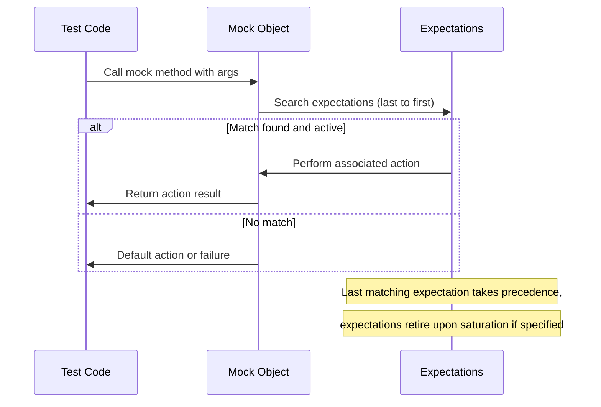

# Breaking Changes

This page provides a clear and concise catalog of all breaking API or behavioral changes introduced in GoogleMock releases. It focuses on changes that may impact your existing test code, including removals of features, incompatible parameter or interface updates, and discontinued platform support. Detailed migration instructions and advice are linked wherever applicable to guide you through upgrades smoothly.

---

## 1. Overview of Breaking Changes

Breaking changes are modifications in the GoogleMock API or behavior that require users to update their test code or test environments. These changes cannot be automatically adapted to and may cause compile errors or runtime test failures if unaddressed.

This page documents such changes in reverse chronological order, emphasizing:

- **Removals:** Deprecated or obsolete features and APIs that have been fully removed.
- **Incompatible Changes:** Modifications in function signatures, behaviors, or expectations that break backward compatibility.
- **Platform Support:** Discontinued platform or compiler support that may affect compilation or execution.

Users should consult the associated migration sections to understand how to fix or adapt their code accordingly.

---

## 2. Recent Breaking Changes

### 2.1. C++17 Language Standard Enforcement

- **Change:** GoogleMock now requires a minimum of **C++17** for both compilation and usage. Older C++ standards are no longer supported.
- **Impact:** Test suites compiled with prior C++ standards must be upgraded to C++17 or later.
- **Migration:** Update your build systems (CMake, Bazel, etc.) to use C++17 or newer. This aligns with modern best practices and unlocks language features beneficial for mocking and testing.

### 2.2. Unified GoogleTest and GoogleMock Repository

- **Change:** GoogleTest and GoogleMock have been merged into a single consolidated repository.
- **Impact:** Build configurations and dependencies referencing separate repos must be updated.
- **Migration:** Migrate to use the unified repository, updating `git` URLs and build target dependencies as per new instructions in [Setup and Installation](https://github.com/google/googletest/blob/main/readme.md#using-googletest).

### 2.3. Revision of `MOCK_METHOD` Macro and Signature Requirements

- **Change:** The `MOCK_METHOD` macro now strictly enforces the correct syntax and modifiers.
  - Return types or argument types containing commas must be parenthesized.
  - Only valid specifiers (`const`, `override`, `noexcept`, `Calltype()`, `ref()`) are accepted.
- **Impact:** Some previously compiling mocks may fail due to stricter checks.
- **Migration:**
  - Wrap any return or argument type with unprotected commas in parentheses.
  - Remove incorrect or unsupported specifiers from the fourth macro parameter.
  - Refer to the [Defining Mocks](../api-reference/mocking-framework/defining-mocks.md#MOCK_METHOD) for detailed syntax.

### 2.4. Changes in Default Verbosity and Logging Behavior

- **Change:** The default verbosity level for `--gmock_verbose` has changed to `warning`.
- **Impact:** Existing tests that relied on a different verbosity level may see more or fewer log messages.
- **Migration:** Adjust verbosity level flags as needed in your test invocation or code to control the amount of mock call tracing or warnings.

### 2.5. Behavior of `EXPECT_CALL` and Search Order of Expectations

- **Change:** Expectation matching now strictly follows the rule that the **last matching expectation overrides earlier ones**.
- **Impact:** Previously, if expectations were written in a certain order, the mocking behavior might differ; now the latest takes precedence.
- **Migration:** Reorder `EXPECT_CALL` statements such that more specific expectations come after general ones.
  - Prefer sequences or chaining `WillOnce()` to express ordered or multiple outcomes clearly.
  - For example, instead of:
  ```cpp
  EXPECT_CALL(foo, Bar()).WillOnce(Return(2)).RetiresOnSaturation();
  EXPECT_CALL(foo, Bar()).WillOnce(Return(1)).RetiresOnSaturation();
  ```
  Use:
  ```cpp
  {
    InSequence s;
    EXPECT_CALL(foo, Bar()).WillOnce(Return(1)).RetiresOnSaturation();
    EXPECT_CALL(foo, Bar()).WillOnce(Return(2)).RetiresOnSaturation();
  }
  ```

### 2.6. Removal of Old-Style `MOCK_METHODn` Macros

- **Change:** The legacy `MOCK_METHODn` and `MOCK_CONST_METHODn` macros are deprecated and removed in the latest major versions.
- **Impact:** Codebases still using these old macros will fail to compile.
- **Migration:** Update to use the modern `MOCK_METHOD` macro with the signature-based parameters as described in [Defining Mocks](../api-reference/mocking-framework/defining-mocks.md).

### 2.7. Strictness Wrappers and Uninteresting Calls

- **Change:** Introduction and standardization around strictness wrapper classes, e.g., `NiceMock`, `NaggyMock`, and `StrictMock`.
- **Impact:** Behavior of uninteresting calls is now configurable, which may affect legacy test results.
- **Migration:** Adopt `NiceMock` or `StrictMock` per test needs to control warnings versus failures on uninteresting calls. See [Strictness & Mock Behavior Modifiers](../api-reference/mocking-framework/strictness-and-behavior-modifiers.md).

### 2.8. `ON_CALL` and `EXPECT_CALL` Decoupling

- **Change:** `ON_CALL` is purely for setting default behavior and does not suppress warnings about unexpected calls unless accompanied by `EXPECT_CALL`.
- **Impact:** Tests relying on `ON_CALL` suppressing warnings need adjustments.
- **Migration:** To suppress warnings, add explicit catch-all `EXPECT_CALL(...).Times(AnyNumber())` statements.

### 2.9. Platform and Compiler Support Changes

- **Dropped:** Support for Visual C++ versions earlier than 2015.
- **Dropped:** Some mobile and embedded platforms lacking requisite OS features.
- **Migration:** Upgrade your development environment to supported compiler versions and platforms as per the [Supported Platforms](../overview/features-and-getting-started/supported-platforms-and-integrations.md) documentation.

---

## 3. Migration Guidance

For each breaking change, GoogleMock provides migration advice and examples. Some key suggestions:

### 3.1. Code Syntax and Signature Adjustments

- Parenthesize complicated types in `MOCK_METHOD`.
- Remove invalid specifiers.
- Use modern `MOCK_METHOD` syntax instead of legacy macros.

### 3.2. Expectation Ordering

- Place more specific expectations after general ones.
- Use `InSequence` to enforce call ordering.
- Use `.RetiresOnSaturation()` to mark expectations as retired after saturation when needed.

### 3.3. Managing Verbosity and Logs

- Modify `--gmock_verbose` as `info`, `warning`, or `error` to control output.
- Use `NiceMock` or `StrictMock` for controlling handling of uninteresting calls.

### 3.4. Environment Upgrades

- Upgrade compiler to at least Visual C++ 2015 or Clang/GCC with C++17 support.
- Review build integration to align with the unified GoogleTest/GoogleMock repository.

---

## 4. References and Next Steps

- [Defining Mocks](../api-reference/mocking-framework/defining-mocks.md) — for syntax and macro usage updates.
- [Setting Expectations](../api-reference/mocking-framework/setting-expectations.md) — for changes in expectation semantics.
- [Strictness & Mock Behavior Modifiers](../api-reference/mocking-framework/strictness-and-behavior-modifiers.md) — to control warnings and errors on uninteresting calls.
- [Supported Platforms](../overview/features-and-getting-started/supported-platforms-and-integrations.md) — for environment requirements.
- [gMock Cookbook](../docs/gmock_cook_book.md) — practical recipes, including handling new macros and patterns.
- GoogleMock [Release Notes](https://github.com/google/googletest/releases) on GitHub for version-specific changes and migration guides.

---

## 5. Troubleshooting Common Breaking Change Issues

<Tip>
If after upgrading your tests fail to compile due to `MOCK_METHOD` syntax errors or warnings related to virtual methods, please carefully check all your mock class definitions for:

- Unparenthesized types with commas.
- Deprecated macro usage.
- Use of invalid specifiers in mock method declarations.

Correcting these will resolve most common compilation issues.
</Tip>

<Tip>
Unexpected test failures related to mock expectations often result from improper ordering of `EXPECT_CALL`s or misunderstanding of default actions. Use `InSequence` and `.RetiresOnSaturation()` clauses to more precisely control the expectation lifecycle.
</Tip>

<Note>
Run your tests with `--gmock_verbose=info` to trace mock function call matching and gain insights on how expectations are evaluated and why some expectations may not be satisfied.
</Note>

---

## 6. Summary Diagram of Expectation Matching Behavior



This diagram emphasizes the reverse-order search and sticky nature of expectations, which are fundamental to understanding breaking changes related to `EXPECT_CALL` semantics.

---

## 7. Contact and Support

For further assistance:

- Consult the [GoogleMock FAQ](../faq/core-questions/usage-common-issues.md) for common problems.
- Join community discussions and developer forums linked from the main GoogleTest repository.
- File issues or seek help on GitHub: https://github.com/google/googletest/issues

---

_All breaking changes are committed with explicit commit messages referencing migration notes. Always review release notes carefully before upgrading._

<Source url="https://github.com/google/googletest" branch="main" paths={[{"path": "docs/breaking-changes.md", "range": "1-100"}]} />
