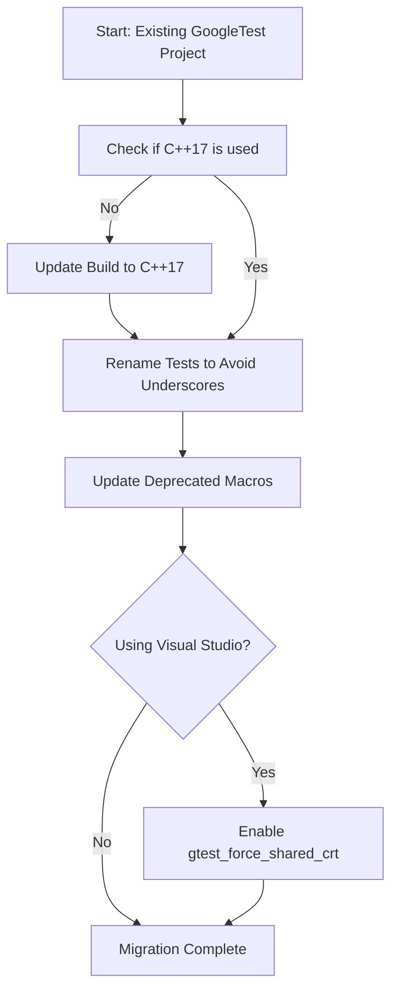

# Deprecation Notices & Removals

GoogleTest continuously evolves to provide a robust and modern testing experience. As part of its commitment to maintainability and leveraging contemporary C++ standards, some features and behaviors have been deprecated or scheduled for removal. This page guides you through these changes, offering advanced warnings, migration strategies, and alternative approaches to keep your test codebase current and functional.

---

## Overview of Deprecations

GoogleTest has deprecated several features to align with modern best practices and to prepare for future major releases. These include:

- **Minimum C++ Standard**: C++17 is now the minimum required standard, deprecating support for earlier standards.
- **Underscore Usage in Test Names**: Use of underscores (`_`) in test suite and test names is strongly discouraged.
- **Macro Aliases**: Older macros or macro styles that conflict with new recommended patterns are marked for removal.
- **Visual Studio Runtime Linking**: The default static linkage of C runtime in GoogleTest may cause conflicts with user projects linking dynamically. Recommended options and flags mitigate this.

As these changes may impact existing test suites, GoogleTest provides guidance and tooling to ease transition.

## Deprecated Features and Planned Removal Timeline

### 1. C++ Standard Version Enforcement

- Starting with the current release, GoogleTest requires compilation under C++17 or above.
- Attempts to build with C++14 or earlier will produce warnings or errors.
- This change enables usage of modern language features, improved safety, and compatibility.

**Migration Tip:**

Update your build system to ensure the compiler flag for C++17 (e.g., `-std=c++17` or equivalent) is set. For CMake, add:

```cmake
set(CMAKE_CXX_STANDARD 17)
set(CMAKE_CXX_STANDARD_REQUIRED ON)
```

### 2. Test and Test Suite Naming Restrictions

GoogleTest has deprecated the practice of using underscores (`_`) in test suite and test names.

- Underscores cause internal naming collisions, especially with macros like `DISABLED_`.
- The restriction disallows underscores at the beginning or end, and encourages avoidance entirely.

**Why?**

GoogleTest generates internal class names for tests based on these names; underscores can cause hidden conflicts or reserved identifier violations.

**Migration Tip:**

Rename your test suites and tests to avoid underscores, using camel case or Pascal case naming styles instead.

### 3. Macro Usage Changes

Certain older macros have been marked deprecated. Users are encouraged to:

- Use the **newer** `EXPECT_*`, `ASSERT_*`, and GoogleMock `MOCK_METHOD` macros.
- Avoid macros with ambiguous or legacy names.

### 4. Visual Studio Runtime Library Linking

- GoogleTest by default links against the static C runtime library.
- This can conflict with projects that link dynamically, causing linker errors.
- The `gtest_force_shared_crt` CMake option allows aligning runtime linkage.

**Migration Tip:**

When using Visual Studio, enable the `gtest_force_shared_crt` option during configuration:

```bash
cmake .. -Dgtest_force_shared_crt=ON
```

This tells GoogleTest to link against the dynamic runtime library, matching most Visual Studio projects.

## Migration Strategies

### Upgrading to C++17

- Modify build configurations to specify C++17 support.
- Verify that any dependency or embedded test code compiles under C++17.
- Test your build and run your tests to confirm compatibility.

### Renaming Tests and Suites

- Systematically rename test suites and test cases to remove underscores.
- For example, change `TEST(My_Suite, My_Test)` to `TEST(MySuite, MyTest)`.
- Review existing test filters and `--gtest_filter` usages to update names accordingly.

### Using Supported Macros

- Replace deprecated macro calls with current recommended macros.
- Consult GoogleTest documentation on assertions and test registration for updated usage patterns.

### Aligning Runtime Libraries

- Configure GoogleTest build options, especially on Windows, to match your application's runtime library usage.
- This prevents linkage conflicts and runtime mismatches.

## Warnings and Usage Notes

<Warning>
Failing to adapt to the deprecations may result in compilation errors, unexpected runtime behavior, or subtle test failures in future releases of GoogleTest.

Always heed compiler and build warnings related to these changes and test your code thoroughly.
</Warning>

<Note>
You may continue using deprecated features temporarily; however, they will be removed in upcoming major releases. It is highly recommended to transition proactively.
</Note>

## Troubleshooting Common Migration Issues

- **Compiler Errors About C++ Standard**: Ensure your build system properly applies C++17 flags.
- **Linker Errors on Windows**: Check runtime library consistency; use `gtest_force_shared_crt` to fix mismatches.
- **Test Names Colliding or Causing Compilation Issues**: Rename test suites and test names to avoid underscores.
- **Unexpected Test Failures After Updating Macros**: Verify that new macros are used with appropriate semantics and expressions.

## Useful References and Links

- [GoogleTest Primer](https://github.com/google/googletest/blob/main/docs/primer.md) — Foundation for writing tests
- [Advanced GoogleTest Topics](https://github.com/google/googletest/blob/main/docs/advanced.md) — Details on assertions and test patterns
- [GoogleTest FAQ: Naming Conventions](https://github.com/google/googletest/blob/main/docs/faq.md#why-should-test-suite-names-and-test-names-not-contain-underscore) — Explains underscore restrictions
- [Build with CMake](https://github.com/google/googletest/blob/main/googletest/README.md#build-with-cmake) — Configuring builds including runtime linkage
- [Breaking Changes](https://github.com/google/googletest/blob/main/docs/changelog/breaking-changes.md) — Overview of all incompatible changes

## Summary

Deprecations and removals in GoogleTest promote modern C++ usage, improve build reliability, and ensure clarity in tests. Users must upgrade to C++17, avoid underscores in test naming, update deprecated macros, and properly configure runtime linkage—especially on Windows. Early migration ensures smooth updates and continued support.


---

<AccordionGroup title="Common Migration Questions">
<Accordion title="Why enforce C++17 requirement?">
GoogleTest leverages modern C++17 features for better safety, performance, and maintainability. Older standards lack these benefits and complicate support.
</Accordion>
<Accordion title="How do I find tests using underscores?">
Search your codebase for `TEST(` and `TEST_F(` macros and review suite and test names containing `_`. Refactor them to camel case or Pascal case.
</Accordion>
<Accordion title="What if I have tests both with and without underscores?">
Rename all test suites and test names to a consistent naming style without underscores. Update filters and scripts accordingly.
</Accordion>
<Accordion title="How to handle Visual Studio CRT mismatch errors?">
Enable the `gtest_force_shared_crt` CMake option for GoogleTest to ensure it uses the same runtime linkage as your project.
</Accordion>
<Accordion title="Are all deprecated macros removed immediately?">
No. Deprecated features are slated for future removal, with warnings provided to give you time to migrate.
</Accordion>
</AccordionGroup>

## Sample CMake snippet for Visual Studio linkage alignment

```cmake
# Enable dynamic CRT linkage for GoogleTest to match project
set(gtest_force_shared_crt ON CACHE BOOL "Use shared runtime for GoogleTest")
add_subdirectory(googletest)

add_executable(my_tests test1.cpp test2.cpp)
target_link_libraries(my_tests GTest::gtest_main)
```

## Summary Diagram: Deprecation & Migration Flow



---

For assistance and more information, consult the [GoogleTest Primer](https://github.com/google/googletest/blob/main/docs/primer.md) and related guides on upgrading and breaking changes.


---