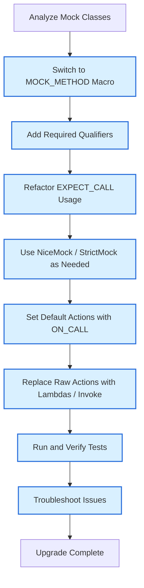

# Upgrade Guides & Migration Paths

This guide provides step-by-step instructions and best practices to help users upgrade from older versions of GoogleTest and GoogleMock to the latest releases with minimal disruption. It includes practical examples, code transformations, and references necessary for a smooth migration.

---

## 1. Preparing to Upgrade

Before starting the migration, ensure you have:

- A clean and stable baseline of your current tests and builds.
- Access to the latest GoogleTest and GoogleMock sources and documentation.
- Familiarity with your current version's features and any known customizations.

It is highly recommended to read the current release notes and deprecation notices for context on changes and removed features.

<Check>
Always back up your test source code and build configuration before applying any upgrades.
</Check>

---

## 2. Key Areas of Change

Upgrading GoogleMock and GoogleTest typically affects the following areas of your test code and build setup:

### 2.1 Mock Class Definitions

- Transition from old `MOCK_METHODn` macros to the new, unified `MOCK_METHOD` macro.
- Adjustments for new qualifier syntax, including `const`, `override`, `noexcept`, and `Calltype()` usage.

#### Sample Transformation

**Before:**
```cpp
MOCK_CONST_METHOD1(Foo, bool(int));
MOCK_METHOD2(Bar, int(int, double));
```

**After:**
```cpp
MOCK_METHOD(bool, Foo, (int), (const, override));
MOCK_METHOD(int, Bar, (int, double), (override));
```

### 2.2 Expectation Specification

- Explicit use of `.Times()` alongside `WillOnce()` and `WillRepeatedly()` clauses, as default inference rules remain but benefit from clarity.
- Recommended usage of `.RetiresOnSaturation()` to make expectations non-sticky when appropriate.

### 2.3 Using Specialized Mock Classes

- Decide on using `NiceMock<>`, `NaggyMock<>`, or `StrictMock<>` wrappers for controlling uninteresting call warnings and failures.

### 2.4 Actions and Matchers

- Adopt newer action suggestions such as lambdas and `Invoke()` over raw function pointers.
- Prefer modern polymorphic and monomorphic matcher patterns for custom matchers.

### 2.5 Threading and Concurrency

- Review multi-threaded test setups to comply with new thread-safety guarantees.

---

## 3. Code Upgrade Workflow

Follow this workflow for an efficient upgrade:

<Steps>
<Step title="Analyze Current Mock Definitions">
Review your existing mock classes and note usages of old macros such as `MOCK_METHODn`, `MOCK_CONST_METHODn`, and adjust to the new `MOCK_METHOD` syntax.
</Step>
<Step title="Update MOCK_METHOD Usage">
Change all legacy macros to the unified `MOCK_METHOD` macro, ensuring proper parentheses around argument types when commas are involved.
</Step>
<Step title="Review QUALIFIERS in MOCK_METHOD">
Add necessary qualifiers such as `(const, override)` where appropriate to match the virtual function signatures.
</Step>
<Step title="Refactor EXPECT_CALL and ON_CALL Usage">
Clarify expectation counts with `Times()` clauses and use `WillOnce()`/`WillRepeatedly()` consistently. Add `.RetiresOnSaturation()` to make expectations non-sticky if desired.
</Step>
<Step title="Adopt Specialized Mock Wrappers (Optional) ">
Where suitable, wrap mocks in `NiceMock` or `StrictMock` to control verbosity and strictness of uninteresting call handling.
</Step>
<Step title="Verify Default Return Values and Actions">
Set default return values with `DefaultValue<T>::Set()` or customize default mock behavior with `ON_CALL`.
</Step>
<Step title="Update Actions to Use Lambdas and Invoke">
Replace raw function pointers in `WillOnce()` and `WillRepeatedly()` by lambdas or calls to `Invoke` for clearer, modern syntax.
</Step>
<Step title="Test and Validate Upgraded Code">
Run your test suite, verify all expectations, adjust as needed, and utilize `--gmock_verbose=info` for debugging.
</Step>
</Steps>

---

## 4. Examples of Code Upgrades

### 4.1 Upgrading MOCK_METHOD

Old style:
```cpp
class MockFoo {
 public:
  MOCK_METHOD1(FooMethod, bool(int arg));
  MOCK_CONST_METHOD0(BarMethod, int());
};
```

New style:
```cpp
class MockFoo {
 public:
  MOCK_METHOD(bool, FooMethod, (int arg), (override));
  MOCK_METHOD(int, BarMethod, (), (const, override));
};
```

### 4.2 Replacing Raw Actions with Lambdas

Old style:
```cpp
EXPECT_CALL(mock, GetValue())
    .WillOnce(Return(42));

EXPECT_CALL(mock, Compute(_))
    .WillOnce(Invoke(&MyComputeFunction));
```

New style with lambdas:
```cpp
EXPECT_CALL(mock, GetValue())
    .WillOnce([]() { return 42; });

EXPECT_CALL(mock, Compute(_))
    .WillOnce([](int x) { return MyComputeFunction(x); });
```

### 4.3 Setting Default Actions

```cpp
ON_CALL(mock, GetName())
    .WillByDefault(Return("DefaultName"));
```

### 4.4 Using NiceMock and StrictMock

```cpp
using ::testing::NiceMock;
using ::testing::StrictMock;

NiceMock<MockFoo> nice_mock;
StrictMock<MockFoo> strict_mock;
```

---

## 5. Deprecated Features & Removal Notice

Pay attention to the following deprecated features that are removed or scheduled for removal:

- Legacy `MOCK_METHODn` macros (migrate to `MOCK_METHOD`).
- Use of `MOCK_METHOD` without proper qualifiers in overriding virtual methods.
- Relying on implicit `Times()` inference without explicit behavior could lead to brittle or confusing tests; prefer explicit `Times()`.

Please consult the [Deprecation Notices and Future Removals page](/changelog/breaking-changes-upgrade/deprecation-notices) for detailed timelines and alternatives.

---

## 6. Troubleshooting Tips

### 6.1 Unexpected Failures After Upgrade

- Verify all mock methods have matching qualifiers and exact signatures.
- Use `--gmock_verbose=info` to observe mock call matching and trace failures.
- Check for missing `override` keywords on mock methods to catch accidental signature mismatches.

### 6.2 Compilation Errors Due to `MOCK_METHOD`

- Ensure all argument types containing commas are enclosed in extra parentheses or aliased.
- Confirm appropriate use of qualifiers such as `(const, override)`, `(noexcept)`, or `(Calltype(...))`.

### 6.3 Linker Errors

- Verify your build is linking against the correct and up-to-date GoogleMock and GoogleTest libraries.
- Check if mock class constructors and destructors are defined appropriately to speed up compilation and reduce linker problems.

---

## 7. Additional Resources

- [Mock Class Definition Reference](/api-reference/mocking-framework/mock-class-definition)
- [Mocking Reference](/docs/reference/mocking.md)
- [gMock Cookbook](/docs/gmock_cook_book.md)
- [Legacy gMock FAQ](/docs/gmock_faq.md)
- [Deprecation Notices and Future Removals](/changelog/breaking-changes-upgrade/deprecation-notices)

---

## 8. Summary Diagram



---

<Note>
For personalized assistance during migration, consult community forums or contact GoogleTest maintainers via the GitHub repository.
</Note>

---