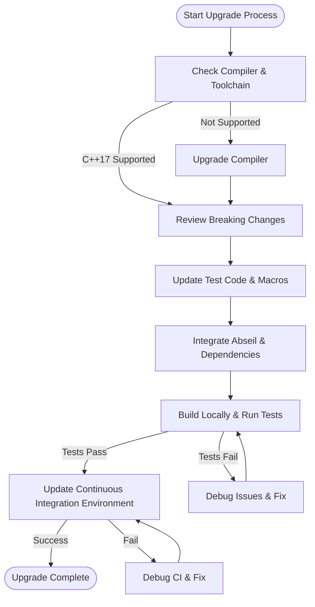

# Upgrade Guides & Migration Paths

Upgrade Guides & Migration Paths provide you with clear, practical instructions to smoothly transition your existing GoogleTest setup to newer versions. This guide focuses on step-by-step instructions for upgrading between major and minor releases, special integration notes for new dependencies like Abseil, and ensuring compatibility within your continuous integration (CI) environments and existing projects.

---

## 1. Upgrading Between Major Versions

Major releases often introduce fundamental changes including new compiler requirements, broken compatibility, or significant API redesigns. Follow these steps to upgrade successfully:

### Step 1: Prepare Your Environment
- Ensure your compiler supports **C++17 or newer**. The latest GoogleTest releases require C++17 as a minimum standard.
- Update your build tools, such as CMake, to a recent version (CMake 3.14+ is recommended).

### Step 2: Review Breaking Changes
- Consult the [Breaking Changes & Deprecations](https://github.com/google/googletest/blob/main/docs/changelog/breaking-changes-upgrades/breaking-changes.md) to identify any incompatible API changes.
- Update your test code accordingly, especially if you use deprecated macros or patterns.

### Step 3: Integrate New Dependencies
- Newer versions plan to depend on [Abseil](https://github.com/abseil/abseil-cpp). Prepare your project by incorporating Abseil as a dependency.
  - Use a compatible version of Abseil.
  - Adjust include paths and linker settings.

### Step 4: Rebuild and Run Tests
- Clean your build environment to avoid stale artifacts.
- Rebuild GoogleTest and your tests with the updated settings.
- Run all tests to verify behavior remains consistent.

### Step 5: Update CI Pipelines
- Modify your CI scripts to use the updated compiler and build configuration.
- Ensure your CI environment has the required C++17 toolchain and dependencies.
- Add additional CI steps if your tests depend on new environment variables or flags.

<Callout>
<Tip>
Always keep a backup of working configurations before beginning the upgrade so you can quickly roll back if needed.
</Tip>
</Callout>

---

## 2. Upgrading Between Minor Versions

Minor releases typically introduce bug fixes, minor features, and improvements without breaking API compatibility.

### Step 1: Review Release Notes
- Check the [Release 1.17.0 Notes](https://github.com/google/googletest/releases/tag/v1.17.0) and other minor versions' release logs for relevant changes.

### Step 2: Evaluate Dependency Updates
- Confirm if your project or CI requires updates to dependencies such as Abseil or system libraries.

### Step 3: Test Locally
- Perform local builds and run your tests.
- Address any new warnings or build issues.

### Step 4: CI Verification
- After local validation, push changes to your CI environment and monitor results.

<Callout>
<Note>
Minor releases should not require changes to test source code unless new features are being integrated.
</Note>
</Callout>

---

## 3. Special Notes for Abseil Integration

GoogleTest's planned transition to use Abseil introduces changes that affect your build system and runtime environment.

### How to Prepare:
- Include Abseil headers and link against Abseil libraries as part of your test target dependencies.
- If using CMake, use `FetchContent` or external project commands to fetch Abseil.
- Adjust include directories to accommodate Abseil's layout.
- Be aware of any namespace or macro conflicts Abseil might introduce and resolve them proactively.

### Troubleshooting Tips:
- If you experience build errors related to Abseil symbols, verify the Abseil version compatibility.
- Ensure that your linker order includes Abseil before GoogleTest.

<Callout>
<Warning>
Abseil integration is still upcoming; consult official release notes frequently to avoid incompatibility surprises.
</Warning>
</Callout>

---

## 4. Ensuring Compatibility with Continuous Integration

Keeping your CI pipelines aligned with your upgraded GoogleTest setup is crucial.

### Recommendations:
- Upgrade your CI environment's compiler and build tools to support C++17.
- Cache dependencies such as Abseil to improve build times.
- Use GoogleTest’s '--gtest_list_tests' and filtering flags to control test selection in CI.
- Implement sharding or parallel test execution for performance optimization, referring to [Performance Optimization & Scalability](https://github.com/google/googletest/blob/main/docs/guides/integration-optimization/performance-optimization.md).
- Monitor the CI logs carefully for new test failures caused by dependency or environment changes.

<Callout>
<Tip>
Automated tests in CI should reflect your local test behavior—ensure you invoke the upgraded GoogleTest binary with the same parameters.
</Tip>
</Callout>

---

## 5. Practical Troubleshooting Tips

### Common Migration Issues and Solutions

| Issue                            | Explanation                             | Resolution                               |
|-------------------------------|-------------------------------------|----------------------------------------|
| Tests Not Discovered           | Incorrect flags or outdated macros used | Verify test macro usage; replace deprecated macros with current ones (e.g., `TEST` instead of old variants) |
| Build Failures Due to Compiler | Compiler lacks C++17 support or missing headers | Upgrade your compiler; confirm C++17 compliance |
| Linker Errors on Abseil Symbols | Abseil not linked or linked out of order | Add Abseil to linker flags before GoogleTest |
| Runtime Failures on Death Tests | Mismatch of death test styles or environment configuration | Confirm `--gtest_death_test_style` flag; check platform-specific guidelines |
| CI Failures with No Local Issues | Differences in environment, toolchain, or dependencies | Synchronize local and CI environments; replicate CI build locally for debugging |

### Validation Checklist
- Confirm GoogleTest version meets your project requirements.
- Validate that all test suites compile and link without warnings or errors.
- Run tests with verbose logging enabled to scrutinize unexpected behavior.
- Follow the user-centric documentation to adapt test code for any API changes.

---

## 6. Helpful Resources

- [GoogleTest User's Guide](https://google.github.io/googletest/)
- [Breaking Changes & Deprecations](https://github.com/google/googletest/blob/main/docs/changelog/breaking-changes-upgrades/breaking-changes.md)
- [Release Notes and Changelog](https://github.com/google/googletest/releases)
- [Abseil C++ Library](https://abseil.io/)
- [GoogleTest Primer](https://google.github.io/googletest/primer.html)
- [Continuous Integration Setup Guide](https://github.com/google/googletest/blob/main/docs/guides/integration-optimization/continuous-integration-setup.md)

---

This migration guide equips you with a structured path and practical considerations to ensure your transition between GoogleTest versions is smooth, efficient, and reliable.

---

# Diagram: Simplified Migration Flow

---