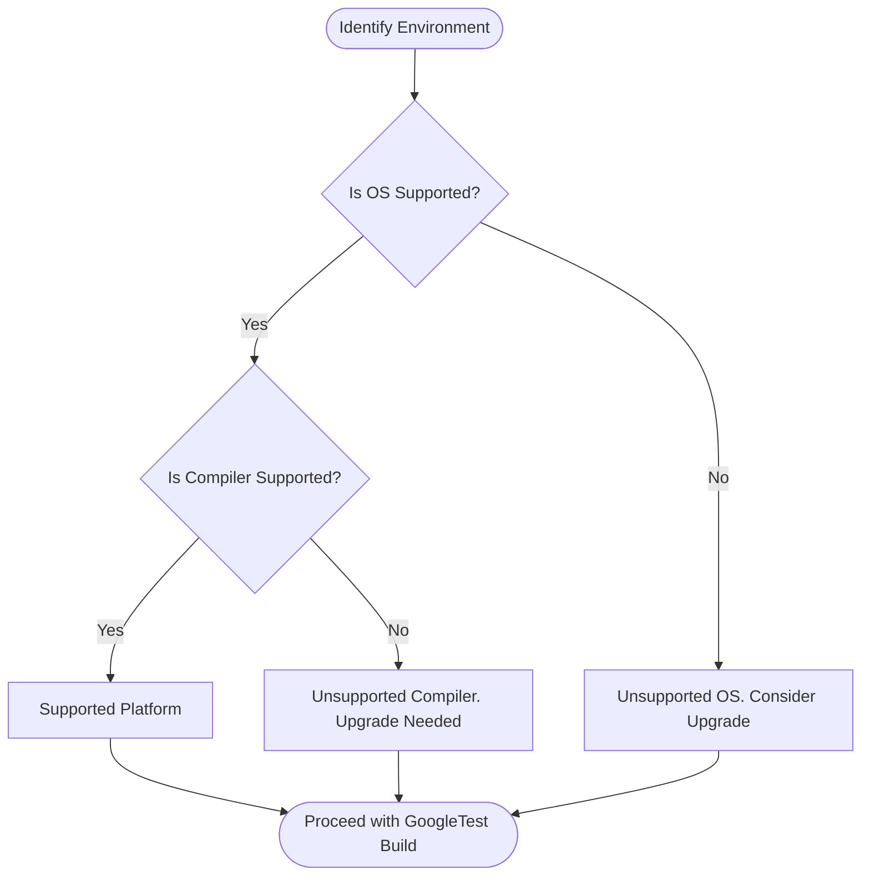

# Supported Platforms & Compatibility Matrix

GoogleTest maintains a detailed compatibility matrix that informs users of the officially supported platforms, compilers, and configurations across current and previous releases. This page serves as a crucial reference point to help you determine when to upgrade your build environments or anticipate changes in compatibility policies.

---

## Purpose and User Value

Keeping your build infrastructure aligned with GoogleTest's officially supported environments ensures smooth integration, reliable test execution, and mitigates unexpected failures due to incompatibilities. This matrix empowers you to plan upgrades proactively and adapt your development setups according to the tested and validated platform combinations.

## How to Use This Compatibility Matrix

- **Identify your platform and compiler versions**: Locate your OS, architecture, and compiler in the matrix.
- **Check support status for your GoogleTest version**: Cross-reference your installed version of GoogleTest with your environment.
- **Plan upgrades accordingly**: If your current platform/compiler is deprecated in an upcoming release, schedule updates to avoid build or runtime issues.

## Coverage

The matrix covers the following aspects:

- Operating systems (including version ranges)
- Compiler versions and vendors
- Supported CPU architectures
- Compatibility with threading and filesystem capabilities
- Cross-references to the applicable GoogleTest release versions

## Best Practices

- **Always target a supported platform and compiler combination** to ensure you receive official support and stability guarantees.
- **Regularly review compatibility updates** after each GoogleTest release to stay ahead of deprecations and new support announcements.
- **Use the matrix as a guide, not an exhaustive guarantee**; verify your development environment settings against the matrix before upgrading.

## Common Pitfalls

- Relying on unofficial or older platforms may lead to build failures or subtle runtime defects.
- Ignoring compiler version constraints might result in unsupported behavior or poorer diagnostics.
- Neglecting to update your build infrastructure prior to major GoogleTest releases can cause integration difficulties.

## Example User Scenario

Imagine you are maintaining a CI pipeline running GoogleTest on Ubuntu 18.04 with GCC 7.3. According to this compatibility matrix, if a new GoogleTest release drops support for GCC 7.3, you will be notified to update your compiler or OS version to continue receiving verified support. This forewarning helps you avoid unexpected breaks in your automated testing.

## Related Resources

- [System Requirements & Supported Platforms](https://github.com/google/googletest/blob/main/docs/getting-started/setup-prerequisites-installation/system-requirements-supported-platforms.md)
- [Installation Using CMake](https://github.com/google/googletest/blob/main/docs/getting-started/setup-prerequisites-installation/install-cmake.md)
- [Supported Platforms in CMake Build scripts](https://github.com/google/googletest/blob/main/googletest/cmake/internal_utils.cmake)
- [GoogleTest Foundation and Support Policy](https://github.com/google/googletest/blob/main/README.md#support-policy)

---

## Navigation and Context

This page fits within the **Changelog** section under **Deprecations & Support Policy**. It complements upgrade and migration notices by providing concrete platform compatibility data. Users navigating from release notes or deprecation warnings will find this matrix invaluable to relate policy changes to their specific build environments.

---

## Summary

An up-to-date, detailed matrix outlines supported operating systems, compilers, and architectures cross-referenced to GoogleTest releases. It acts as the authoritative guide for ensuring your environment's compatibility, helping you avoid breaking changes due to platform or compiler deprecations. Regular consultation of this matrix in your upgrade workflow will lead to a more predictable and smooth development experience.

---

<Tip>
Ensure that your environment aligns with the officially supported configurations to maintain build stability and receive support. For custom environments, test diligently before adopting new GoogleTest releases.
</Tip>

<Warning>
Unsupported platforms or compilers may cause unexpected build failures or test inconsistencies. Production builds should avoid unsupported setups.
</Warning>

<Accordion title="Example Compatibility Table Snapshot">
| Platform          | Compiler           | Version Range              | GoogleTest Release Support |
|-------------------|--------------------|----------------------------|----------------------------|
| Ubuntu 20.04 LTS  | GCC                | 9.3 - 11                   | 1.10.x and later           |
| macOS 12          | Clang              | Xcode 13.x                 | 1.11.x and later           |
| Windows 10        | MSVC               | 2017 (v141) and 2019 (v142)| 1.9.x and later            |
</Accordion>

---

## Troubleshooting

If your build environment is having issues:

- Verify exact OS and compiler versions against the matrix.
- Confirm any custom flags or patches you use do not interfere with default compatibility assumptions.
- Consult release notes for any breaking changes related to platform support.
- When possible, upgrade to a supported environment flagged in this matrix.

---

## How This Affects You

Knowing which combinations are officially supported lets you:

- Allocate resources to update compilers and operating systems before incompatibility arises.
- Avoid troubleshooting wasted on unsupported configurations.
- Plan continuous integration upgrades with confidence.

---

## Diagram: GoogleTest Platform Compatibility Flow

---

For detailed platform definitions, including minimum version numbers and supported compiler flags, please consult the [System Requirements & Supported Platforms](https://github.com/google/googletest/blob/main/docs/getting-started/setup-prerequisites-installation/system-requirements-supported-platforms.md) documentation.

---

## Summary

This page details the officially supported platforms, compilers, and configurations for GoogleTest across releases, enabling proactive build environment management. It provides a compatibility matrix to identify current support status, plan upgrades, and understand compatibility policy evolution.

# 
---

