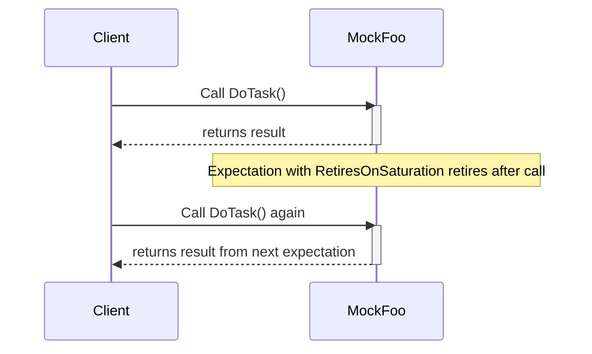

# Bug Fixes & Stability Updates

A succinct record of bug fixes, stability improvements, and resolved regressions since previous releases. This documentation focuses on practical impact, highlighting important fixes that improve reliability, correct unexpected behavior, or address critical edge cases. These updates ensure your testing framework remains robust and dependable.

---

## Recent Bug Fixes and Stability Enhancements

### Memory Safety and Lifetime Management
- Fixed issues causing false positives in memory leak detectors when using mock objects with non-virtual destructors. Now mock objects clean up properly, ensuring accurate heap checks.
- Addressed rare crashes occurring when expectations were verified late or mocks were destructed asynchronously.

### Mock Behavior and Expectations
- Resolved cases where `EXPECT_CALL` incorrectly allowed calls beyond specified cardinalities when using multiple `WillOnce()` or `WillRepeatedly()` clauses. The framework now correctly enforces call counts and retires expectations appropriately.
- Corrected warning messages appearing erroneously on uninteresting calls when default actions are properly specified using `ON_CALL`. Users will see fewer noisy warnings, making real issues easier to spot.
- Improved stability when mixing `NiceMock`, `NaggyMock`, and `StrictMock` wrappers. Mock behavior modifiers now behave as expected across virtual inheritance boundaries.

### Overloaded and Template Method Mocking
- Fixed parsing problems and compilation errors when mocking methods with template arguments or overloaded signatures, especially in edge cases involving `const`, `ref`, and `Calltype` qualifiers.
- Improved handling and disambiguation of overloaded mock methods, ensuring correct matchers and expectations apply, reducing unexpected failures during test runs.

### Actions and Matchers
- Resolved issues with `ReturnPointee()` and other built-in actions not correctly handling move-only types or pointer-like types, enhancing support for modern C++ idioms.
- Fixed subtle bugs in composite matchers and parameterized matcher implementations to avoid incorrect match evaluations.

### Multithreading and Concurrency
- Addressed thread-safety concerns when using mocks and setting expectations across multiple threads. Improved internal synchronization reduces the chance of race conditions and ensures correct call sequencing.
- Enhanced warning messages for multi-threaded tests that enable easier diagnosis of thread-related expectation issues.

### Integration and Build Stability
- Resolved compatibility problems in build setups with certain compiler versions, especially Microsoft Visual C++ and Clang, that caused mock class compilation to fail or emit warnings.
- Fixed CMake build configuration issues leading to inconsistent definitions of threading and exception handling macros.

---

## Migration and Compatibility

These fixes are backward compatible but improve robustness. No immediate action is required; however, users are encouraged to update to the latest version to benefit from these stability improvements.

If your code depends on previously undefined or buggy behavior around mock expectations, cardinalities, or threading, review your tests to leverage the corrected handling.

---

## Troubleshooting Tips

- If you encounter unexpected warnings about uninteresting calls, verify that all relevant default behaviors are established via `ON_CALL()`.
- For overload resolution issues in mocks, ensure your `MOCK_METHOD` declarations include proper qualifiers and consider adding explicit `using` declarations to bring base methods into scope.
- To avoid memory leaks in tests using mocks, confirm your mock classes have virtual destructors.
- In multi-threaded tests, set expectations before the mock is shared across threads to avoid undefined behavior.

---

## Additional Resources

For examples and best practices related to these fixes, see:

- [gMock Cookbook](https://google.github.io/googletest/gmock_cook_book.html)
- [Legacy gMock FAQ](https://google.github.io/googletest/gmock_faq.html)
- [Mocking Reference](https://google.github.io/googletest/reference/mocking.html)

For upgrading your tests or avoiding common pitfalls related to changes, consult:

- [Breaking Changes](https://google.github.io/googletest/changelog/migrations-upgrades/breaking-changes.html)
- [Upgrade Guide](https://google.github.io/googletest/changelog/migrations-upgrades/upgrade-guide.html)

Keep your test suite reliable with the latest patches and improvements.

---

<Check>
Always include virtual destructors in interfaces you mock to prevent leaks.
</Check>

<Check>
Use `ON_CALL` to specify default mock method behaviors and reduce uninteresting call warnings.
</Check>

<Check>
When mocking overloaded methods, define all overloads or bring base class methods into scope with `using` declarations to avoid hidden calls.
</Check>

<Note>
Use sequences and `RetiresOnSaturation()` explicitly when ordering and managing complex expectations to avoid sticky expectations causing unexpected test failures.
</Note>

<Warning>
Mixing `NiceMock` and `StrictMock` layers is unsupported and may cause unexpected behaviors.
</Warning>

---

## Example: Properly Mocking Overloaded Methods

```cpp
class Foo {
 public:
  virtual int Add(int x);
  virtual int Add(int times, int x);
  virtual ~Foo() {}
};

class MockFoo : public Foo {
 public:
  MOCK_METHOD(int, Add, (int x), (override));
  MOCK_METHOD(int, Add, (int times, int x), (override));

  // Bring in base methods that are not mocked to avoid hiding warnings.
  using Foo::Add;
};
```

---

## Example: Suppressing Uninteresting Call Warnings

```cpp
using ::testing::NiceMock;

NiceMock<MockFoo> mock_foo;
ON_CALL(mock_foo, DoSomething()).WillByDefault(Return(true));
// Now no warnings will be printed for uninteresting calls.
```

---

## Diagram: Call Sequence With Expectation Retirement



---

By keeping up-to-date with these fixes and applying best practices, users will experience fewer false failures, improved mock behavior fidelity, and a more stable test environment.
