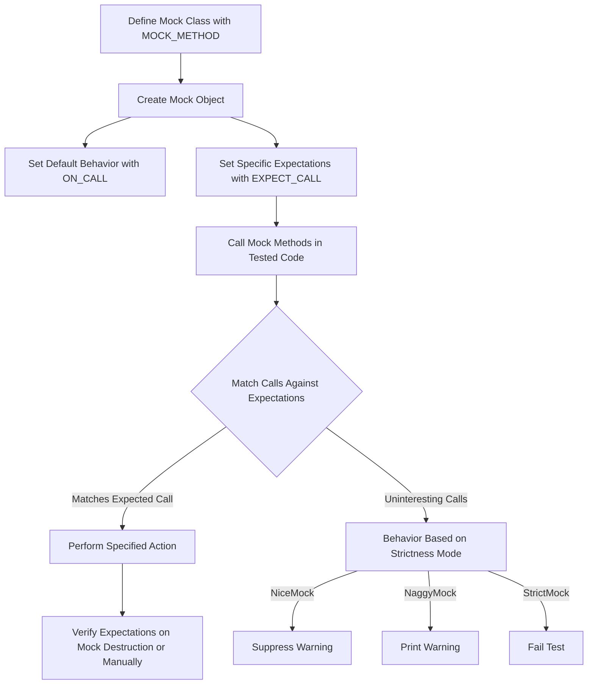

# Major New Features in GoogleTest and GoogleMock

This document highlights the significant new functionality introduced in recent releases of GoogleTest and GoogleMock. We emphasize how these features empower you to create more expressive, maintainable, and robust tests with minimal effort. By integrating these features, you can streamline your unit testing workflows and enhance the precision and clarity of your mock-based testing strategies.

---

## 1. Enhanced Mocking Capabilities

GoogleMock continues to evolve by introducing robust improvements in mocking capabilities, giving you finer control and increased flexibility when working with mock objects.

### 1.1 Support for Move-Only Types in Mock Methods

Previously, mocking methods that took or returned move-only types like `std::unique_ptr<T>` was challenging. Now, GoogleMock natively supports move-only types as function arguments and return types in mocks using the same `MOCK_METHOD` macro syntax. This enhancement enables you to:

- Mock interfaces using modern C++11 move semantics seamlessly.
- Use lambdas in `WillOnce()` or `WillRepeatedly()` to generate fresh move-only objects for every call, avoiding pitfalls with `Return(std::move(...))`.

#### Example:

```cpp
class MockBuzzer : public Buzzer {
 public:
  MOCK_METHOD(std::unique_ptr<Buzz>, MakeBuzz, (StringPiece text), (override));
  MOCK_METHOD(bool, ShareBuzz, (std::unique_ptr<Buzz> buzz, int64_t timestamp), (override));
};

// Usage in test
EXPECT_CALL(mock_buzzer_, MakeBuzz("hello"))
    .WillOnce(Return(std::make_unique<Buzz>(AccessLevel::kInternal)));

EXPECT_CALL(mock_buzzer_, ShareBuzz(NotNull(), _)).WillOnce(Return(true));
```

### 1.2 Delegation Patterns for Default Actions

GoogleMock now highlights best practices for delegation:

- **To a Fake**: You can delegate default actions in your mock to an existing fake implementation, enabling a blend of real and mocked behavior.
- **To a Real Object**: Use delegation to ensure your mock behaves identically to the real object by default, while still verifying interactions.
- **To a Parent Class**: Call a base class’s implementation from within an action.

This pattern simplifies progressive migration strategies or partial mocking where you want to preserve most real behavior and selectively verify calls.

#### Example: Delegation to a Fake

```cpp
class MockFoo : public Foo {
 public:
  MOCK_METHOD(char, DoThis, (int n), (override));
  MOCK_METHOD(void, DoThat, (const char* s, int* p), (override));

  void DelegateToFake() {
    ON_CALL(*this, DoThis).WillByDefault([this](int n) {
      return fake_.DoThis(n);
    });
    ON_CALL(*this, DoThat).WillByDefault([this](const char* s, int* p) {
      fake_.DoThat(s, p);
    });
  }

 private:
  FakeFoo fake_;
};
```

### 1.3 Advanced Expectation Ordering

GoogleMock now supports complex partial ordering of expectations via:

- `EXPECT_CALL(...).After(...)` to denote that specific calls should happen only after others.
- Using multiple `Sequence` objects with `.InSequence(...)` for flexible ordering DAGs.

This allows you greater precision and maintainable test flows for scenarios where strict linear ordering is insufficient.

#### Example: Combining Sequences

```cpp
Sequence s1, s2;
EXPECT_CALL(foo, A()).InSequence(s1, s2);
EXPECT_CALL(bar, B()).InSequence(s1);
EXPECT_CALL(bar, C()).InSequence(s2);
EXPECT_CALL(foo, D()).InSequence(s2);
```

This specifies a DAG of expected calls where certain calls precede others, yet some calls can appear in any order with respect to each other.

### 1.4 Support for Reference Qualification in Mock Methods

GoogleMock’s `MOCK_METHOD` macro now fully supports mocking methods with C++11 reference qualifiers (`&` and `&&`). For functions with different lvalue/rvalue qualifiers, you can specify `ref(&)` or `ref(&&)` in the 4th parameter list.

#### Example:

```cpp
MOCK_METHOD(void, Foo, (), (ref(&), override));  // Mock method qualified for lvalues
MOCK_METHOD(void, Foo, (), (ref(&&), override)); // Mock method qualified for rvalues
```

This addition enables finer-grained mocking when your interfaces use reference qualifiers.

### 1.5 Improvements to Default Value Customization

The `::testing::DefaultValue<T>` class template now supports more intuitive mechanisms to set, override, or clear the default value for types returned by mock methods. This is beneficial especially for types without trivial default constructors.

#### Usage:

```cpp
DefaultValue<std::unique_ptr<Foo>>::SetFactory([] {
  return std::make_unique<Foo>();
});
...
DefaultValue<std::unique_ptr<Foo>>::Clear();
```

This flexibility empowers you to eliminate unexpected crashes or surprises when mock functions returning complex types are called without specified actions.


## 2. Richer Expectation Setting and Behavior Control

Recent releases of GoogleMock include enhancements to how you specify call expectations and how mocks behave during tests.

### 2.1 Explicit Control of Uninteresting Calls via Strictness Mocks

To give you control over warnings and failures on calls for which no `EXPECT_CALL` is set, GoogleMock offers three strictness modes:

- **NiceMock**: Suppresses warnings on uninteresting calls.
- **NaggyMock**: Prints warnings on uninteresting calls (default behavior).
- **StrictMock**: Treats uninteresting calls as test failures.

This feature helps maintain test stability and reduces noise related to irrelevant calls.

#### Example:

```cpp
using ::testing::NiceMock;
NiceMock<MockFoo> mock_foo;
EXPECT_CALL(mock_foo, DoThis());
```

You can switch to `StrictMock<MockFoo>` when you want to catch any unplanned call usage.

### 2.2 Simplified and Expressive Expectation Syntax

You can now omit arguments in `EXPECT_CALL` if the method is non-overloaded, effectively expecting any arguments, and drop the parentheses to create succinct, readable expectations:

```cpp
EXPECT_CALL(mock, NonOverloadedMethod);
EXPECT_CALL(mock, MethodWithArgs).Times(3);
```

This streamlines your setup where argument values are not of interest.

### 2.3 More Flexible Action Chains

Multiple `WillOnce()` clauses can be chained to specify different actions on successive calls, followed optionally by a `WillRepeatedly()` clause that defines behavior for all subsequent calls.

This gives you the power to model complex call behaviors naturally.

#### Example:

```cpp
EXPECT_CALL(foo, GetValue())
    .WillOnce(Return(1))
    .WillOnce(Return(2))
    .WillRepeatedly(Return(3));
```

### 2.4 Multi-Argument Matchers and `.With()` Clauses

Leverage the `.With()` clause to match all arguments as a tuple, enabling cross-parameter constraints such as "first argument less than second":

```cpp
EXPECT_CALL(mock, SetPosition(_, _))
    .With(Lt());  // Matches calls where arg0 < arg1
```

This introduces a powerful way to impose relational constraints across arguments.

### 2.5 Verifying and Resetting Mock Expectations Prematurely

You can verify expectations and clear them before mock destruction using `Mock::VerifyAndClearExpectations()` and `Mock::VerifyAndClear()`. This supports scenarios where mocks have longer lifetimes or are owned externally.

#### Example:

```cpp
MockFoo foo;
EXPECT_CALL(foo, DoSomething());
... code using foo ...
Mock::VerifyAndClearExpectations(&foo);
```

Use these APIs with care to avoid undefined behavior post verification.


## 3. Usability, Tooling, and Diagnostics

Rich consideration has been given to improve diagnostics and usability for developers.

### 3.1 Improved Diagnostic Messages and Verbosity Control

The `--gmock_verbose` flag allows setting verbosity levels (`info`, `warning`, `error`) controlling how much diagnostic output GoogleMock emits on mock usage, especially for uninteresting calls. `info` offers the most insight with stack traces.

### 3.2 Advanced Diagnostic Support for Overloaded and Const Methods

Considerable improvements have been made to help disambiguate overloaded and `const`-qualified method mocks, including dedicated argument wrappers like `Const()` and explicit matcher casting, improving code clarity and compiler errors.

### 3.3 Enhanced Support for Shared Actions and Matchers

Actions and matchers are efficiently copyable objects. To avoid surprises in stateful actions, understand sharing semantics. This ensures you can reuse matchers and actions safely and avoid subtle bugs in tests.

### 3.4 Integration with C++11 Lambdas and Modern Callbacks

GoogleMock now fully embraces C++11 lambdas and functors as mock actions and matchers, granting elegant, expressive, and inline mock behaviors.

---

## Next Steps

- Explore the [GoogleMock Cookbook](https://google.github.io/googletest/gmock_cook_book.html) for practical recipes leveraging these features.
- Review the [Mock Strictness Modes](api-reference/mocking-api/strictness-modes.mdx) documentation to tune mock object behaviors.
- Consult the [Expectations & Actions](api-reference/mocking-api/expectations-and-actions.mdx) reference for detailed syntax and clauses.
- For troubleshooting, refer to the [Troubleshooting & Common Pitfalls](getting-started/first-test-usage/troubleshooting-setup.mdx) guide.

---

# References & Resources

- [GoogleMock Official Documentation](https://google.github.io/googletest/gmock.html)
- [Mocking Reference](docs/reference/mocking.md)
- [gMock Cheat Sheet](docs/gmock_cheat_sheet.md)
- [gMock Cookbook](docs/gmock_cook_book.md)
- [Matchers Reference](api-reference/matchers-and-assertions/matcher-library.mdx)
- [Actions Reference](docs/reference/actions.md)
- [Mock Strictness Modes](api-reference/mocking-api/strictness-modes.mdx)
- [GoogleTest GitHub Repository](https://github.com/google/googletest/releases)

---

##### Visual Overview Diagram of Expectation Flow


