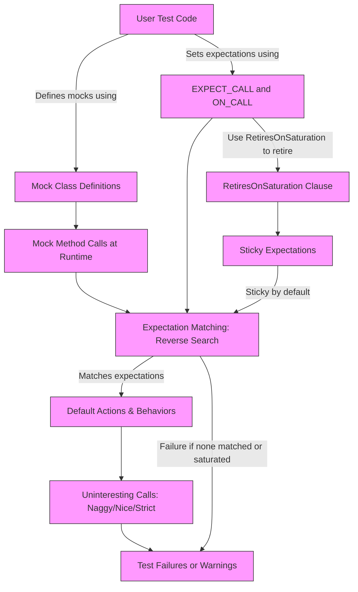

# Breaking Changes

This page highlights any API, behavior, or platform-level changes in GoogleMock that may require updates to your test code. It directs your attention to modifications that affect your mocks and expectations, ensuring that you are well-prepared for upgrades and can maintain compatibility with newer GoogleMock versions.

---

## Understanding the Impact of Breaking Changes

Breaking changes in gMock typically involve modifications to macros, class interfaces, or underlying behaviors that might affect the way mocks are defined, how expectations are set, or how mock method calls are verified. Because tests depend heavily on these interfaces, breaking changes usually require proactive action:

- Review your mock class definitions.
- Adjust your `EXPECT_CALL` or `ON_CALL` usage.
- Update any custom matchers or actions that rely on changed internals.

This page compiles breaking changes information to help you identify such points and migrate your tests smoothly.

## Recent Breaking Changes (Since Last Stable Release)

### 1. Transition from `MOCK_CONST_METHODn` Macros to `MOCK_METHOD` with `const` qualifier

- **Change:** The family of macros `MOCK_CONST_METHODn` is deprecated in favor of the unified `MOCK_METHOD` macro that includes a `(const)` qualifier as its fourth parameter.
- **User Impact:** If your mocks currently use `MOCK_CONST_METHODn`, update them to use `MOCK_METHOD` with the `(const, override)` specifier.

#### Example Migration

```cpp
// Before
MOCK_CONST_METHOD1(Foo, int(int));

// After
MOCK_METHOD(int, Foo, (int), (const, override));
```

### 2. Use of `MOCK_METHOD` Macro for All Mock Methods

- **Change:** The old `MOCK_METHODn` macros have been superseded by the generic `MOCK_METHOD` macro, which supports all method types, including const, noexcept, and call types.
- **User Impact:** Migrate all existing `MOCK_METHODn` usages to `MOCK_METHOD` for consistency and future compatibility.

#### Example

```cpp
// Old style
MOCK_METHOD1(Foo, bool(int));

// New style
MOCK_METHOD(bool, Foo, (int), (override));
```

### 3. Requirement for Mock Method Definitions to Be Public

- **Behavioral Enforcement:** Mocked methods must be declared in the `public:` section of the mock class, regardless of the base class method's original access level.
- **User Impact:** Ensure you move or declare all `MOCK_METHOD` macros within the `public:` section to avoid compilation or linkage errors.

### 4. Sticky Expectations by Default

- **Change:** Expectations in gMock remain active (sticky) even after satisfying their call count upper bounds unless `RetiresOnSaturation()` is explicitly specified.
- **User Impact:** When setting expectations with limited call counts, you might experience "upper bound violated" errors sooner than before.
- **Migration Advice:** Append `.RetiresOnSaturation()` to your `EXPECT_CALL` statements with upper bounds to ensure expectations retire promptly.

#### Example

```cpp
EXPECT_CALL(mock, Foo()).Times(2).RetiresOnSaturation();
```

### 5. Reverse-Order Matching of Expectations

- **Behavior:** gMock matches expectations in reverse order; the newest matching expectation is selected first.
- **User Impact:** If you add a general expectation before a more specific one, the specific one may never be matched.
- **Migration Advice:** Always put more specific expectations *after* more general ones.

## Migration Tips

- Audit your mock classes for usage of legacy macros like `MOCK_CONST_METHODn`, `MOCK_METHODn`, and remove usages in favor of `MOCK_METHOD` with appropriate specifiers.
- Review `EXPECT_CALL` statements and ensure `.RetiresOnSaturation()` is used for expectations with limited calls to prevent unexpected failures.
- Confirm all `MOCK_METHOD` declarations reside in the public section.
- Reorder expectations for proper precedence, placing specific matchers last.
- Use `ON_CALL` for default behaviors instead of noisy `EXPECT_CALL` for methods you do not intend to verify strictly.

## Breaking Changes in Default Behavior of Uninteresting Calls

- The default mock object behavior is "naggy": uninteresting calls produce warnings but do not fail tests.
- Using `NiceMock`, `StrictMock`, or `NaggyMock` can modify this behavior.
- Be aware of these defaults when upgrading, as strictness can affect test outcomes.

## Verification and Clearing of Mocks

The way to forcibly verify and clear expectations on mocks remains through:

```cpp
::testing::Mock::VerifyAndClearExpectations(&mock_object);
::testing::Mock::VerifyAndClear(&mock_object);
```

You *should not* set new expectations after verification.

## Common Pitfalls

- Forgetting to add `(override)` in `MOCK_METHOD` can cause silent errors.
- Declaring mock methods in protected or private sections leads to inaccessible methods.
- Omitting `.RetiresOnSaturation()` on limited-limit expectations leads to sticky expectations causing failures.

## Additional Resources

- [gMock Cookbook](https://google.github.io/googletest/gmock_cook_book.html)
- [Mocking Reference](https://google.github.io/googletest/reference/mocking.html)
- [Legacy gMock FAQ](https://google.github.io/googletest/gmock_faq.html)
- [gMock Cheat Sheet](https://google.github.io/googletest/gmock_cheat_sheet.html)

---

### Troubleshooting Migration Issues

If tests start to fail after upgrading due to expectations not being matched or unexpected calls:

1. Enable verbose logging:

```shell
--gmock_verbose=info
```

2. Carefully track expectation order and whether methods are declared public.
3. Add `.RetiresOnSaturation()` to limit sticky expectations.
4. Use `NiceMock` or `NaggyMock` to control warning levels on uninteresting calls.

---

This page will be updated as new breaking changes arise. Always check release notes and changelogs before upgrading to newer versions of GoogleMock.

<Note>
For detailed migration guides and upgrade instructions, consult the official release changelogs and related guides under the [Changelog Version History](https://google.github.io/googletest/changelog/version-history/release-overview) and [Migration & Upgrade](https://google.github.io/googletest/changelog/migration-upgrade/breaking-changes) sections.
</Note>

---

## Visual Overview



---

## Summary

The diagram illustrates the flow where user test code defines mock classes and sets expectations with `EXPECT_CALL` or `ON_CALL`. At runtime, mock method invocations are matched to expectations in reverse order. Expectations are sticky by default and do not retire unless specified. Uninteresting calls invoke default behaviors but may emit warnings or failures depending on the mock's strictness setting.

---

<Source url="https://github.com/google/googletest" branch="main" paths={[{"path": "docs/gmock_cook_book.md", "range": "1-600"},{"path": "docs/reference/mocking.md", "range": "1-300"},{"path": "docs/gmock_faq.md", "range": "1-200"},{"path": "docs/gmock_cheat_sheet.md", "range": "1-150"}]}/>
