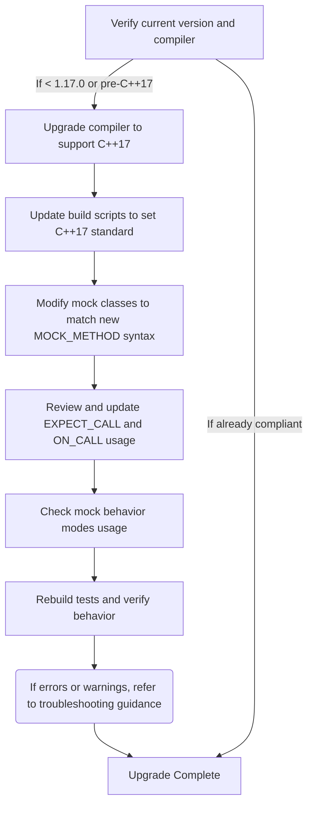

# Migration & Upgrade Guides

This comprehensive guide provides detailed step-by-step instructions for migrating GoogleTest and GoogleMock users across major versions. It focuses on ensuring a smooth upgrade process by outlining all necessary prerequisites, mitigation steps, and explicit code migration examples.

---

## 1. Prerequisites for Upgrading

### 1.1 Minimum Compiler Version and Language Standard
- Starting from **GoogleTest 1.17.0**, a **C++17** compiler is **required**.
- Ensure your build environment and compiler flags support at least C++17, for example, by setting `-std=c++17` or equivalent.
- Check your C++ standard compliance to avoid build failures or undefined behavior.

### 1.2 Supported Platforms
- Confirm your platform and toolchain versions are compatible as listed in the [System Requirements & Supported Platforms](https://github.com/google/googletest/blob/main/docs/getting-started/prerequisites-installation/system-requirements.md).

### 1.3 Build Tool Adjustments
- When building GoogleTest as a **standalone** or as part of your project, verify your build scripts (CMake, Bazel, etc.) specify the correct C++ standard and include all necessary flags.
- For CMake users, make sure to specify `set(CMAKE_CXX_STANDARD 17)` and `set(CMAKE_CXX_STANDARD_REQUIRED ON)`.

### 1.4 Dependency Updates
- If integrating GoogleTest and GoogleMock with external dependencies (e.g., Abseil in future releases), review those dependencies' compatibility with your environment.

---

## 2. Migration Steps and Mitigation

### 2.1 Updating Code to Meet New Requirements

#### 2.1.1 Handling Mock Method Declarations
- The updated `MOCK_METHOD` macro enforces consistent usage and qualifiers.
- Mock methods must now explicitly specify qualifiers such as `const`, `override`, or `noexcept` as appropriate.
- For example:

```cpp
class MockFoo : public Foo {
 public:
  MOCK_METHOD(int, Compute, (int value), (const, override, noexcept));
};
```

#### 2.1.2 Addressing Overloaded Method Mocks
- When mocking overloaded virtual methods, fully specify qualifiers and parameter types to avoid ambiguity.

#### 2.1.3 Fixing Compile Errors Related to Commas in Types
- Wrap complex argument or return types containing commas in parentheses or use type aliases:

```cpp
using PairBoolInt = std::pair<bool, int>;
MOCK_METHOD(PairBoolInt, GetResult, ());

// or
MOCK_METHOD((std::pair<bool, int>), GetResult, ());
```

### 2.2 Replacing Deprecated Macros
- Old-style `MOCK_METHODn` macros are deprecated; migrate to the generic `MOCK_METHOD` macro as shown above.

### 2.3 Updating Expectation Syntax
- Ensure `EXPECT_CALL` invocations follow the updated chaining order:
  - `.With()` (if used) first
  - `.Times()` (only once)
  - `.InSequence()` (any number)
  - `.After()` (any number)
  - `.WillOnce()` (any number)
  - `.WillRepeatedly()` (at most once)
  - `.RetiresOnSaturation()` (at most once, last)

Example:

```cpp
EXPECT_CALL(mock, Method(_))
    .With(SomeMatcher())
    .Times(2)
    .InSequence(seq1)
    .WillOnce(Return(1))
    .WillRepeatedly(Return(2))
    .RetiresOnSaturation();
```

### 2.4 Managing Mock Behavior Modes
- Consider updating usages of `NiceMock`, `NaggyMock`, and `StrictMock` wrappers per guidance in the [Mock Behaviors and Strategies](https://google.github.io/googletest/api/gmock_cook_book.html#Nice-Strict-Naggy) documentation to avoid unexpected warnings or failures on uninteresting calls.

### 2.5 Using `ON_CALL` Correctly
- Use `ON_CALL` for specifying default behavior without expectations.
- Avoid suppressing warnings by misusing `EXPECT_CALL`.

### 2.6 Ensuring Virtual Destructors
- Confirm that all interfaces or classes being mocked have **virtual destructors** to prevent heap errors.

---

## 3. Example Migration Snippets

### 3.1 Migrating from Old `MOCK_METHODn` to New `MOCK_METHOD`

Before:

```cpp
class MockExample : public Example {
 public:
  MOCK_CONST_METHOD1(GetValue, int(int));
};
```

After:

```cpp
class MockExample : public Example {
 public:
  MOCK_METHOD(int, GetValue, (int), (const, override));
};
```

### 3.2 Handling Multiple `WillOnce` and `WillRepeatedly`

Before:

```cpp
EXPECT_CALL(mock, Func())
  .WillOnce(Return(1))
  .WillOnce(Return(2))
  .WillRepeatedly(Return(3));
```

Note: If you omit `.Times()` here, the call count is inferred as `AtLeast(number_of_WillOnce_clauses)`. Specify `.Times()` explicitly if needed.

### 3.3 Controlling Expectation Lifespan

To prevent “sticky” expectations causing upper bound violations, add `.RetiresOnSaturation()`:

```cpp
EXPECT_CALL(mock, Func())
  .WillOnce(Return(1))
  .RetiresOnSaturation();
```

---

## 4. Troubleshooting

### 4.1 Compilation Errors
- Verify that C++17 is enabled in your build system.
- Ensure all mock methods have the necessary qualifiers.
- Check for incorrect use of commas in template types and fix by wrapping types or using aliases.

### 4.2 Linking Errors
- Confirm virtual destructors in base interfaces.
- Rebuild GoogleTest and GoogleMock with the same compiler settings as your project.

### 4.3 Unexpected Warnings and Failures
- Use `NiceMock` or adjust expectations to manage uninteresting calls.
- Run tests with `--gmock_verbose=info` to get detailed call traces for debugging.

### 4.4 Deprecated APIs
- Replace deprecated macros and patterns with updated `MOCK_METHOD` and chaining syntax.

---

## 5. Additional Resources

- [GoogleTest Primer](https://google.github.io/googletest/primer.html) — Starting point for writing tests.
- [Mocking Reference](docs/reference/mocking.md) — Detailed mock macros and expectations syntax.
- [gMock Cookbook](docs/gmock_cook_book.md) — Recipes and tips for mocking.
- [Mock Behaviors and Strategies](api_reference/mocking_api/mock_behaviors_and_strategies.md) — Using NiceMock, NaggyMock, StrictMock.
- [Installation Instructions](getting-started/prerequisites-installation/installation-instructions.md) — For building with C++17 support.

---

## 6. Summary Diagram


