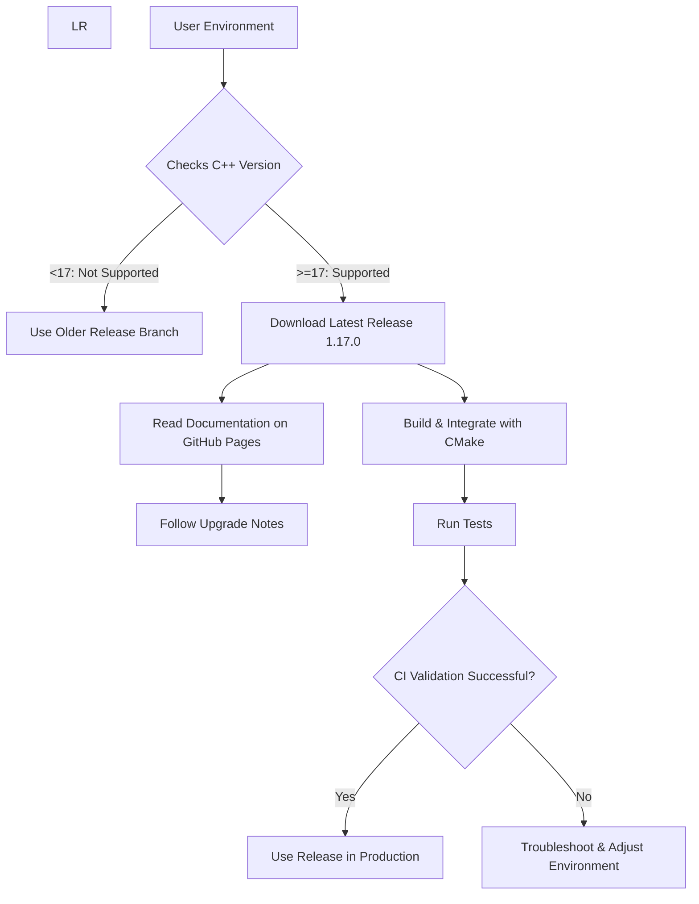

# Recent Releases

This page provides a clear and user-focused summary of GoogleTest and GoogleMock's latest stable and pre-release versions. It highlights significant updates, compatibility requirements, and direct links to detailed changelogs and download resources to help users stay informed and plan their upgrades effectively.

---

## 1. Latest Stable Release: GoogleTest/GoogleMock v1.17.0

- **Release Date:** [Refer to official release page](https://github.com/google/googletest/releases/tag/v1.17.0)
- **C++ Standard Requirement:** Minimum C++17 required to compile and use this release.
- **Compatibility:** This release follows [Google’s C++ support policy](https://opensource.google/documentation/policies/cplusplus-support#c_language_standard) ensuring broad platform compatibility.
- **Highlights:**
  - Updated codebase to require C++17, reflecting modern C++ practices.
  - Continuous integration leveraging Google’s internal systems for robust validation.
  - Planned future dependency on [Abseil](https://github.com/abseil/abseil-cpp) to further enhance functionality.

## 2. Download and Documentation

- **Official Documentation:**
  We recommend accessing the GoogleTest documentation live on GitHub Pages here:
  [https://google.github.io/googletest/](https://google.github.io/googletest/)

- **Source and Downloads:**
  Available through the main GitHub repository's releases:
  [GoogleTest Releases](https://github.com/google/googletest/releases)

- **Build Configuration:**
  Users can follow detailed building instructions for standalone or embedded integration projects using CMake. Always ensure your build environment is configured to support at least C++17.

## 3. Noteworthy Upgrade Considerations

- **C++17 Compliance:**
  Projects must upgrade to a C++17 compatible compiler and build environment before adopting this version.

- **Transition Advice:**
  Older projects requiring compatibility with pre C++17 standards will need to remain on earlier branches or plan for migration.

- **Dependency Roadmap:**
  The upcoming addition of the Abseil library as a dependency is planned but not yet mandatory; users should monitor release notes and update directions.

## 4. Versioning and Release Strategy

While this page focuses on the most recent release, GoogleTest adheres to semantic versioning principles with clear branch distinctions:

- **Stable branches:** Receive minor updates and security patches.
- **Major releases:** May include breaking changes such as the upgrade to C++17.
- **Pre-releases:** Announced with clear tagging for early adopters.

## 5. Continuous Integration and Quality Assurance

GoogleTest leverages Google’s internal CI systems to ensure high quality and reliability. Updates undergo extensive automated testing before being published.

## 6. How This Page Fits Into Documentation

This summary is part of the Changelog section under "Release Highlights & Version History" and complements more detailed changelogs found in:

- [Full Version History](https://github.com/google/googletest/releases) - detailed chronological release notes.
- [Breaking Changes and Deprecations](#) - for upgrade considerations.
- [Upgrade Guide](#) - step-by-step migration instructions.

---

<Tip>
Always verify your development environment’s compiler version and C++ standard support before upgrading to GoogleTest v1.17.0 or higher to avoid build issues.
</Tip>

<Note>
Refer to the official release page for the most current and detailed information about upcoming releases and pre-release versions.
</Note>

---

## 7. Additional Resources

- **Getting Started:**
  - [GoogleTest Primer](https://google.github.io/googletest/primer.html)
  - [Building and Configuring Your Project](https://github.com/google/googletest/blob/main/googletest/README.md)

- **Core Guides:**
  - [Writing Your First Test](https://google.github.io/googletest/writing-tests.html)
  - [Using GoogleMock](https://google.github.io/googletest/gmock_for_dummies.html)

- **API References:**
  - [Assertions and Matchers](https://google.github.io/googletest/reference/assertions.html)
  - [Mock Object Creation](https://google.github.io/googletest/gmock_cook_book.html#mock-basic)

- **Community Contributions:**
  - [Community-Created Documentation](https://github.com/google/googletest/blob/main/docs/community_created_documentation.md)

---

## 8. Summary Diagram: Release Information Flow

---

## 9. Troubleshooting & Tips

- **Compiler Errors:** Typically due to insufficient C++17 support.
- **Linking Issues:** Verify proper linkage to `gtest`, `gmock`, and their respective main libraries.
- **Documentation Navigation:** Use GitHub Pages site for the latest docs and interactive navigation.
- **Community Support:** Participate in issue trackers and community guides when encountering challenging issues.

---

## 10. Feedback and Contributions

GoogleTest welcomes community contributions. Please refer to [`CONTRIBUTING.md`](https://github.com/google/googletest/blob/main/CONTRIBUTING.md) for guidelines on submitting issues and pull requests.

---