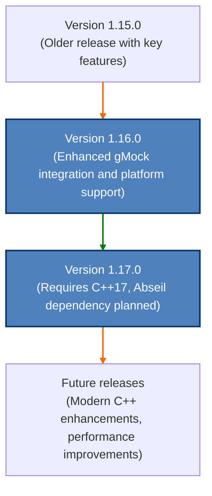

# Version History & Major Releases

This page provides a comprehensive, chronological overview of GoogleTest and GoogleMock's major and minor releases. It is designed to help users quickly understand the evolution of the framework, the introduction of new capabilities, key improvements, deprecations, and upgrade considerations that may affect their development workflow.

---

## Understanding the Version History

Each GoogleTest release encapsulates a set of new features, enhancements, fixes, and occasionally breaking changes or deprecations. This history page helps you see at a glance what has changed over time and whether a particular update requires modifications in your test code or build system.

### Why This Matters to You

Tracking version changes empowers you to:

- Stay informed about new testing capabilities that simplify your work.
- Understand potential impacts and migration steps when upgrading.
- Avoid running outdated versions that lack important fixes or improvements.
- Leverage new features early to improve test quality, performance, and reliability.


---

## Overview of Versioning Philosophy

GoogleTest uses semantic versioning where versions are typically denoted as MAJOR.MINOR.PATCH (e.g., 1.17.0). The changes can be understood broadly as follows:

- **Major releases** (e.g., 2.0.0) introduce significant new features or breaking changes.
- **Minor releases** (e.g., 1.17.0) add new functionality or improvements without breaking backward compatibility.
- **Patch releases** (e.g., 1.17.1) mostly consist of bug fixes, optimizations, and security patches.

---

## Recent Major Releases

### Version 1.17.0 (Released February 2024)

- **C++ Standard Update**: Minimum required standard raised to C++17, enabling modern language features that improve performance and code clarity.
- **Dependency Plans**: Announced planned integration with Abseil libraries to standardize utilities and improve platform consistency.
- **Test Framework Enhancements**: Improved discovery and registration mechanisms for test binaries, enhancing user experience during test execution.
- **Backward Compatibility**: Maintained existing APIs with deprecation warnings for some older constructs slated for future removal.

*For detailed release notes, visit: [GitHub Release 1.17.0](https://github.com/google/googletest/releases/tag/v1.17.0)*

---

### Version 1.16.0 (Released June 2022)

- **Improved gMock Integration**: Enhanced support for mocking syntax and functions, including cleaner handling of partial mocks.
- **Platform Support**: Expanded compiler compatibility and updated build scripts for broader platform coverage.
- **Build Improvements**: CMake support refined (not officially maintained by core maintainers but community-backed).
- **Installation Options**: More flexible install targets for use in complex build environments.

---

## Notable Deprecated Features and Migration Notes

- Deprecated macros and testing patterns are clearly documented in each release to prepare users for upcoming changes.
- Migrating between major versions may require code updates, particularly where language standards or testing APIs are updated.
- Users should consult the [Upgrade & Migration Guide](/changelog/release-highlights/upgrade-guide) for step-by-step instructions and compatibility matrices.

---

## How to Navigate Version History Effectively

- Review **release highlights** to quickly identify new capabilities impactful to your tests.
- Check **breaking changes** before upgrading stable releases to understand what adaptations are necessary.
- Watch for **security patches** especially when using GoogleTest in environments requiring high integrity.
- Use the chronological listing of releases to trace back fixes or added features relevant to your project timeline.

---

## Sample Release Summary

Below is an example snippet demonstrating typical content in release notes you will find reflected within this Version History page:

```markdown
### Release 1.17.0 - February 2024

- Requires C++17 minimum standard compliance.
- Improved test filtering and discovery.
- Planned future dependency on Abseil.
- Bug fixes and platform support enhancements.
- Deprecation notices for legacy test macros.
```

This format serves as a quick reference guiding your decision on when and how to update GoogleTest.

---

## Troubleshooting and Support

Should you encounter build or runtime issues after an upgrade:

- Verify your compiler and environment meet the [Prerequisites & System Requirements](/getting-started/setup-prerequisites-installation/prerequisites-system-requirements).
- Consult the [Troubleshooting Common Setup Issues](/getting-started/troubleshooting-faq-support/common-setup-errors) guide.
- Check community-contributed documentation and GitHub issues for shared fixes.

---

## Additional Resources

- [GoogleTest User's Guide](https://google.github.io/googletest/)
- [gMock Guide](https://google.github.io/googletest/gmock_for_dummies.html)
- [Upgrade & Migration Guide](/changelog/release-highlights/upgrade-guide)

---

For ongoing updates, this page will be maintained alongside new releases to provide the latest insights and upgrade advice.

---

_Last updated: February 2024_

---

## Navigation

Explore related sections to deepen your understanding:

- [Upgrade & Migration Guide](/changelog/release-highlights/upgrade-guide)
- [Detailed Change Log: New Features & Improvements](/changelog/detailed-changelog/new-features-improvements)
- [Detailed Change Log: Bug Fixes & Patches](/changelog/detailed-changelog/bug-fixes-patches)
- [Detailed Change Log: Deprecations & Breaking Changes](/changelog/detailed-changelog/deprecations-breaking-changes)

Feel free to contribute or suggest updates via the [GoogleTest GitHub repository](https://github.com/google/googletest).


---

## Summary Diagram: High-level View of Version Progression



This progression diagram captures the major release path emphasizing key milestones.

---

Thank you for choosing GoogleTest for your C++ testing needs. Stay current, test confidently, and contribute to building a robust open-source testing ecosystem.


---

> For feedback or questions regarding these release notes, visit the [GoogleTest repository](https://github.com/google/googletest) or join the user community discussions.
