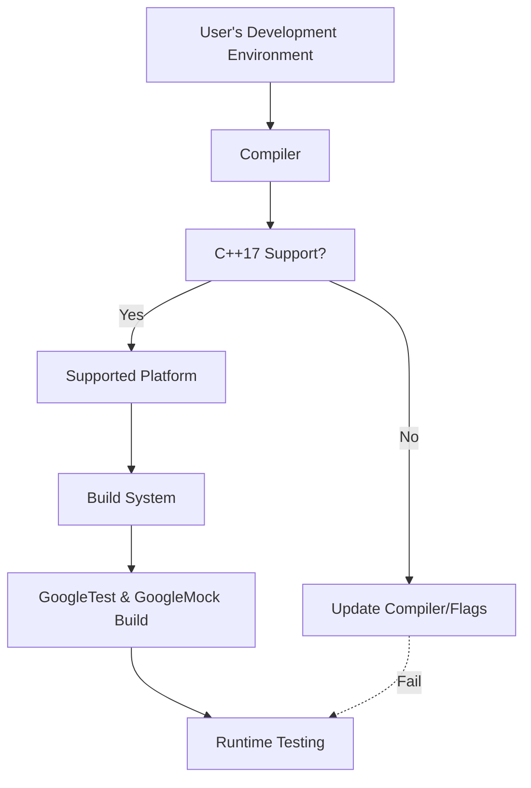

# Supported Platforms & Compiler Changes

GoogleTest and GoogleMock prioritize broad compatibility and reliable cross-platform behavior. This document outlines the evolution of supported platforms, compilers, and build tools throughout the product's release cycles. It clarifies the implications of platform shifts and mandatory standards, such as the adoption of C++17, helping you understand how these changes might affect your development and testing workflows.

---

## Understanding Supported Platforms and Compilers

GoogleTest follows Google's [Foundational C++ Support Policy](https://opensource.google/documentation/policies/cplusplus-support), ensuring compatibility with widely-used, actively maintained platforms and toolchains. Supported platforms include mainstream operating systems like Linux, Windows, and Mac OS, as well as some embedded and specialized environments.

Compiler support is carefully curated to reflect modern language standard requirements and practical build experiences. Since GoogleTest requires C++17, all supported compilers must provide robust C++17 compliance.

### What This Means for Your Workflow

- **Platform Compatibility**: Before upgrading or integrating GoogleTest/GoogleMock, verify your target platform and OS are supported as per the latest compatibility matrix.
- **Compiler Requirements**: Use compilers that fully support C++17 or higher. Unsupported compiler versions might lead to build failures or subtle runtime issues.
- **Build Tools**: GoogleTest provides dedicated CMake integration for flexible build configuration and supports Bazel in some scenarios (see integration guides).

<Tip>
Ensure your environment complies with the latest compiler and platform support requirements early in your setup process to avoid unexpected build or runtime issues.
</Tip>

---

## Highlights of Platform & Compiler Changes by Release

This section summarizes key platform or compiler updates introduced in recent release cycles and the impact on users.

### C++17 Requirement Enforcement

Starting from recent versions, GoogleTest and GoogleMock strictly require an environment that supports the C++17 standard. This requirement ensures:

- Access to modern language features improving test robustness and maintainability.
- Consistency in compiler behavior across supported platforms.
- Easier adoption of Abseil and other modern dependencies.

<Check>
If your project or build system does not specify at least C++17, you will encounter errors during compilation. For CMake projects, this entails invoking `set(CMAKE_CXX_STANDARD 17)` and `set(CMAKE_CXX_STANDARD_REQUIRED ON)` early in your configuration.
</Check>

### Windows Runtime Library Linking Improvements

GoogleTest's CMake configuration now includes more nuanced handling of dynamic versus static CRT linkage, especially for Visual Studio environments to reduce runtime mismatches.

- Use the `gtest_force_shared_crt` option in CMake to align runtime library linkage with your project needs.
- Building GoogleTest as a shared library requires defining `-DGTEST_CREATE_SHARED_LIBRARY=1` and also adding `-DGTEST_LINKED_AS_SHARED_LIBRARY=1` when compiling dependent tests.

This reduces linker errors caused by mismatched runtime libraries seen in Windows builds.

### Platform Detection Interface

Extensive platform-identifying macros are defined in internal headers (e.g., `gtest-port-arch.h`), which conditionally enable or disable features based on the target environment.

- These macros include identifiers such as `GTEST_OS_LINUX`, `GTEST_OS_WINDOWS_DESKTOP`, `GTEST_OS_MAC`, and many others.
- Build systems should not override these but rely on auto-detection provided.

### pthreads Support and Thread Safety

GoogleTest supports POSIX `pthreads` on most Unix-like platforms for thread-safe tests.

- For Windows MinGW environments, pthreads support is disabled since it can be problematic.
- The macro `GTEST_HAS_PTHREAD` is defined automatically or can be overridden to enable/disable threading support.

### Deprecations and Removals

- Older unsupported platforms or compilers not meeting the C++17 minimum standard are no longer maintained.
- Platform-specific workarounds in internal code may be phased out as compilers standardize their behavior.

---

## How to Adapt Your Build for Platform and Compiler Changes

Follow these best practices to maintain compatibility:

1. **Update Compiler and Build Tools**
   - Upgrade to modern compiler versions with full C++17 support (e.g., GCC 7+, Clang 5+, MSVC 2017+).
   - Use a recent CMake release (3.14+) to leverage features like `FetchContent_MakeAvailable`.

2. **Specify C++ Standard Explicitly**

```cmake
set(CMAKE_CXX_STANDARD 17)
set(CMAKE_CXX_STANDARD_REQUIRED ON)
```

This avoids ambiguous compiler defaults and ensures your tests use the expected language features.

3. **Manage Runtime Libraries on Windows**

- If using Visual Studio, configure the CMake option `gtest_force_shared_crt` according to your application’s CRT linkage.
- Build GoogleTest and GoogleMock as shared libraries only if you understand the implications and have adjusted linkage accordingly.

4. **Validate Platform Detection Macros**

- Confirm that platform macros like `GTEST_OS_...` are correctly defined for your environment.
- Use these macros in any custom code or extensions to conditionally adapt behavior.

5. **Check Threading Support**

- Verify whether your target platform supports POSIX `pthreads`.
- For Windows and certain embedded platforms, consider the implications of disabling threading features.

---

## Troubleshooting Platform and Compiler Issues

- **Build Failures Related to C++17**: Check your compiler version and build flags to ensure that you request C++17 explicitly. Refer to the CMakeLists.txt or project configurations.

- **Linker Errors on Windows (Runtime Mismatch)**: Verify that your application and GoogleTest/GoogleMock use compatible runtime libraries (static vs. dynamic). Use `gtest_force_shared_crt` to align runtimes.

- **Missing pthread Support on Unix**: If builds fail due to pthread detection, ensure your system has pthread libraries installed and not disabled by build options.

- **Unrecognized Platform Macros**: Confirm that your platform is recognized using `GTEST_OS_...` and consider updating to a newer GoogleTest release if you are on a very new or obscure platform.

<Tip>
Consult the detailed platform compatibility table in the [System Requirements & Supported Platforms](/getting-started/setup-prerequisites-installation/system-requirements) page for your specific environment.
</Tip>

---

## Key References and Further Reading

- [System Requirements & Supported Platforms](/getting-started/setup-prerequisites-installation/system-requirements): Detailed compatibility matrix.
- [Installation with CMake](/getting-started/setup-prerequisites-installation/installation-cmake): Guidance on CMake builds respecting platform/compiler nuances.
- [Platform Portability and Utilities](/api-reference/platform-integration-utils/platform-portability): Reference on macros and environment utilities.
- [Integration and Dependencies Overview](/overview/architecture-and-integration/integration-and-dependencies): Covers platform support and build tool integration.
- [Upgrading and Compatibility](/faq/getting-started-questions/migration-and-updates): Tips on version upgrades with changing platform requirements.

---

By staying informed about supported platforms and compiler changes, you can confidently integrate, build, and run GoogleTest and GoogleMock in your diverse and evolving C++ projects.

---

## Summary Diagram (Conceptual)



This flow illustrates the critical checkpoint of the C++17 standard compliance as a gateway to successful build and testing using GoogleTest.
