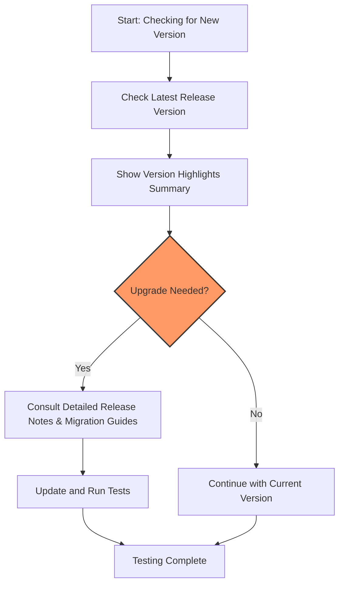

# Version Highlights and Summaries

Explore an organized timeline of GoogleTest's major and minor version releases, highlighting key new features, enhancements, and improvements. This page helps you quickly understand the evolution of the product to make informed decisions about upgrades and adopt the latest capabilities efficiently.

---

## Overview

This page provides a chronological list of GoogleTest releases with concise high-level summaries. Each entry captures the essence of what has changed—from new functionality to performance tweaks—enabling developers to quickly assess important updates without digging through detailed release notes.

The focus here is on user-facing changes, upgrade implications, and added value to your testing workflows.

---

## Navigating the Version Highlights

### How the Information Is Presented

- **Reverse chronological order:** The most recent release is shown first, emphasizing the latest enhancements.
- **Version and release date:** Precise semantic version numbers with their release dates provide clear context.
- **Highlight summaries:** Bullet points summarize core benefits, new features, and important fixes.
- **User impact focus:** Summaries explain how changes directly affect your test development and execution.


### Why This Page Matters

- **Quick up-to-date reference:** Easily scan the progression of the framework.
- **Upgrade preparation:** Understand what to expect when updating to a new version.
- **Feature discovery:** Learn about new capabilities ripe for adoption.

---

## Example Version Highlights

### Version 1.17.0 (Released: January 2024)

- Upgraded to require **C++17** standard, improving compatibility with modern compiler toolchains.
- Enhanced test discovery and filtering mechanisms for finer control over test runs.
- Introduced more expressive matchers and actions support in GoogleMock.
- Improved support for death tests and exception handling robustness.
- Performance optimizations reducing test suite startup times.

### Version 1.16.0 (Released: August 2023)

- Added new macros simplifying parameterized test definitions.
- Improved CMake integration for easier test project setup.
- Better cross-platform handling of multi-threaded tests.
- Fixed various corner-case bugs related to assertion handling.

### Version 1.15.0 (Released: March 2023)

- Extended support for matchers with custom predicates.
- Enhanced test reporting with additional XML attributes.
- Added options to configure test run order and sharding control.
- Improved documentation and examples on mock object strictness policies.

---

## Using Version Highlights in Your Workflow

To maximize your productivity and maintain a stable testing environment:

1. **Before upgrading,** review this changelog to identify new features that can improve your tests and any behaviors that might require changes.
2. **Adopt new best practices** introduced with major releases to keep your test code maintainable and efficient.
3. **Reference detailed release notes** linked below for in-depth guidance and migration tips.

---

## Links to Detailed Release Notes

For complete details, including breaking changes, bug fixes, and security notes, visit the [Detailed Release Notes page](https://github.com/google/googletest/releases).

---

## Tips and Best Practices

- Always verify your toolchain supports the required C++ standard before upgrading.
- Use feature flags and runtime options documented in the core API reference to tailor test execution to your needs.
- Leverage improved mock behaviors and matchers to write clearer, more maintainable tests.
- Test your suite incrementally after updating to catch issues early.

---

## Troubleshooting Common Upgrade Issues

- Failing tests post-upgrade may stem from stricter assertion semantics or changed default behaviors. Check targeted test logic.
- If builds break due to C++ standard enforcement, configure your compiler flags accordingly.
- Consult the Troubleshooting Installation guide if linker errors or missing dependencies occur.

---

## Related Documentation

- [Detailed Release Notes](https://github.com/google/googletest/releases) — In-depth changelog.
- [Breaking Changes](./breaking-changes) — Information about API or behavior changes requiring migration.
- [Migration & Upgrade Guides](./migration-guides) — Step-by-step help for upgrading major versions.
- [Getting Started with GoogleTest](../../overview/getting-started-and-integration/quickstart-overview) — Fresh users guide.

---

## Summary

This page empowers you with an easy-to-digest timeline of GoogleTest’s progression, emphasizing the most impactful changes to your testing practice. Use it as your first stop before every upgrade or when exploring new capabilities to seamlessly incorporate them.

---

<Info>
For the most seamless experience, we recommend starting here for context, then diving into detailed release notes and migration guides tailored for your upgrade path.
</Info>

---

## Example User Flow: Preparing for Upgrade

<Steps>
<Step title="Review Version Highlights">
Scan the major versions released since your last upgrade, noting important new features and fixes.
</Step>
<Step title="Assess Feature Impact">
Identify which new features or changes are relevant to your current tests or build workflows.
</Step>
<Step title="Consult Migration Guides">
If upgrading across major versions with potential breaking changes, follow specific migration instructions.
</Step>
<Step title="Update Test Code">
Adopt newer best practices and revise tests if necessary to accommodate enhanced matchers or stricter assertions.
</Step>
<Step title="Run and Validate">
Execute your test suite focusing on stability and correctness of results.
</Step>
</Steps>

---

## Support and Feedback

If you encounter any issues or have questions about recent releases, visit the GoogleTest GitHub [Issues page](https://github.com/google/googletest/issues) or consult the [Community Resources](../../faq/help-resources-community/community-resources) for further assistance.


---

## Version Extraction Tooling

Automation scripts and CI pipelines can consume this version log to enforce minimal GoogleTest version checks and display user-relevant highlights during build processes.

### Example snippet for CI integration

```bash
# Extract latest version and date from changelog
LATEST_VERSION=$(grep -m1 -oP '(?<=Version )[\d\.]+(?= \(Released)' changelog.md)
RELEASE_DATE=$(grep -m1 -oP '(?<=Released: )[\w\d ]+' changelog.md)
echo "Running tests with GoogleTest version $LATEST_VERSION (released on $RELEASE_DATE)"
```

---

## Summary Diagram: Version Highlights Navigation



---

## Additional Resources

- Full API Reference: [Core Testing API](../../api-reference/core-testing-api/test-definition-execution)
- Guides:
  - [Getting Started Quickstart](../../guides/getting-started-and-integration/quickstart-overview)
  - [Mocking Basics](../../guides/core-testing-workflows/mocking-basics)
- Community & Support:
  - [FAQ](../../faq)
  - [Contribution Guide](https://github.com/google/googletest/blob/main/CONTRIBUTING.md)

---

<Note>
Keeping your GoogleTest version updated with awareness of these highlights ensures your test suites benefit from continuous improvements in stability, usability, and performance.
</Note>


---

*This page is part of the Changelog section offering rapid insights into GoogleTest’s evolution aligned with developer needs.*

---