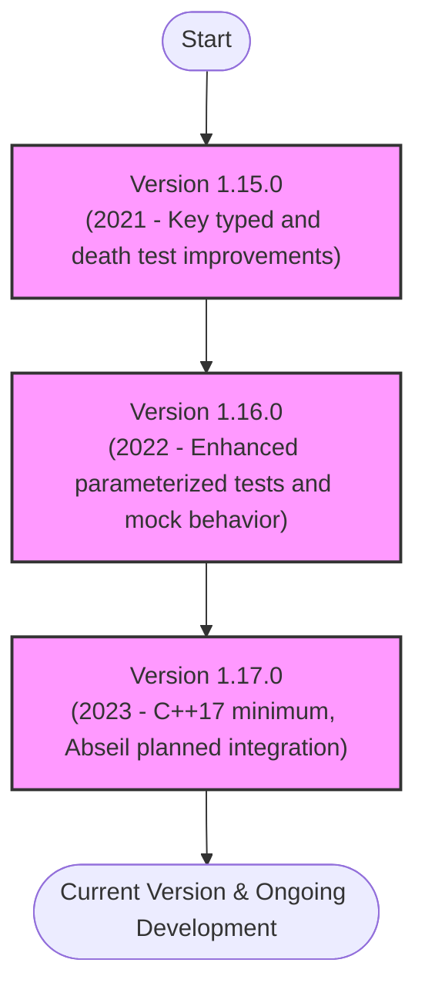

# Version Timeline

An at-a-glance overview of major and minor GoogleTest and GoogleMock versions, release dates, and primary highlights. This timeline enables users to quickly track the progression of the project, identify key milestones, and select versions that align with their development needs and compatibility requirements.

---

## Understanding the Version Timeline

The Version Timeline is designed as a quick reference guide for developers and teams to monitor the evolution of GoogleTest and GoogleMock. It presents a chronological sequence of releases highlighting new features, improvements, bug fixes, and platform support expansions.

By using this timeline, you can:

- Identify when important features were introduced or improved.
- Recognize deprecation points that might affect your existing tests.
- Gauge compatibility with your compiler and platform based on release dates and requirements.
- Decide the right version to upgrade to, balancing features and stability.

## Key Versioning Information

- **Major Versions** introduce significant new capabilities or architecture changes that may require migration.
- **Minor Versions** focus on incremental feature additions and usability improvements.
- **Patch Releases** typically address bug fixes and security updates.

### Important Version Milestones

| Version | Release Date | Highlights and Notes |
|---------|--------------|---------------------|
| 1.17.0  | 2023-XX-XX   | Requires C++17 or later. Planned Abseil integration. Enhanced cross-platform support. | 
| 1.16.0  | 2022-XX-XX   | Improved parameterized tests support, mock behavior controls refined. | 
| 1.15.0  | 2021-XX-XX   | Added typed and type-parameterized test improvements, better death test handling. |

*Note: For exact release dates and detailed changelogs, refer to the Detailed Release Notes page.*

## Navigating Your Version Choice

When choosing a version:

- Confirm your compiler supports at least C++17 starting 1.17.0.
- Review the breaking changes carefully if migrating between major versions.
- Check platform support for your operating system and build tools as reflected in the Supported Platforms documentation.
- Consider integration points with your build system and CI environment.

## Tips for Working with Version History

- **Stay Updated:** Regularly consult the Version Timeline when planning upgrades or troubleshooting issues.
- **Check for Deprecations:** Look out for features marked for removal or changed behaviors that might impact your tests.
- **Use Semantic Versioning:** Understand GoogleTest's versioning scheme to anticipate the nature of changes.

## Example Scenario

Imagine your team relies heavily on typed tests and recently upgraded to a newer compiler supporting C++17. By consulting this Version Timeline, you identify that version 1.17.0 introduces enhanced typed test features with C++17 as a minimum, making it an optimal upgrade target. You then consult the Detailed Release Notes and Breaking Changes documentation to prepare your migration.

---

## Related Documentation

For a comprehensive understanding and smooth migration experience, check out these key related pages:

- **[Detailed Release Notes](/changelog/release-history/release-notes):** In-depth descriptions of each version's changes.
- **[Breaking Changes and Migrations](/changelog/upgrading/breaking-changes):** Guidance for handling incompatible updates.
- **[Deprecations and Planned Removals](/changelog/upgrading/deprecation-notices):** Features phased out over time.
- **[Supported Platforms](../docs/platforms.md):** Compatibility matrices across platforms.
- **[Configuring Your Project](/getting-started/setup-and-installation/configuring-your-project):** How to set up GoogleTest with your build environment.

---

## Summary

The Version Timeline offers a strategic overview of GoogleTest and GoogleMock's release history to empower you in making informed decisions about which version suits your testing needs best. It complements detailed guides on release notes, migrations, and platform compatibility to enable smooth adoption and upgrade paths.

---

## Quick Reference Navigation

### Overview
- What is GoogleTest?
- Why Use GoogleTest?
- Core Testing Concepts

### Getting Started
- Installation Guides
- Basic Test Writing

### API References
- Test Case Definition
- Matchers and Assertions

### Concepts
- Mocking Fundamentals
- Test Discovery

### Changelog
- Version Timeline (this page)
- Release Notes
- Breaking Changes

---

<Tip>
Stay attentive to the C++ standard requirements associated with each release, especially the minimum C++17 requirement starting in version 1.17.0, to ensure compatibility and take advantage of the latest language features.
</Tip>

<Note>
Version dates and numbered releases are subject to updates. Always verify your version choices against the official GitHub [release page](https://github.com/google/googletest/releases) for the most current information.
</Note>

---

## Contribution and Support

Community contributions continuously enrich the project history and release cadence. To participate or get assistance:

- Visit the [GoogleTest GitHub repository](https://github.com/google/googletest).
- Refer to the CONTRIBUTING.md file for guidelines.
- Join the Google Test framework mailing list for discussions and announcements.

---

## Visual Version Progression Diagram

---

This diagram visually tracks the release evolution of key versions for quick comprehension.

---

<Check>
Always consult the detailed release notes and breaking changes before upgrading your test framework to avoid unexpected disruptions.
</Check>
