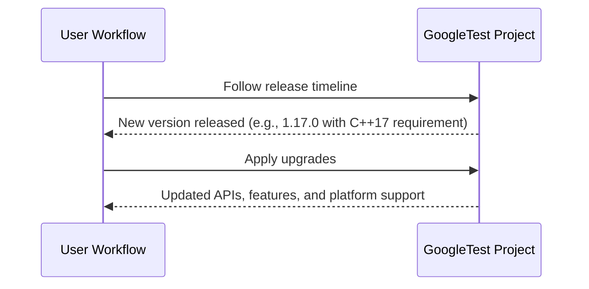

# Version Timeline and Major Releases

A comprehensive chronological overview of significant GoogleTest and GoogleMock releases. This page helps you track the evolution of the project over time, highlighting when key versions shipped and what major architectural or feature milestones they marked.

---

## Overview

GoogleTest and GoogleMock have evolved steadily since their inception, embracing modern C++ standards and expanding capabilities to match the needs of developers seeking robust, scalable, and expressive testing frameworks. This timeline captures pivotal releases, API changes, and strategic shifts in project focus.

---

## Major Releases and Milestones

### Release 1.17.0
- **Release Date:** Recent (specific date available on [GitHub Releases](https://github.com/google/googletest/releases/tag/v1.17.0))
- **C++ Standard:** Requires at least C++17, aligning with modern C++ development practices
- **Highlights:**
  - Continued integration and harmonization of GoogleTest and GoogleMock into a single repository
  - Improvements in test discovery, assertions, and parameterization capabilities
  - Preparations for dependency on Abseil, enhancing internal utilities and support

> For full release details, visit: [GoogleTest 1.17.0 Release Notes](https://github.com/google/googletest/releases/tag/v1.17.0)

### Integration of GoogleMock and GoogleTest
- Merged the formerly separate projects into a single repository to simplify maintenance and usage
- Made it easier to write tests that seamlessly incorporate mocking capabilities alongside standard assertions

### Introduction of Advanced Features
- Support for value-parameterized and type-parameterized tests, enabling reuse of test logic across varying inputs and types
- Enhancement of death tests and fatal/non-fatal failure handling to improve error detection and test isolation
- Introduction of flexible test filtering and sharding support to boost testing efficiency in CI environments

### Continuous Improvement through User Feedback
- Evolving assertion macros and matcher infrastructure
- Expanded platform support aligned with the [Google Foundational C++ Support Policy](https://opensource.google/documentation/policies/cplusplus-support#c_language_standard)
- Increasingly detailed debugging output including stack traces, signal handling, and integration with debuggers

---

## Understanding the Timeline

Each release builds on its predecessors, aiming to provide:

- **Better developer ergonomics** through improved default test behaviors and user-friendly APIs
- **Stronger, more deterministic testing** supported by rich assertions and flexible mocking
- **Cross-platform reliability and consistency** across compilers, OSes, and build systems
- **Tighter integration with build and CI tools**, including support for XML/JSON test output formats

Consider this timeline a starting point for appreciating the breadth of development and a guide for migration or upgrade planning.

---

## Navigating Further Documentation

To deepen understanding or prepare for upgrades, review the following related documentation sections:

- [GoogleTest Primer](https://google.github.io/googletest/primer.html): Beginner-friendly guide to writing tests
- [Assertions Reference](/api-reference/core-test-api/assertions): Comprehensive detail on assertions
- [Parameterized Tests Guide](/api-reference/core-test-api/parameterized-tests): Using parameterized and typed tests
- [Mocking with GoogleMock](/guides/core-workflows/mocking-with-gmock): Creating and managing mocks
- [Breaking Changes and Migration Notes](/changelog/upgrade-guidance/breaking-changes): Instructions for smooth upgrades

---

## Practical Tips

- For new projects or major upgrades, verify your compiler supports at least C++17 to use recent GoogleTest versions
- Follow semantic versioning and the release notes to understand when breaking changes or new features occur
- Use the test filtering and sharding features to optimize testing time in large-scale CI environments
- Explore the ecosystem of tools and extensions (e.g., test runners, VS Code extensions) to enhance productivity

---

## Troubleshooting Release Upgrades

When upgrading across major versions:

- Check for deprecated API usage in tests
- Validate all parameterized and type-parameterized tests are correctly instantiated
- Monitor test failures carefully as breaking changes can affect test discovery and result reporting

---

## Summary Diagram of Major Release Phases

---

## Conclusion

This version timeline page surfaces critical historical context for GoogleTest and GoogleMock, enabling you to anticipate the implications of each release and plan your testing strategy accordingly. Always align your environment with project prerequisites and leverage the detailed guides provided to maximize the benefits of this powerful testing ecosystem.

---

##### Additional Resources
- Explore the full [GoogleTest README](https://github.com/google/googletest/blob/main/README.md) for overall project guidance.
- Review Supported Platforms in [docs/platforms.md](docs/platforms.md) to confirm compatibility.
- Visit [GoogleTest on GitHub Pages](https://google.github.io/googletest/) for curated user documentation.
- Engage with the community through [Community Documentation](docs/community_created_documentation.md).

---