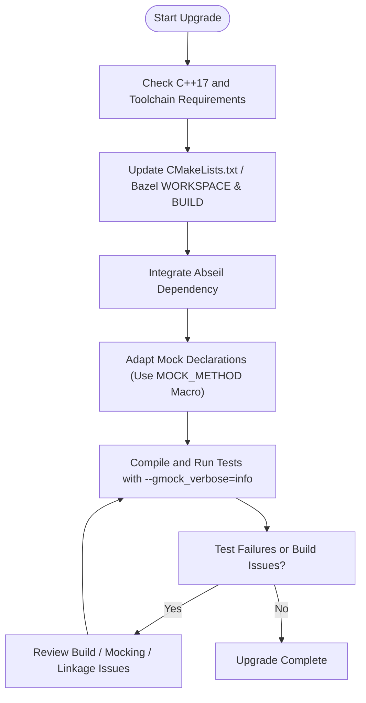

# Upgrade Guides

This guide provides detailed, step-by-step instructions to assist you in upgrading from previous versions of GoogleTest and GoogleMock to the latest release. It covers essential adjustments necessary due to new C++ standard requirements, changes in build system integration (notably Bazel and CMake), and upcoming dependency updates such as the integration of Abseil.

---

## 1. Prerequisite Updates

Before starting the upgrade process, ensure your development environment meets the new requirements:

- **C++ Standard**: The current release requires a minimum of C++17 support. Verify your compiler supports C++17 fully.
- **Supported Compilers**: GCC, Clang, and MSVC remain supported with minimum versions corresponding to C++17 compliance.
- **Build Tools**: CMake v3.14 or newer is required. Verify your Bazel workspace is updated to handle new dependency and toolchain requirements.

<Tip>
Review the [Prerequisites & System Requirements](../../getting-started/essential-setup/prerequisites-requirements) page for detailed platform and tool compatibility.
</Tip>


## 2. Adjusting Build System Integration

### 2.1 CMake Changes
- Update your `CMakeLists.txt` to link against the latest GoogleTest and GoogleMock targets.
- Use the explicitly provided imported targets:
  - `gtest`
  - `gtest_main`
  - `gmock`
  - `gmock_main`

Example snippet to link your test executable:

```cmake
find_package(GTest REQUIRED)
target_link_libraries(your_test PRIVATE GTest::gtest GTest::gtest_main GTest::gmock GTest::gmock_main)
```

- Be aware that the current release introduces an upcoming dependency on Abseil libraries. If your build system supports transitive dependency management, these should be handled automatically. Otherwise, ensure your build fetches and links Abseil appropriately.

### 2.2 Bazel Updates
- Bazel users must update the `WORKSPACE` and `BUILD` files according to the new rules provided in the GoogleTest GitHub repository for the latest release.
- The newer versions require explicit fetching and linking of Abseil components.

<Tip>
Consult the repository's Bazel integration documentation and examples for the latest recommended workspace configurations.
</Tip>

## 3. Adjusting to New C++ Standard Requirements

- Refactor existing test code if necessary to comply with C++17. This includes:
  - Removing deprecated constructs.
  - Updating compiler flags.

- Verify usage of the GoogleMock `MOCK_METHOD` macros to account for updated syntax and qualifier support:
  - Ensure that mock methods overriding `noexcept` and reference-qualified methods are correctly declared.

- If you previously used legacy `MOCK_METHODn` macros, consider migrating to the unified `MOCK_METHOD` macro for improved consistency and future compatibility.

### Example: Migrating From Legacy to Unified MOCK_METHOD
```cpp
// Legacy
MOCK_CONST_METHOD1(Foo, bool(int));

// New preferred form
MOCK_METHOD(bool, Foo, (int), (const));
```

## 4. Dependency Changes — Abseil Integration

- The upcoming release plans to use Abseil (`absl`) as a foundational dependency.

- To prepare, ensure your build system has access to the Abseil library and that it is compatible with your compiler and platform.

- This integration may impact linkage order and symbol resolution; adjust accordingly.

<Warning>
Meet with your build infrastructure or DevOps teams ahead of the upgrade to coordinate Abseil dependency integration.
</Warning>

## 5. Compiler and Code Modifications

- With stricter C++17 rules, pay attention to mock classes that mock methods using move-only types such as `std::unique_ptr`. The current release includes full support for move-only types in mock methods.

- Consult the [Mocking Methods That Use Move-Only Types](../../docs/gmock_cook_book.md#Mocking-Methods-That-Use-Move-Only-Types) documentation to correctly declare and set expectations on such methods.

- Use lambda expressions or callable objects compatible with move-only semantics for `WillOnce` actions.

## 6. Testing and Validation

- After upgrading, compile all tests and run them in your environment.

- Verify that no warnings or unexpected failures occur during linking or runtime.

- Use the `--gmock_verbose=info` flag for verbose tracing during test execution to facilitate debugging.

## 7. Troubleshooting Common Upgrade Issues

### Build Failures
- Check that your build scripts correctly reference the new imported targets and dependencies.
- Confirm that Abseil is correctly integrated and available.

### Mock-Related Errors
- Ensure all mock method declarations use the updated `MOCK_METHOD` macro syntax.
- Verify correct use of qualifiers: `const`, `noexcept`, `override`, and reference qualifiers.

### Linker Errors
- Look out for missing symbols from Abseil or GoogleTest libraries, indicating linkage order or missing dependency issues.

### Runtime Failures
- Validate expectation declarations especially if applying strict mock modes; some behaviors could be stricter due to enhanced verification.

<Tip>
Refer to the [Troubleshooting & Common Issues](../../getting-started/quickstart-and-troubleshooting/troubleshooting-validation) guide for diagnosis strategies.
</Tip>

## 8. Additional Best Practices

- Consider migrating to the latest GoogleMock features for enhanced expressiveness and maintainability.
- Leverage modern C++ standards fully in your testing code to improve performance and clarity.
- Regularly consult release notes and breaking changes documentation to keep your tests updated with evolving APIs.

---

## Related Documentation

- [Prerequisites & System Requirements](../../getting-started/essential-setup/prerequisites-requirements)
- [Installation and Setup](../../guides/getting-started/install-and-setup)
- [Breaking Changes & Migrations](../breaking-changes)
- [Mocking Reference](../../docs/reference/mocking)
- [Troubleshooting & Common Issues](../../getting-started/quickstart-and-troubleshooting/troubleshooting-validation)
- [GoogleTest GitHub Repository](https://github.com/google/googletest)

---

## Summary Diagram of Upgrade Steps



---

This upgrade guide ensures you move confidently to the latest GoogleTest and GoogleMock versions while adhering strictly to the new build, C++ standard, and dependency requirements.