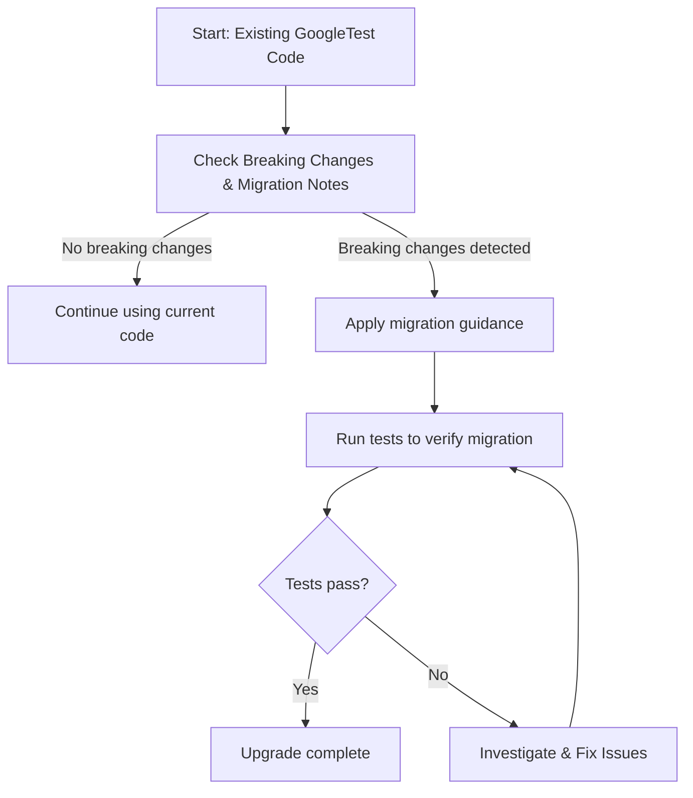

# Breaking Changes & Migration Notes

This page delivers a focused and actionable summary of all backward-incompatible changes, deprecated features, and interface removals introduced in recent GoogleTest releases. It serves as an essential resource for users planning upgrades and refactoring, ensuring smooth transitions by clearly identifying impacted functionalities and guiding migration efforts with practical advice and code snippets.

---

## Understanding Breaking Changes

Breaking changes affect the observable behavior or interfaces of GoogleTest in ways that require users to modify their existing code or test suites. These may include:

- Removal or modification of public APIs
- Changes in behavior of assertions or mocks
- Modifications to test registration or execution semantics

Staying informed about such changes is critical to maintaining test reliability and avoiding subtle bugs after upgrades.

<Info>
When encountering a breaking change, review the migration advice and code samples carefully before upgrading. This helps prevent regressions and reduces downtime.
</Info>

## Migration Guidance for Affected Modules

Each release summary on this page includes direct references to the specific GoogleTest modules impacted by breaking changes. Commonly affected areas may include:

- **Mocking Framework**: Adjustments in `MOCK_METHOD` declarations, expectations, or default behaviors
- **Assertion Macros**: Updates to macros requiring code changes or replacements
- **Test Fixtures and Suite Setup**: Modifications to test suite lifecycle methods or naming conventions

Explicit migration snippets illustrate how to modify existing code to comply with the new versions.

### Example: Handling ASSERT_* in Non-void Functions

Previously, fatal assertions such as `ASSERT_*` had limitations if used inside non-void functions, leading to confusing compile errors like "void value not ignored as it ought to be." The recommended migration is to either:

```cpp
// Instead of:
bool Foo(int x) {
  ASSERT_EQ(x, 5);  // This causes a compile error.
  return x == 5;
}

// Do:
void Foo(int x, bool* result) {
  ASSERT_EQ(x, 5);
  *result = (x == 5);
}
```

This change ensures fatal assertions only occur in void-returning functions.

### Example: Splitting Death Tests into Separate Suites

GoogleTest recommends naming *test suites* containing death tests with the suffix `DeathTest` for stability and thread-safety. If your test suite mixes death tests and non-death tests, the migration is:

```cpp
class FooTest : public ::testing::Test { ... };

using FooDeathTest = FooTest;  // Alias for death test variants

TEST_F(FooTest, RegularTest) { ... }
TEST_F(FooDeathTest, DeathTestExample) {
  ASSERT_DEATH(SomeFunction(), "death message");
}
```

This approach isolates death tests to avoid unexpected execution order issues.

## Practical Migration Tips

- **Always Read Release Notes**: Before upgrading to a new version, consult the detailed release notes for breaking changes sections.
- **Run Migration Tests Early**: Set up branches or environments to try the new version with your existing tests to discover potential incompatibilities.
- **Refactor Incrementally**: Apply migration snippets step by step, verifying after each to isolate issues.
- **Use Static Analysis and Compilation Checks**: Some changes will fail to compile if your code still uses deprecated or removed APIs.

## Common Pitfalls and How to Avoid Them

- Using fatal assertions (`ASSERT_*`) inside constructors or destructors, which is unsupported.
- Forgetting to rename or alias test suites when splitting death tests.
- Overlooking updated cardinality or sequence requirements in mock expectations causing unexpected failures.

<Warning>
Failure to properly migrate tests to match breaking changes can lead to false positives/negatives and disrupt test suite stability.
</Warning>

## Overview of Recent Breaking Changes

| Version  | Change Type        | Description                                      | Impacted Modules       | Migration Guidance                       |
|----------|--------------------|------------------------------------------------|-----------------------|-----------------------------------------|
| 1.12.0   | API Removal         | Removed support for `StaticAssertTypeEq` in non-instantiated templates | Assertions | Use explicit function instantiation or alternative static assertions |
| 1.11.0   | Behavioral Change   | Changed default death test style to ‘threadsafe’ on some platforms   | Death Tests            | Review death test code for threading assumptions |
| 1.10.0   | Interface Change    | Modified MOCK_METHOD macro to support reference qualifiers          | Mocking                | Update mock method declarations with `ref(&)` qualifiers |

For detailed release-specific breaking changes, see the [Version Timeline](../release-history/version-timeline.md) and [Detailed Release Notes](../release-history/release-notes.md).

## Troubleshooting Migration Issues

- **Compilation Errors Due to Assertion Placement**: Ensure `ASSERT_*` macros are only used in void-returning functions or adapt functions accordingly.
- **Unrecognized Mock Method Errors**: Confirm mock method declarations follow updated macro syntax, including qualifiers.
- **Deadlock or Unexpected Behavior in Death Tests**: Consider adopting the threadsafe death test style explicitly and separate death tests into dedicated suites.

## Additional Resources

- [Mocking Reference](../reference/mocking.md): API details on mock expectations and method declarations.
- [Assertions Reference](../reference/assertions.md): Comprehensive listings of available assertions and usage notes.
- [gMock Cookbook](../gmock_cook_book.md): Practical examples for mocking practices including migration techniques.
- [Mocking Workflow Guide](../guides/mocking-best-practices/mocking-workflow.md): Best practices for creating and maintaining mocks.
- [Version Timeline](../release-history/version-timeline.md): Chronological view of all releases with summaries.

<Callout class="note">
To smoothly upgrade, always consult this page alongside the release notes specific to your target GoogleTest version.
</Callout>

---

#### Technical Diagram



This flow represents the user journey on the Breaking Changes page: first, identify any breaking changes, then migrate code as directed, followed by verification and iteration until success.

---

## Concluding Advice

Upgrading GoogleTest versions is critical for benefit from new features and fixes, but the changes summarized here require deliberate analysis. This page empowers you with exactly what you need: clear definitions of breaking changes, focused migration instructions, and pointers to detailed resources. Adhere closely to the migration snippets and take advantage of community channels if you encounter issues.

---