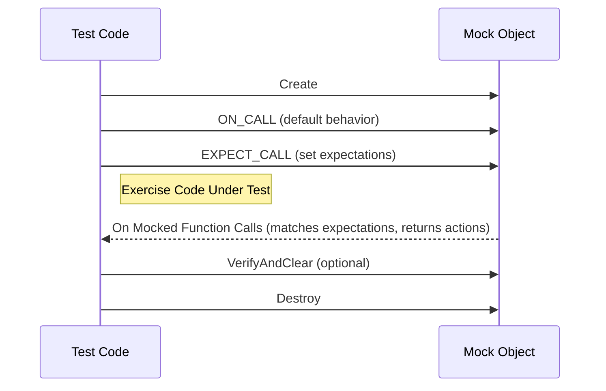

# Upgrade Guide for GoogleTest and GoogleMock

This guide provides a practical, step-by-step approach to migrate your codebase and test infrastructure when adopting a new version of GoogleTest/GoogleMock. It focuses on ensuring your mocks, expectations, and test flows remain functional and maintainable throughout the upgrade.

---

## 1. Preparing for the Upgrade

### 1.1 Understand the Version Change Impact
- Review the [Breaking Changes and Deprecations](../../changelog/upgrade-guidance/breaking-changes.md) to identify incompatible API or behavioral changes.
- Confirm your compiler toolchain meets the new minimum requirements (notably C++17 and beyond).

### 1.2 Assess Your Current Usage
- Inventory your usage of `MOCK_METHOD` and the older `MOCK_METHODn` macros.
- Catalog any custom mock classes, actions, or matchers that might rely on deprecated idioms.
- Identify complex mock behaviors or test patterns that may be sensitive to semantic changes in mocks.

### 1.3 Back Up Your Test Code
- Ensure your existing tests and mocks are committed to version control or otherwise safely preserved.
- It's recommended to branch your code before applying changes to enable easy rollback if needed.


---

## 2. Migrating Mock Definitions

### 2.1 Transition to the `MOCK_METHOD` Macro
- Replace old-style `MOCK_METHODn`/`MOCK_CONST_METHODn` macros with the unified `MOCK_METHOD(return_type, method_name, (args), (specs))` syntax.
- Pay special attention to qualifiers such as `const`, `override`, `noexcept`, and calling conventions (`Calltype(...)`).

```cpp
// Old style
MOCK_CONST_METHOD1(Foo, int(int));

// New style
MOCK_METHOD(int, Foo, (int), (const, override));
```

### 2.2 Wrapping Complex Types in Parentheses
- When return types or argument types contain commas (e.g., template types like `std::pair<int, double>`), wrap these types in parentheses to avoid macro parsing errors.

```cpp
MOCK_METHOD((std::pair<int, double>), GetPair, ());
```

Or consider aliasing complex types:

```cpp
using IntDoublePair = std::pair<int, double>;
MOCK_METHOD(IntDoublePair, GetPair, ());
```

### 2.3 Handling Overloaded Methods
- Verify your mocks correctly specify all overloaded variants.
- Use `Const()` wrapper in expectations for const-qualified overloads.

```cpp
EXPECT_CALL(mock, GetBar()).WillOnce(ReturnRef(bar1));
EXPECT_CALL(Const(mock), GetBar()).WillOnce(ReturnRef(bar2));
```

### 2.4 Check Virtual Destructors
- Ensure all classes being mocked have virtual destructors, as this guarantees proper cleanup and alignment with gMock's expectations.


---

## 3. Adjusting Test Expectations and Behaviors

### 3.1 Leveraging `ON_CALL` vs `EXPECT_CALL`
- Use `ON_CALL` to set default behaviors without expectations. This makes your tests resilient by avoiding over-constraining.

```cpp
ON_CALL(mock, Method(_)).WillByDefault(Return(true));
EXPECT_CALL(mock, Method(5));  // Only expects a call with argument 5
```

- Remember that `EXPECT_CALL` sets expectations that calls will happen, while `ON_CALL` only specifies default behavior.

### 3.2 Fine-Tuning Call Cardinalities
- Update or add `.Times()` clauses to reflect changed call patterns, especially if new version default cardinalities differ.
- Use `.RetiresOnSaturation()` for expectations that should become inactive after being saturated to avoid sticky expectations leading to unexpected call errors.

### 3.3 Sequence and Ordering Updates
- Validate the usage of `InSequence` and `After` clauses to ensure calls are still expected in your specified order.
- Use `Sequence` objects for partial ordering when needed.

### 3.4 Behavior Modes: Nice, Naggy, Strict
- Consider adopting `NiceMock` where you want to suppress warnings on uninteresting calls.
- Use `StrictMock` only when all uninteresting calls should be treated as errors.

Example:

```cpp
using ::testing::NiceMock;
NiceMock<MockFoo> nice_foo;
EXPECT_CALL(nice_foo, DoSomething());
```

### 3.5 Migrate Legacy Actions to Lambdas or Functors
- Where your expectations define actions via old macros or function pointers, consider converting to lambdas or callable objects for clearer semantics and maintainability.

```cpp
EXPECT_CALL(mock, Foo(_))
    .WillOnce([](int x) { return x * 2; });
```


---

## 4. Automating Migration (If Migration Tools Available)

If your version upgrade toolchain includes migration utilities, integrate these as part of your process to automate repetitive changes:

- Macro replacement tools to convert old `MOCK_METHODn` macros.
- Static analysis or grep scripts to identify potentially broken mocks or expectations.
- Scripts to verify deprecated usage of qualifiers or APIs.


---

## 5. Testing and Validation Post-Migration

### 5.1 Run Your Test Suite Thoroughly
- Execute all tests to validate that expectations are met.
- Pay attention to new warnings or errors related to uninteresting calls or mocking errors.

### 5.2 Use Verbosity Flags to Understand Mock Behavior
- Use the `--gmock_verbose=info` flag to get detailed traces of mock calls and expectation matches.
- Combine with `--gtest_stack_trace_depth=0` to avoid verbose stack traces if needed.

### 5.3 Failure Investigation Tips
- If tests fail due to unexpected or excessive calls, review the order and cardinality of your expectations.
- Investigate warnings about uninteresting calls — assess if you should add expectations or convert mocks to `NiceMock`.

### 5.4 Verify Mock Cleanup
- Ensure mocks with expectations complete properly to avoid leaks or missed verification.
- Use `Mock::VerifyAndClearExpectations()` manually if mocks are destroyed asynchronously or indirectly.


---

## 6. Common Pitfalls and How to Avoid Them

- **Sticky expectations**: Without `.RetiresOnSaturation()`, certain expectations persist and cause errors after calls exceed `.Times()` limit.
- **Incorrect macro usage**: Watch for unwrapped commas in type specifiers, missing qualifiers, or misused macro variants.
- **Destructor issues**: Mocks of classes without virtual destructors can cause undefined behavior.
- **Over-specification of expectations**: Avoid setting expectations on every call unless necessary; use `ON_CALL` and `NiceMock` judiciously.
- **Confusing uninteresting and unexpected calls**: Understand the difference and how behavior modes affect test outcomes.


---

## 7. Troubleshooting Migration Issues

### Issue: Compilation errors related to `MOCK_METHOD`
- Confirm all argument and return types with commas are wrapped in parentheses or aliased.
- Verify qualifiers on methods match those in the base class.

### Issue: Unexpected test failures or warnings about uninteresting calls
- Check if expectations are missing or too strict.
- Consider switching mocks to `NiceMock` to suppress warnings on uninteresting calls.
- Verify `EXPECT_CALL` ordering and `.Times()` settings.

### Issue: Memory leaks or mock verification errors at test teardown
- Explicitly call `Mock::VerifyAndClearExpectations(&mock)` if mock lifetime is uncertain.
- Avoid deleting mocks inside their own actions; if needed, use safe delegation patterns.


---

## 8. Additional Resources and References

- [Mocking Reference](../../docs/reference/mocking.md) — Detailed API for creating and using mocks.
- [gMock Cookbook](../../docs/gmock_cook_book.md) — Practical recipes and patterns for mock usage.
- [Legacy gMock FAQ](../../docs/gmock_faq.md) — Answers to common migration questions.
- [Mock Behavior Modes](../../api-reference/mocking-api/mock-behavior-modes.md) — Understanding NiceMock, NaggyMock, and StrictMock.
- [Setting Expectations, Actions, and Cardinalities](../../api-reference/mocking-api/setting-expectations-actions.md) — How to specify call expectations.

Remember to consult the comprehensive release notes and breaking change documentation for your specific version upgrade.


---

## Appendix: Example Migration Snippet

Before:

```cpp
class MockFoo {
 public:
  MOCK_CONST_METHOD1(Foo, int(int));
};

EXPECT_CALL(mock_foo, Foo(5)).WillOnce(Return(10));
```

After:

```cpp
class MockFoo {
 public:
  MOCK_METHOD(int, Foo, (int), (const, override));
};

EXPECT_CALL(mock_foo, Foo(5)).WillOnce(Return(10));
```


---

For a visual overview, the mock interaction lifecycle remains as follows:



---

By following this guide, you will ensure a smooth transition to the new version of GoogleTest and GoogleMock with robust and maintainable mocks and tests.
