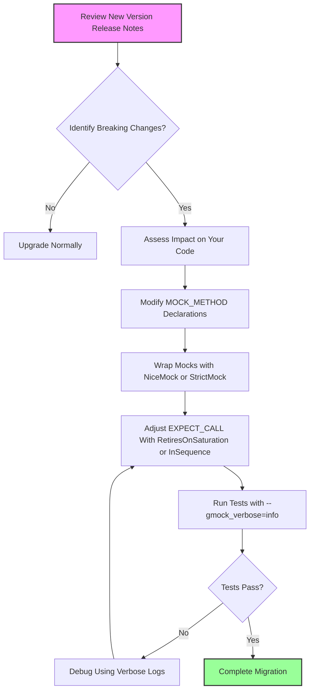

# Breaking Changes and Migration

GoogleTest documents all breaking API and behavior changes that might affect your existing tests and code base. Understanding these changes early helps you update your projects smoothly with minimal disruption. This guide details all known breaking changes introduced in each major or minor release of GoogleTest and GoogleMock, provides migration steps, and offers practical examples to assist you in adapting your tests effectively.

---

## 1. Introduction to Breaking Changes

Breaking changes are modifications in the API or behavior between releases that may cause your existing code or tests to fail to compile or behave differently. GoogleTest carefully tracks such changes to keep users informed about compatibility issues and to mitigate upgrade risks.

This page focuses specifically on:

- Changes affecting mock class definitions and usage
- Alterations in expectation and default action behavior
- Behavioral changes in mock strictness and call handling
- Syntax and semantic changes in macros like `MOCK_METHOD` and `EXPECT_CALL`


## 2. Overview of Notable Breaking Changes

### 2.1 Changes to `MOCK_METHOD` Macro Usage

- Commas within argument types require careful handling by either:
  - Wrapping the entire argument or return type in parentheses,
  - Or defining a type alias and using that alias in the mock declaration.

Example:

```cpp
// Invalid usage (won't compile due to comma in type):
MOCK_METHOD(std::pair<bool, int>, GetPair, ());

// Correct ways:
MOCK_METHOD((std::pair<bool, int>), GetPair, ());
// or
using BoolAndInt = std::pair<bool, int>;
MOCK_METHOD(BoolAndInt, GetPair, ());
```

- Qualifiers such as `const`, `override`, `noexcept`, and `Calltype(...)` may be specified as a fourth optional argument to precisely model target functions.

### 2.2 Mock Strictness Behavior

GoogleMock has three primary mock strictness modes, each impacting how unexpected or uninteresting calls are handled:

- `NaggyMock<T>` (default behavior): Warns on uninteresting calls but allows them.
- `NiceMock<T>`: Suppresses warnings on uninteresting calls.
- `StrictMock<T>`: Treats uninteresting calls as test failures.

Use these wrappers by replacing your mock object declaration:

```cpp
using ::testing::NiceMock;
using ::testing::NaggyMock;
using ::testing::StrictMock;

NiceMock<MockFoo> nice_foo;    // No warnings on uninteresting calls
StrictMock<MockFoo> strict_foo; // Fails on unexpected calls
```

**Caution:** These wrappers only affect mock methods defined *directly* in the mock class via `MOCK_METHOD`. Inherited mock methods may not respect these modifiers consistently across compilers.

### 2.3 Changes in Default and Expected Call Behavior

- `ON_CALL` specifies default behaviors without setting expectations. Not setting `EXPECT_CALL` for a method implies no expectation to be called, and calls are considered uninteresting.
- With only `ON_CALL`, uninteresting calls produce warnings (naggy behavior) unless wrapped in `NiceMock`.
- `EXPECT_CALL` sets an expectation, the mock verifies calls against these.
- Call order and count expectations are enforced strictly when using `InSequence` and `After` clauses.

Example of ordered expectations:

```cpp
using ::testing::InSequence;
{
  InSequence seq;
  EXPECT_CALL(mock, Call1());
  EXPECT_CALL(mock, Call2());
}
```

This requires `Call1()` before `Call2()`.

### 2.4 Expectations are "Sticky" by Default

Expectations remain active even after their upper usage limit is reached, causing failures on excessive calls.
To make expectations retire automatically after reaching their limit, use `.RetiresOnSaturation()`:

```cpp
EXPECT_CALL(mock, GetValue())
  .Times(2)
  .RetiresOnSaturation();
```

This lets other expectations match subsequent calls.


### 2.5 Changes in Matchers and Actions

- Matchers must be pure functions without side effects.
- When matching overloaded methods, explicit disambiguation might be needed using `Const()` or `SafeMatcherCast`.
- Lambda expressions, free functions, and custom actions via `ACTION` macros or functor objects are supported to customize method behaviors.

Examples:

```cpp
EXPECT_CALL(mock, DoSomething(_))
  .WillOnce([](int x) { return x * 2; });
```


## 3. Migration Strategies and Best Practices

### 3.1 Handling Comma-containing Types in MOCK_METHOD

To prevent parsing issues caused by commas in types:

- Wrap the type in extra parentheses:

```cpp
MOCK_METHOD((std::pair<int, int>), Foo, ());
```

- Or use type aliases:

```cpp
using IntPair = std::pair<int, int>;
MOCK_METHOD(IntPair, Foo, ());
```

### 3.2 Transitioning to Strict or Nice Mocks

Evaluate your code base’s tolerance for unexpected or uninteresting calls:

- Use `NiceMock` to suppress warnings if uninteresting calls are acceptable.
- Use `StrictMock` to catch unexpected calls as test failures.

Example:

```cpp
NiceMock<MockClass> mock;   // For less noisy tests
StrictMock<MockClass> mock; // Strict verification
```

### 3.3 Adapting to Sticky Expectations Behavior

- If you experience errors due to multiple calls exceeding expected invocations, consider adding `.RetiresOnSaturation()` to your expectations.
- Use sequences to enforce call ordering that corresponds with your test scenarios.

### 3.4 Ensuring Proper EXPECT_CALL Ordering

- `EXPECT_CALL` setups must occur *before* the mock method is called to guarantee correct verification.
- Place more specific expectations after general catch-all ones to properly shadow them.

Example:

```cpp
EXPECT_CALL(mock, Foo(_)).Times(AnyNumber());
EXPECT_CALL(mock, Foo(42));  // More specific, placed last
```

### 3.5 Using Verbosity Flags for Debugging

- Run your tests with the `--gmock_verbose=info` flag to see detailed call traces and expectations matching.
- To reduce noise, use `--gmock_verbose=warning` or `error`, according to needs.


## 4. Practical Example: Migrating to Use NiceMock and RetiresOnSaturation

If your test previously generated warnings on uninteresting calls and failed on excessive calls, update your mocks as follows:

```cpp
using ::testing::NiceMock;
using ::testing::RetiresOnSaturation;

class MockFoo {
 public:
  MOCK_METHOD(void, Bar, (int x), (override));
};

// In your test:
NiceMock<MockFoo> mock;

EXPECT_CALL(mock, Bar(42))
  .Times(2)
  .RetiresOnSaturation();

mock.Bar(42);  // Ok
mock.Bar(42);  // Ok
// Further calls fall through to NiceMock, no warnings
```

## 5. Troubleshooting Common Migration Issues

### 5.1 Compilation Errors Related to Macro Parsing

- Verify that all argument types containing commas are protected with parentheses or type aliases.

### 5.2 Unexpected Warnings or Failures About Uninteresting Calls

- Wrap mocks with `NiceMock` to suppress warnings if those calls are expected but not verified.
- If strict verification is desired, use `StrictMock`.

### 5.3 Failing Tests Due to Call Count or Order

- Review `Times()` usage and consider adding `.RetiresOnSaturation()`.
- Use `InSequence` and `After` attributes to specify call order explicitly.

### 5.4 Difficulty with Overloaded Methods

- Use explicit disambiguation techniques such as `Const()` or matchers like `SafeMatcherCast<T>()`.


## 6. Key References

- [gMock Cookbook](../guides/mocking-and-advanced-techniques/gmock_cook_book.md) — For detailed recipes including mocking techniques, actions, and matchers.
- [gMock for Dummies](../guides/mocking-and-advanced-techniques/gmock_for_dummies.md) — Introductory guide for newcomers.
- [Mocking Reference](../api-reference/mocking-apis/expect-call-and-on-call.md) — Detailed descriptions of EXPECT_CALL and ON_CALL.
- [Mock Class Behaviors](../api-reference/mocking-apis/mock-class-behaviors.md) — Explains NiceMock, StrictMock, and NaggyMock.
- [Matchers Reference](../api-reference/matchers-and-actions/argument-matchers.md) — For mastering argument matching.
- [Actions Reference](../api-reference/matchers-and-actions/mock-actions.md) — For custom behavior implementations.

---

<Callout title="Tips for Smooth Migration">
- Use `NiceMock` to reduce noise from uninteresting calls.
- Add `.RetiresOnSaturation()` to avoid upper-bound misuse failures.
- Use sequences or `.After()` to maintain explicit call order.
- Take advantage of `--gmock_verbose=info` for tracing test behavior.
- Carefully update `MOCK_METHOD` declarations with corrected parentheses or type aliases for complex types.
</Callout>

---

## 7. Summary of API Changes with Migration Steps

| Change                          | Impact                                          | Migration Step                                                                                   |
|--------------------------------|-------------------------------------------------|------------------------------------------------------------------------------------------------|
| Handling of commas in types     | Compilation errors on `MOCK_METHOD` with comma in type | Use parentheses around type or type aliases                                                    |
| Introduction of `NiceMock`      | Suppresses warnings on uninteresting calls      | Wrap mocks: `NiceMock<MockFoo>` instead of `MockFoo`                                           |
| Introduction of `StrictMock`    | Turns uninteresting calls into failures          | Wrap mocks: `StrictMock<MockFoo>` and update tests to expect failures on unexpected calls      |
| Expectations sticky by default  | Multiple calls beyond expected cause failures   | Add `.RetiresOnSaturation()` or use sequences                                                  |
| Requirement for ordered calls   | Optional, controlled via `InSequence`            | Use `InSequence` or `.After` clauses to enforce call order                                     |
| Default action management       | Use `ON_CALL` to specify defaults, separate from `EXPECT_CALL` | Refactor to ensure default actions are set with `ON_CALL`, expectations with `EXPECT_CALL`    |

---

## 8. Additional Resources

- [GoogleTest GitHub Repository](https://github.com/google/googletest) — For latest releases and issues.
- [GoogleTest Release Notes and Changelog](https://github.com/google/googletest/blob/main/CHANGELOG.md) — Track version-specific changes.


---

<Info>
For best practices on writing and using mocks effectively, refer to the [Using Mocks guide](../guides/mocking-and-advanced-techniques/using-mocks.md) and the [Advanced Mocking Patterns](../guides/mocking-and-advanced-techniques/advanced-mocking-patterns.md).
</Info>

---

# Diagram: Typical User Workflow for Adapting to Breaking Changes



---

## Credits

Documentation compiled by the GoogleTest Team, based on internal specifications, user feedback, and official release notes.

---

<Source url="https://github.com/google/googletest" paths={[{"path": "docs/gmock_cook_book.md", "range": "1-522"},{"path": "docs/gmock_for_dummies.md", "range": "1-187"},{"path": "googlemock/include/gmock/gmock-nice-strict.h", "range": "1-200"},{"path": "googlemock/test/gmock-nice-strict_test.cc", "range": "1-460"},{"path": "docs/reference/mocking.md", "range": "1-367"},{"path": "docs/gmock_cheat_sheet.md", "range": "1-147"}]} />