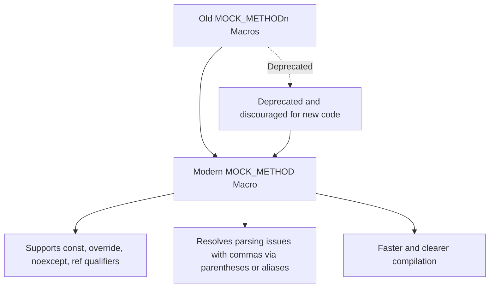

# Upgrade Guides & Best Practices

GoogleTest and GoogleMock evolve continuously to provide more robust, performant, and user-friendly testing frameworks. This document delivers focused, hands-on guidance for upgrading existing test suites to newer versions of GoogleTest and GoogleMock. It clarifies environment or build tool changes required and highlights commonly encountered migration issues with actionable advice.

---

## 1. Overview of Upgrade Strategy

Upgrading your test suite effectively requires understanding changes in the frameworks, adapting to new APIs, and mitigating breaking changes.

- **Versioning Scheme:** GoogleTest and GoogleMock use semantic versioning. Major versions may introduce breaking changes requiring cautious migration.
- **Upgrade Types:** Minor releases typically add features and fix bugs without breaking existing behavior. Major releases may alter APIs, behavior, or drop deprecated features.
- **Preparation:** Always review release notes of the target version to anticipate changes.
- **Testing Upgrades:** Before upgrading your entire suite, run your tests against the new version to identify regressions early.

## 2. Build Tool and Environment Updates

New releases of GoogleTest sometimes require updates in your development environment or build configurations.

### C++ Standard Requirements

- GoogleTest now requires a minimum of C++17 support for building and running. Ensure your compiler and build environment are set accordingly:

```cmake
set(CMAKE_CXX_STANDARD 17)
set(CMAKE_CXX_STANDARD_REQUIRED ON)
```

- Older compilers or environments lacking robust C++17 support may no longer be compatible.

### Build System Changes

- When using CMake, prefer the bundled GoogleMock build option with `-DBUILD_GMOCK=ON` instead of separate GoogleMock builds.
- For Bazel users, ensure the `@com_google_googletest` repository is updated and rules are compatible with the current version.

### Runtime Flags and Macros

- Adjust any custom flags or macros related to GoogleTest or GoogleMock according to updated documentation; for example, `gmock_verbose` controls the verbosity of mock output.

## 3. Migrating Mock Classes and API Usage

Recent releases include enhancements and changes in mocking mechanisms. Be aware of these points to upgrade your mocks without friction.

### Modern MOCK_METHOD Macro Adoption

- If your code uses legacy `MOCK_METHODn` macros, transition to the generic `MOCK_METHOD()` macro that accepts return type, method name, argument types, and optional qualifiers.

Example before:

```cpp
MOCK_METHOD1(Foo, bool(int));
```

After:

```cpp
MOCK_METHOD(bool, Foo, (int));
```

- This change better supports modern C++ features such as noexcept, ref qualifiers, and call conventions.

### Handling Overloaded Methods

- Mock every overloaded version to avoid compiler warnings about hidden base class methods.
- You can bring hidden base versions into scope with `using` declarations to prevent warnings.

### Non-virtual and Free Function Mocking

- For non-virtual member functions, use template-based dependency injection or interface wrappers.
- Free functions require wrapping in interfaces or using `std::function` adapters and `MockFunction`.

### Move-Only Types and Modern C++ Features

- Support for mocking methods with move-only types (e.g., `std::unique_ptr`) is fully available in recent versions. Use lambdas or `MOCK_METHOD` with usual syntax.

### Strict and Nice Mocks

- Consider default behaviors for uninteresting calls. Use `NiceMock` to suppress warnings or `StrictMock` to treat uninteresting calls as errors.
- Adjust your mocks accordingly to reduce test flakiness.

## 4. Expectations and Behavior Specification

### Use `ON_CALL` and `EXPECT_CALL` Judiciously

- Define `ON_CALL` for setting default behaviors without imposing call expectations.
- Use `EXPECT_CALL` only where verifying the invocation is desired.

### Cardinality and Call Ordering

- Define invocation counts using `Times()`, `AtLeast()`, `Exactly()`, etc.
- Impose call order using `InSequence` or `After()` clauses as your test logic requires.

### Retiring Expectations

- Use `.RetiresOnSaturation()` to avoid sticky expectations leading to false positives.

## 5. Handling Breaking Changes and Migration Pitfalls

### Common Migration Issues

- **Virtual Destructor Requirement:** Ensure interfaces you mock have virtual destructors to prevent runtime issues.
- **Overloaded Methods Hiding Base Methods:** Apply `using` directives or mock all overloads.
- **Qualifiers on Mocked Methods:** Correctly specify qualifiers like `const`, `noexcept`, and `ref(&)` to match overridden base class methods.
- **Commas in Template Arguments:** Wrap complex template types in parentheses or use type aliases for `MOCK_METHOD` to parse correctly.

### Deprecated Features

- Avoid old-style `MOCK_METHODn` macros, prefer the modern `MOCK_METHOD`.
- Migrate from legacy mocking constructs and flags as directed.

## 6. Best Practices in Upgrading Tests

- Run tests under increased verbosity (`--gmock_verbose=info`) while migrating to get detailed diagnostics.
- Incrementally apply expectations rather than over-constraining tests.
- Suppress unnecessary warnings using `NiceMock` during iterative development.
- Make use of sequences and cardinalities to reflect real intent, keeping tests stable and less brittle.

## 7. Examples

### Migrating a Mock Method with Comma in Arguments

Before:

```cpp
class MockFoo {
 public:
  MOCK_METHOD(std::pair<bool, int>, GetPair, ());  // Fails to compile
};
```

After:

```cpp
using BoolAndInt = std::pair<bool, int>;

class MockFoo {
 public:
  MOCK_METHOD(BoolAndInt, GetPair, ());
};
```

### Using Strict and Nice Mocks

```cpp
using ::testing::NiceMock;
using ::testing::StrictMock;

NiceMock<MockFoo> nice_mock;  // Suppresses uninteresting call warnings
StrictMock<MockFoo> strict_mock;  // Treats uninteresting calls as failures
```

### Setting Default Return Values for Custom Types

```cpp
using ::testing::DefaultValue;

Bar default_bar;
DefaultValue<Bar>::Set(default_bar);
...
DefaultValue<Bar>::Clear();
```

---

## Further Resources and Links

- [Mocking Reference](/api-reference/mocking-framework/mock-definition)
- [gMock Cookbook](docs/gmock_cook_book.md)
- [Using Mocks to Isolate Dependencies Guide](/guides/mocking-and-advanced-patterns/using-mocks)
- [Breaking Changes & Migrations](/changelog/upgrade-notices/breaking-changes)
- [Mocking Best Practices and Patterns](/guides/mocking-and-advanced-patterns/mocking-best-practices)
- [GoogleTest Primer](docs/index.md)

---

## Summary

Upgrading GoogleTest and GoogleMock requires adapting to changes in build environment, modern mock APIs, and revised mocking best practices. This guide equips you with strategies to migrate smoothly, handle breaking changes, manage mock expectations, and leverage new features for reliable and maintainable test suites.

---

<Callout title="Tip">
Before upgrading, run your existing tests with increased verbosity (`--gmock_verbose=info`) to detect hidden issues easily.
</Callout>

<Callout title="Warning">
Do not mix old-style `MOCK_METHODn` macros with new `MOCK_METHOD`; this may cause compilation errors.
</Callout>

<AccordionGroup title="Common Migration Pitfalls and Solutions">
<Accordion title="Mismatch of virtual destructors">
Ensure all interfaces and base classes you mock declare a virtual destructor to avoid memory leaks and undefined behavior.
</Accordion>
<Accordion title="Overloaded methods hiding base class methods">
Mock every overload or bring base class overloads into scope via `using` declarations to silence compiler warnings.
</Accordion>
<Accordion title="Incorrect qualifiers on mock methods">
Match qualifiers (`const`, `noexcept`, `ref(&)`) exactly as in the base class method declarations.
</Accordion>
<Accordion title="Parsing errors in MOCK_METHOD macro">
Wrap complex return or argument types containing commas with parentheses or use aliases to avoid parsing issues.
</Accordion>
</AccordionGroup>

---

### Mermaid Diagram: Mock Method Declaration Upgrade Story



---

### Final Notes
Keeping your test codebase current with GoogleTest and GoogleMock's best practices ensures better stability, maintainability, and productivity. Always refer to release notes and official upgrade guides during version transitions.
