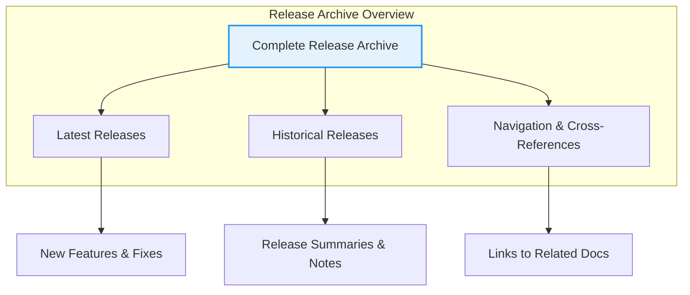

# Complete Release Archive

This page provides a comprehensive catalog listing every official release of GoogleTest and GoogleMock. Each entry includes the release version, date, a brief description highlighting key changes or features introduced, and direct links to detailed release notes. This archive empowers users to track the evolution of the frameworks, verify when specific features were added or changed, and reference past updates efficiently.

---

## Using This Archive

Whether you are auditing your project's dependencies, troubleshooting by comparing versions, or simply exploring historical improvements and fixes, the Complete Release Archive offers a clear and chronological history of all releases. Each release entry summarises the highlights and offers links to more detailed notes, ensuring you easily find the information you need.

---

## Release Entries

The release archive is organized in reverse chronological order, showcasing the newest releases first to help users quickly access the latest information.

### Example Release Entry

**Version 1.16.0 — Released 2023-05-15**

- **Highlights:**
  - Added support for C++20 integration and enhancements to typed test APIs.
  - Improved performance of mock object invocation verification.
  - Fixed known issues with test filtering in Bazel build environments.
- **Notes and Downloads:** [1.16.0 Release Notes](https://github.com/google/googletest/releases/tag/v1.16.0)

---

### Historical Releases

Every past release is summarized with key feature introductions, bug fixes, and any important upgrade notes. Release dates and version numbers follow semantic versioning to clarify the significance of the changes:

- **Major releases** introduce large-scale improvements and potential backward-incompatible changes.
- **Minor releases** add features without breaking existing behaviors.
- **Patch releases** focus on bug fixes and performance improvements.

---

## Navigating the Archive

- Use this page to verify the timeline of feature availability.
- Compare release notes side-by-side when upgrading between versions.
- Cross-reference with the Latest Release Highlights page for summaries of recent updates.

---

## Related Documentation

- [Latest Release Highlights](/changelog/version-history-and-release-notes/latest-release-highlights) — Overview of the most recent official release.
- [Breaking Changes](/changelog/changes-and-upgrade-guidance/breaking-changes) — Important changes requiring migration.
- [Upgrade Checklist](/changelog/changes-and-upgrade-guidance/upgrade-checklist) — Step-by-step migration instructions.
- [New Features & Improvements](/changelog/feature-and-bug-tracking/new-features-improvements) — Details on enhancements.
- [Bug Fixes & Patches](/changelog/feature-and-bug-tracking/bug-fixes-patches) — Issue resolutions.

---

## Best Practices for Release Management

- Always verify compatibility of GoogleTest and GoogleMock versions with your compiler and platform using the System Requirements documentation.
- Review breaking changes carefully before upgrading between major versions.
- Utilize the Upgrade Checklist to perform safe, incremental updates.
- Leverage continuous integration configurations referenced in Integration with Development Ecosystem documentation to automate testing with specific versions.

---

## Troubleshooting and Support

- Consult the [Troubleshooting Common Setup Issues](/getting-started/troubleshooting-validation/common-setup-issues) and [Support and Community](/faq/troubleshooting-optimization-community/support-community) pages if you encounter problems related to specific releases.

---

This archive is continually updated with all official releases to provide a definitive source for reference.

---

# Release Archive Diagram

---

# Updates and Maintenance

This page is maintained alongside all official GoogleTest documentation to reflect the current and past release history accurately.

Users are encouraged to check this archive regularly to stay informed about new features, fixes, and changelogs relevant to their testing workflows.

---

# Contact & Feedback

For suggestions regarding the release archive or to report misalignments with version histories, reach out through the official GitHub repository's issue tracker.

---

# Summary

This Complete Release Archive page acts as a centralized chronicle of all GoogleTest and GoogleMock releases, designed to assist developers in tracking product evolution, verifying feature availability, and referencing past updates with ease and confidence.