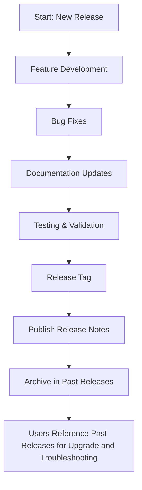

# Past Releases

GoogleTest's 'Past Releases' page serves as a comprehensive, chronological catalog of previous versions of the framework. Here, users can track the evolution of GoogleTest over time by reviewing summaries of enhancements, bug fixes, resolved issues, and overall directions taken by the project with each release.

This documentation resource is essential for understanding the historical context of changes, identifying when features were introduced or altered, and locating release notes specific to particular versions. The page supports users in successful upgrades and troubleshooting by clearly recording past modifications.

---

## Navigating the Past Releases

When examining past releases, expect the information organized in reverse chronological order, with the newest releases appearing first. Every entry typically includes:

- **Version Number and Date** – Clear identification and timestamp of the release.
- **Release Type** – Whether it is a major, minor, or patch update.
- **Key Improvements** – Highlights of new features, API changes, or performance enhancements.
- **Bug Fixes** – Resolutions to known issues or user-reported defects.
- **Deprecations and Breaking Changes** – Notifications relevant to migrating your test suites.
- **Security Updates** – Any patches related to vulnerabilities.

This structured detail helps teams decide on upgrading versions by weighing benefits against migration effort.

---

## How Past Releases Fits into Your Workflow

The Past Releases page acts as a vital historical reference complementary to the following documentation:

- **Latest Release Notes:** For current features and changes.
- **Breaking Changes and Upgrade Guides:** To assist with smooth transitions between major versions.
- **Feature and Fix Logs:** For tracking newly added capabilities or bug fixes.

By cross-referencing these documents, users gain a full picture of GoogleTest’s development trajectory and how it impacts their testing strategy.

---

## Best Practices When Using Past Releases Information

- **Consult Early When Upgrading:** Before migrating to a newer version, review past releases for breaking changes or deprecations that affect your codebase.
- **Understand the Migration Path:** Look at associated upgrade guides and compatibility notes for each major revision.
- **Leverage Historical Fixes:** Use the bug fix lists to identify if issues encountered were resolved in later versions.
- **Use Versioning Clues:** Version semantics (major.minor.patch) offer insights into the nature and compatibility of changes.

---

## Troubleshooting with Historical Release Notes

Past release documentation can be a valuable tool in solving integration or build problems that arise due to:

- Version mismatches between GoogleTest and other dependencies
- Deprecated APIs or changed behaviors
- Platform-specific fixes or compatibility notes
- Known issue regressions or patches

Resolve issues proactively by determining if a particular version introduced the problem or if a newer release includes a fix.

---

## Locating Past Release Notes

While this page catalogs past releases, detailed release notes can usually be found:

- Within the GitHub repository `releases` section: [https://github.com/google/googletest/releases](https://github.com/google/googletest/releases)
- In tagged release commits and associated CHANGELOG files
- In dedicated documentation files and online HTML docs

This page acts as a gateway to those resources, allowing you to precisely pinpoint and access the historical data you need.

---

## Summary

The Past Releases page is your authoritative resource for tracking GoogleTest’s historical updates. It empowers users to make informed decisions about upgrading, troubleshooting, and understanding the framework’s evolution.

Browse this page regularly to stay aligned with the project's direction and ensure robust, up-to-date testing with GoogleTest.

---

## Related Documentation

- [Latest Release Notes](./latest-release.md): Discover the newest features and updates.
- [Breaking Changes](./breaking-changes.md): Understand critical changes and migration paths.
- [Upgrade Guide](./upgrade-guide.md): Step-by-step instructions for safe version transitions.
- [Feature Additions](./feature-additions.md): Track recent feature development.
- [Bug Fixes and Stability Updates](./bug-fixes.md): Get the latest fixes impacting stability.

These resources form a comprehensive changelog ecosystem, providing clarity from past through future versions.

---

## Practical Tip

When preparing to upgrade or debug, always cross-reference your current GoogleTest version with the Past Releases entries and corroborate with upgrade guides and breaking change notices. This prevents surprises and enables smooth test suite maintenance.

---

## Troubleshooting

If you encounter discrepancies or cannot locate information about a specific version:

- Confirm the exact version and build date used.
- Check the GitHub releases and tags directly for more detailed notes.
- Reach out to the community or consult the [FAQ](../faq.md) for common issues.

Use the Past Releases page as the first step in your investigative workflow.

---

## How to Access Detailed Release Notes

You can access the detailed notes for any past version in the repository’s [GitHub Releases](https://github.com/google/googletest/releases), which provide comprehensive change lists, contributors, and download artifacts. For automation or historical integration, note the version number and build date listed here for precise referencing.

---

## Contributor Credits

Each past release entry acknowledges contributors involved in feature additions, bug fixes, and documentation improvements. Recognizing these efforts supports community collaboration and ongoing framework excellence.

---

## Summary Diagram

This flow illustrates how new releases are processed and then archived as part of Past Releases, guiding users through the lifecycle of GoogleTest versions.
