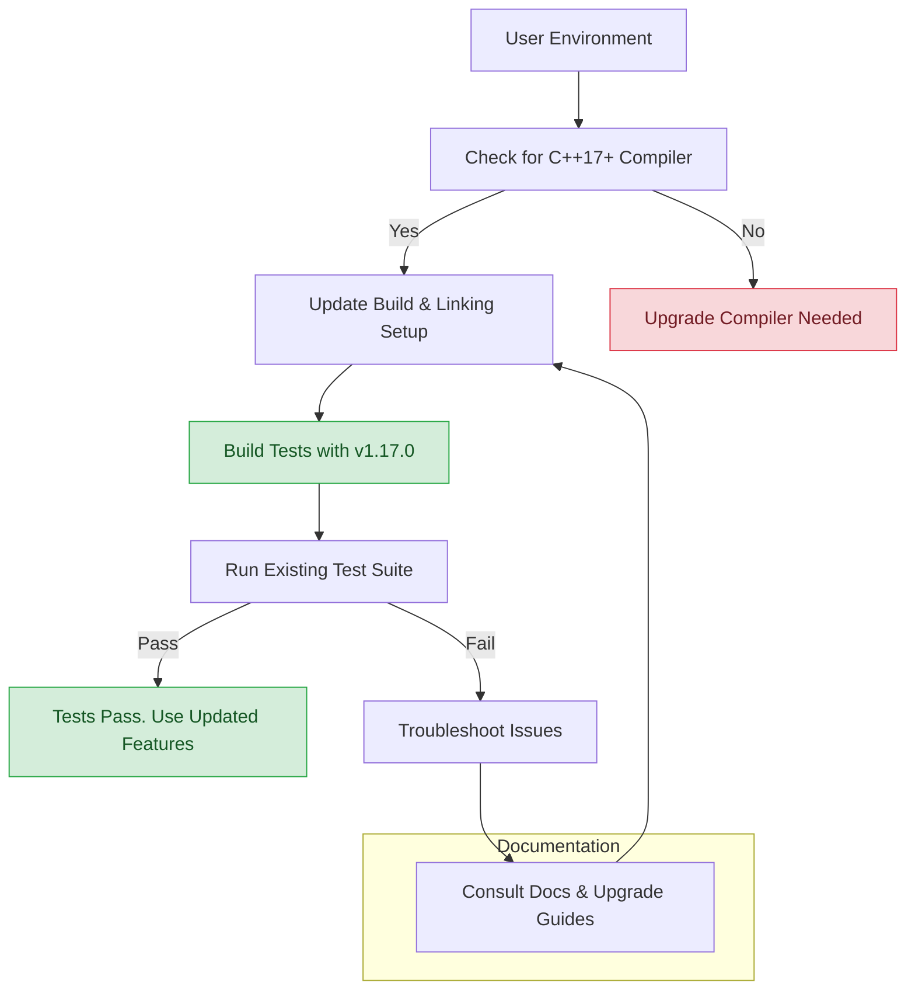

# Latest Release Details - GoogleTest v1.17.0

## Overview

The latest GoogleTest release, version 1.17.0, marks an important milestone with significant improvements focused on modern C++ support, enhanced performance, and increased robustness in both GoogleTest and GoogleMock components. This release requires a minimum of C++17, reflecting the framework's evolution to embrace modern language features and developer expectations.

This documentation provides a thorough breakdown of what has changed, what new features have been introduced, important bug fixes, and behavioral updates that will impact users upgrading to this version. It highlights how you, as a C++ developer or testing engineer, can leverage these improvements to write more efficient, maintainable tests and mocks.

---

## 1. Key New Features in v1.17.0

### 1.1 Mandatory C++17 Support

- The release strictly requires at least C++17 compatibility, unlocking modern language capabilities for a cleaner, more efficient, and safer test codebase.
- Users must ensure their build environment and compiler settings adhere to this requirement to successfully build and use the framework.

### 1.2 Improved Build Integration and Packaging

- Enhanced CMake support with clearer options:
  - `BUILD_GMOCK` and `INSTALL_GTEST` options make subproject and installation control more transparent.
  - Integration with system threading libraries is better handled (`@CMAKE_THREAD_LIBS_INIT@`).
- Pkg-config template files (`gmock.pc.in`, `gmock_main.pc.in`) now include precise linking flags and versioning tied directly to the project version, simplifying dependency management for users.

### 1.3 Streamlined GoogleMock Experience

- GoogleMock now ships as an integral part of GoogleTest, maintained and released in unison for enhanced consistency.
- Support for hybrid mocks, sophisticated matchers, and declarative mock syntax continues with refinements making mock method declarations simpler.

### 1.4 Richer Testing Utilities

- Improvements in synchronization primitives and thread-local storage enhance thread safety and test reliability.
- Enhanced support for advanced assertions and matchers allows more expressive and precise test verifications.

---

## 2. Performance Enhancements

- Optimized internal thread synchronization reduces overhead for multi-threaded test runs.
- Improvements in regular expression handling (leveraging RE2 or POSIX RE where applicable) speed up matcher evaluation.
- Streamlined test discovery and execution pipelines minimize startup latency and improve runtime throughput.

---

## 3. Bug Fixes and Stability Improvements

- Fixed subtle race conditions in thread-local storage implementations across platforms, increasing consistency in parallel test execution.
- Resolved intermittent linker issues related to inconsistent macros for threading libraries in various build environments.
- Improved error reporting during test failures, making debugging easier and more informative.
- Addressed spurious failures in death tests by refining default test environment setups.

---

## 4. Behavioral Changes and Migration Notes

### 4.1 Upgrading to C++17

- The minimum compiler standard is now C++17. Ensure your compilation flags include `-std=c++17` or equivalent.
- Legacy code relying on older C++ standards must be ported accordingly.

### 4.2 Build System Adjustments

- When integrating via CMake, verify the `BUILD_GMOCK` and `INSTALL_GTEST` options match your project's needs.
- Linking must include updated `gmock` or `gmock_main` targets as per the new packaging.

### 4.3 Header and Library Locations

- Updated pkg-config files direct include paths and linker flags accurately — check your IDE or build system to align with these paths.

### 4.4 API Compatibility

- No breaking API changes are introduced in this release; however, some internal headers have evolved (e.g., `gtest-port.h`) to adapt to C++17.
- Continue following recommended practices around mock declaration, matchers, and test structuring.

---

## 5. How to Upgrade

1. Verify your compiler supports C++17 and configure your build system accordingly.
2. Replace any existing GoogleTest and GoogleMock binaries and headers with the version 1.17.0 distribution.
3. Update your CMakeLists or build scripts to ensure proper linking to the new `gtest`, `gtest_main`, `gmock`, and `gmock_main` as required.
4. Run your test suite with increased verbosity to identify any potential integration issues quickly.
5. Consult the [Breaking Changes](./breaking-changes.md) and [Upgrade Guides](./upgrade-guides.md) pages for detailed instructions.

---

## 6. Additional Resources

- [GoogleTest Primer](https://google.github.io/googletest/primer.html) – Getting started with writing tests.
- [Mocking Basics](https://google.github.io/googletest/gmock_for_dummies.html) – Introduction to mocking with gMock.
- [Feature Highlights](../overview/feature-glance/feature-highlights) – Overview of key capabilities.
- [Common Issues and Troubleshooting](../getting-started/troubleshooting-validation/common-issues) – How to resolve frequent problems.
- [Community Resources](../docs/community_created_documentation.md) – Documentation created by the community.

---

## 7. Summary Diagram: Release Impact Workflow

---

## Troubleshooting Tips

- **Build failures?** Check that your compiler supports C++17 and your build system uses the appropriate flags.
- **Linker errors regarding threading?** Confirm that linking includes `@CMAKE_THREAD_LIBS_INIT@` equivalent and that BOTH `gmock` and `gtest` libraries are linked.
- **Tests not executing?** Ensure your test executable links against `gtest_main` or you provide your own `main()`.
- **Mock issues?** Revisit mock method declarations and expectations against the updated gMock usage guidelines.

---

## Conclusion

GoogleTest v1.17.0 advances the framework into the modern C++ era with improved performance, streamlined integration, and refined mocking capabilities. By adopting this release, users can benefit from more robust, maintainable tests and mocks designed with contemporary C++ standards and best practices in mind.

Upgrade early to stay current and harness the full power of GoogleTest and GoogleMock on your projects.

---

*This documentation matches the 'Latest Release Details' page within the GoogleTest changelog and assumes familiarity with build systems and C++ development best practices.*

---