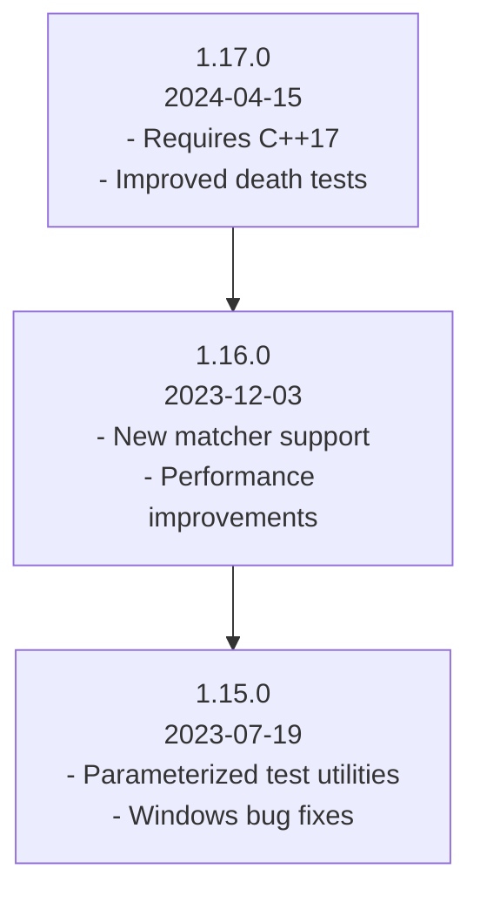

# Releases at a Glance

GoogleTest's **Releases at a Glance** page is your essential timeline that highlights major and minor version updates, helping you quickly understand the framework's evolution and decide on upgrading plans. This resource distills each release into version numbers, release dates, and headline features, enabling users to grasp improvements and stability milestones at a glance.

---

## Understanding the Release Timeline

Every release of GoogleTest introduces important changes that impact usability, capabilities, and compatibility. Our timeline summarizes each release chronologically, starting from the most recent to the earliest, clearly noting the **version number**, **release date**, and key **features or fixes** included.

This chronological view helps users:

- Track the growth and maturity of GoogleTest.
- Identify new features that can improve their testing experience.
- Evaluate when and how to upgrade based on their project needs.

## Release Entry Components

Each entry in the timeline provides:

- **Version Number**: Presented using semantic versioning (e.g., 1.17.0), indicating major, minor, and patch levels.
- **Release Date**: The official date when the release became available.
- **Headline Features**: Concise bullet points or summaries describing the most significant new capabilities, bug fixes, or optimizations introduced.

By focusing on these components, the timeline becomes an actionable resource for developers maintaining or adopting GoogleTest.

## Example Timeline Snapshot

| Version | Release Date | Headline Features |
|---------|--------------|------------------|
| 1.17.0  | 2024-04-15   | - Requires C++17 or later  
- Improved death test reliability  
- Enhanced assertion macros  |
| 1.16.0  | 2023-12-03   | - Added new matcher support  
- Performance improvements in test discovery  |
| 1.15.0  | 2023-07-19   | - Expanded parameterized test utilities  
- Bug fixes for Windows platform |

## Best Practices for Upgrading

- Always consult the **Detailed Release Notes** for comprehensive change lists before upgrading.
- Review any **Breaking Changes & Upgrade Guidance** available in the documentation to smoothly transition between versions.
- Use versioning information to ensure compatibility with your project’s compiler and platform requirements.

## Additional Resources

- For in-depth information on each release, see the [Detailed Release Notes](/changelog/version-history/release-notes-links).
- Understand possible [Breaking Changes Overview](/changelog/breaking-changes-upgrade/breaking-changes-summary) and prepare with [Upgrade Guides & Migration Paths](/changelog/breaking-changes-upgrade/upgrade-guides).
- Explore newly added capabilities in the [New Features & Enhancements](/changelog/feature-bugfix-log/new-features-and-enhancements) page.

---

## Navigating the Releases at a Glance Page

- **Latest Releases First**: The timeline is displayed in reverse chronological order to prioritize the most recent updates.
- **Clear Visual Distinction**: Version headers distinguish each release entry for quick scanning.
- **Concise yet Informative**: Headline features shine light on what matters most to users upgrading or adopting new versions.

# Practical Tips

- Bookmark this page to stay informed about upcoming and past releases.
- Use the timeline as a roadmap when planning integration with continuous integration (CI) systems.
- Keep an eye on version requirements, especially when using advanced features like death tests or parameterized tests.

# Troubleshooting and Common Questions

**Q: How do I know if an upgrade will affect my current tests?**

A: Check the Breaking Changes section in the changelog and detailed release notes. Also, review the upgrade guides for step-by-step migration paths.

**Q: Where can I find the source code or download older releases?**

A: Access all releases, source code, and assets on our GitHub releases page: https://github.com/google/googletest/releases.

**Q: How can I report an issue or contribute?**

A: Use the GitHub repository’s issue tracker and consult the CONTRIBUTING.md guide.

---

By leveraging the Releases at a Glance, you keep your project aligned with GoogleTest’s best and latest practices while maintaining stability and maximizing testing capabilities.

---

<Info>
For comprehensive migration advice, see **Breaking Changes & Upgrade Guidance**: /changelog/breaking-changes-upgrade
</Info>

<Check>
Keep this page handy to plan your project’s upgrade strategy with clear, time-stamped summaries.
</Check>

---

## Related Documentation

- [Detailed Release Notes](/changelog/version-history/release-notes-links) – Full features and fixes for every release
- [Breaking Changes Overview](/changelog/breaking-changes-upgrade/breaking-changes-summary) – Essential alerts on compatibility
- [New Features & Enhancements](/changelog/feature-bugfix-log/new-features-and-enhancements) – Highlights of new capabilities
- [Installation Methods](/getting-started/setup-and-installation/installation-methods) – How to incorporate GoogleTest in your environment

---

## Summary

Releases at a Glance provides a user-friendly, reverse-chronological summary of GoogleTest's major and minor releases, including version numbers, release dates, and headline features. It supports effective version tracking and upgrade planning by spotlighting user-relevant changes. Combined with detailed release notes and upgrade guidance, it empowers you to keep your tests modern, reliable, and efficient.

---

### Example Visualization

---