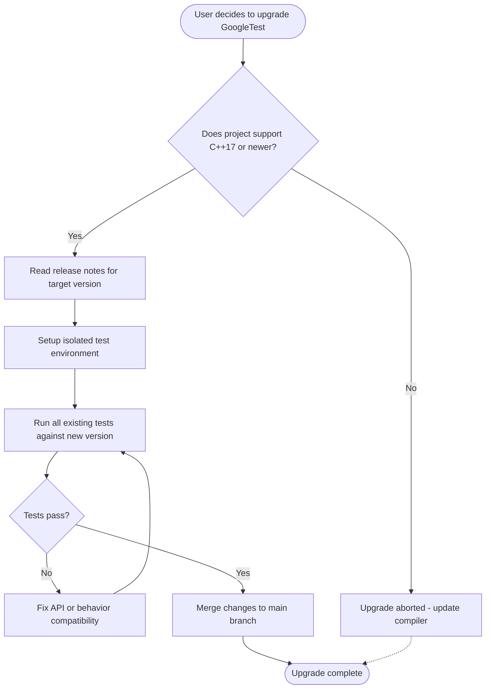

# Releases Overview

The **Releases Overview** page provides a complete list of all publicly released versions of GoogleTest and GoogleMock. This resource helps you determine which version fits your project best, considering compatibility requirements such as supported C++ standards and integration timelines.

---

## 1. Release Listings

Each release entry includes:

- **Version Number**: Semantic versioning follows MAJOR.MINOR.PATCH conventions.
- **Release Date**: When the version was publicly announced and made available.
- **C++ Standard Requirement**: Minimum required C++ standard (currently C++17 or later).
- **Highlights**: Key features, improvements, or notable changes in the release.
- **Links to Detailed Notes**: Access comprehensive release notes with full change logs, migration instructions, and deprecations.

Users can review this listing to select a version for upgrading or initial adoption.

---

## 2. Versioning Scheme

GoogleTest and GoogleMock use [Semantic Versioning](https://semver.org/) with this structure:

- **MAJOR** version increments when there are incompatible API changes.
- **MINOR** version increments for added functionality in a backward-compatible manner.
- **PATCH** version increments for backward-compatible bug fixes.

Release candidates and pre-release versions follow the semantic versioning pre-release tag conventions.

This predictable versioning assists users in managing dependencies and anticipating the impact of upgrades.

---

## 3. Compatibility and Requirements

- All **current releases require C++17 or newer.**
- Users targeting older C++ standards should consult older releases or consider upgrading their compiler support.
- Certain releases introduce new dependencies or platform support; users must review these in the detailed release notes.

Ensuring compatibility ahead of adopting a release minimizes integration issues.

---

## 4. How to Use the Release Overview

Follow these steps:

1. Identify your project’s minimum C++ standard support.
2. Check the release list for the latest compatible version.
3. Review the release highlights and breaking changes for that version.
4. Access the detailed release notes linked for migration guidance.
5. Update your project dependencies accordingly.

By following this flow, you ensure smooth upgrades with minimal disruption.

---

## 5. Troubleshooting Common Upgrade Issues

### Common Pain Points
- **Compiler incompatibilities:** Some older compilers may not fully support C++17.
- **Changed API Behavior:** Adjust tests or mocks if APIs have changed or been deprecated.
- **Linker errors:** Verify build system integration and dependency linking.

### Tips
- Always consult the **Upgrade Guides & Migration Paths** for step-by-step instructions.
- Use `--gtest_verbose` and other runtime flags (*see gMock Cheat Sheet*) to assist in debugging.
- Employ **Mock::AllowLeak()** when dealing with death tests or deliberate leaks during transition.

---

## 6. Links to Related Resources

- [gMock Cheat Sheet](../docs/gmock_cheat_sheet.md): Quick reference for mock method macros, expectations, and clauses.
- [Mocking Reference](../api-reference/mocking-apis/mock-object-definitions.md): Detailed documentation on mock object definitions and behaviors.
- [Upgrade Guides & Migration Paths](../changelog/breaking-changes-upgrades/upgrade-guide.md): Stepwise instructions for major version migrations.
- [GoogleTest Primer](../overview/intro-concepts/what-is-googletest.md): Overview and key concepts of the framework.
- [Release Notes](https://github.com/google/googletest/releases): Official GitHub release notes with source tarballs and binaries.

---

## 7. Summary

The Releases Overview consolidates essential information about GoogleTest and GoogleMock versions, enabling informed decisions regarding version adoption and upgrade planning. It forms a foundational starting point for users updating existing integrations or onboarding new projects with the latest test tooling.

---

## 8. Example Release Entry (Template)

```markdown
### Version 1.12.1 (Released: 2024-05-10)
- **C++ Standard:** Requires C++17 or newer.
- **Highlights:**
  - Enhanced thread safety in stress tests.
  - Improved leak detection and messaging.
  - Fixed flakiness in death tests under multithreaded scenarios.
- **Breaking Changes:** None.
- **Deprecations:** Deprecated flag `--gmock_catch_leaked_mocks=0`; recommend using `Mock::AllowLeak()` explicit calls.
- **Security Updates:** None.
- [Full Release Notes](https://github.com/google/googletest/releases/tag/release-1.12.1)
```

---

## 9. Best Practices

- Always validate your compiler and runtime environment support for the C++ version required.
- Test your existing test suites with the new version in isolated branches before full integration.
- Leverage verbose and debug flags to gain insight into expectation failures or mock misbehavior.
- When using death tests, be mindful of mock leak detection and use `Mock::AllowLeak()` as needed.


# Troubleshooting

If you encounter unexpected behaviors, consult:

- Upgrade Guides for breaking changes
- FAQ on assertion and mock usage errors
- CI/CD integration and environment setup guides

---

# Change Diagram: Release and Test Interaction Flow



---

For detailed migration pathways and selective feature upgrades, refer to the **Upgrade Guides & Migration Paths** page in the documentation.

---