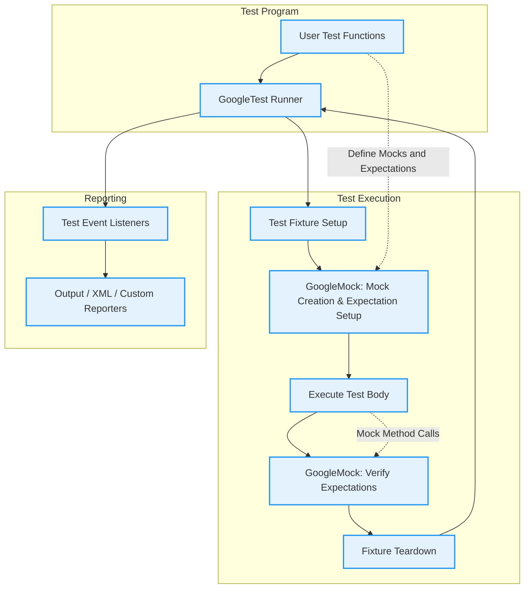

# Framework Architecture

Understanding the architecture of GoogleTest and GoogleMock is key to mastering effective and maintainable unit testing workflows. This guide explains how these frameworks are structured at a high level, outlining their modular organization, main components, and how they orchestrate test discovery, execution, and result reporting.

---

## Overview of the GoogleTest and GoogleMock Frameworks

GoogleTest is a robust C++ testing framework designed to support rapid test development while providing detailed diagnostics and flexible test execution.

GoogleMock (gMock) extends GoogleTest by providing a comprehensive framework to create mock classes and set expectations on them. It offers a declarative syntax to define method behaviors, validate arguments, and control mock strictness.

Together, these frameworks provide a powerful suite for interaction-based and verification testing.

---

## Modular Organization

GoogleTest's architecture is modular, supporting clear separation between core testing features, mock object support, and extensibility:

- **Core Testing Engine:** Handles test registration, execution, assertion evaluation, and result aggregation.
- **GoogleMock Extensions:** Build on the core testing engine to provide mocking capabilities, including mock class generation, expectations, actions, and matchers.
- **Supporting Utilities:** Such as matchers, actions, sequencing controls, and configuration flags that integrate seamlessly with the test lifecycle.

---

## Main Components and Their Responsibilities

### Test Discovery and Registration
- **Test Macros (`TEST`, `TEST_F`, etc.):** Define individual tests and group them logically into test suites or fixtures.
- **Test Registry:** Internally, GoogleTest maintains a global registry of all tests. When the program starts, tests are automatically registered and made discoverable.

### Test Execution Flow
- **Test Runner:** Iterates through the registered tests, sets up test fixtures, runs test body code, and handles setup/teardown.
- **Assertion Checking:** Assertions within tests automatically report success or failure, affecting test results.
- **Mock Verification:** GoogleMock intercepts calls on mock objects during tests, verifies expectations immediately if violated, and performs final verification upon mock destruction.

### Result Reporting
- **Event Listeners:** GoogleTest emits events reflecting test progress, failures, and completion.
- **Output Formatters:** Listeners format test results as human-readable output or machine-readable formats like XML.
- **Integration Points:** Custom event listeners or reporters can hook into this system to extend reporting (e.g., UI integration, CI dashboards).

---

## Execution Flow: How Tests Run

The execution flow of tests with GoogleTest and GoogleMock follows these steps:

1. **Initialization:** GoogleTest and GoogleMock are initialized, parsing command-line flags and preparing internal structures.
2. **Test Discovery:** All test cases defined via macros are registered.
3. **Test Scheduling:** Tests are executed one by one, with fresh fixture instances created for each.
4. **Mock Object Setup:** Mocks are instantiated, and user-defined expectations (`EXPECT_CALL`) and default behaviors (`ON_CALL`) are set.
5. **Test Execution:** The test function body runs, exercising mocks and other code under test.
6. **Verification:** GoogleMock verifies that all expectations are met before the mocks are destroyed.
7. **Result Aggregation:** Test results, including assertion failures and mock verification failures, are collected.
8. **Reporting:** Results are reported via event listeners and potentially aggregated into summaries.
9. **Cleanup:** Fixture teardown and resource cleanup are performed.

---

## GoogleMock Strictness Modes (Nice, Naggy, Strict)

GoogleMock provides three strictness modes to control how mocks respond to calls without explicit expectations:

- **NaggyMock (Default):** Warns when an uninteresting call (a method without an expectation) occurs, alerting you but allowing the test to continue.
- **NiceMock:** Suppresses warnings on uninteresting calls, making tests less noisy and often more maintainable.
- **StrictMock:** Treats uninteresting calls as errors, causing test failures to detect unexpected interactions.

These modes allow balancing test strictness and verbosity according to user needs.

Usage examples:

```cpp
using ::testing::NiceMock;
using ::testing::NaggyMock;
using ::testing::StrictMock;

NiceMock<MockFoo> nice_mock;   // Warnings suppressed
NaggyMock<MockFoo> naggy_mock; // Warning on uninteresting calls
StrictMock<MockFoo> strict_mock; // Uninteresting calls fail tests
```

---

## Expectation Specification and Control

Users configure mock behavior and expectations using macros:

- `MOCK_METHOD`: Defines a mock method in a mock class.
- `EXPECT_CALL`: Sets expectations on calls to mock methods, including argument matchers, call counts (`Times`), order (`InSequence`), and specific return actions (`WillOnce`, `WillRepeatedly`).
- `ON_CALL`: Defines default actions for mock methods without setting expectations.

This DSL enables precise control over mock behaviors and validation.

---

## Data and Control Flow Diagram



---

## Integration Points and Extensibility

GoogleTest and GoogleMock support extensibility:

- **Custom Listeners:** Users can implement custom event listeners to capture test progress and build tailored reports or integrate with other tools.
- **New Matchers and Actions:** GoogleMock allows defining new matchers and actions beyond the built-in ones, enabling domain-specific validations.
- **Configuration Flags:** Verbosity and behaviors can be controlled using flags such as `--gmock_verbose`.

Together, these extensibility points empower users to adapt the frameworks to complex testing needs.

---

## Best Practices for Framework Use

- Define mocks in headers associated with the interfaces they mock to minimize maintenance overhead.
- Prefer `NiceMock` for less noisy tests and `StrictMock` when you want to catch unexpected calls.
- Use sequence controls (`InSequence`, `After`) to enforce partial or total ordering only when necessary to maintain test resilience.
- Use `ON_CALL` to specify default behaviors and `EXPECT_CALL` to specify behaviors where you want to verify interaction.
- Avoid over-specifying expectations to prevent brittle tests.

---

## Troubleshooting Common Issues

- **Uninteresting Call Warnings:** Use `NiceMock` or add generic `EXPECT_CALL(...).Times(AnyNumber())` to suppress unintended warnings.
- **Order Violations:** Use `InSequence` or `After` clauses to express required order explicitly.
- **Unexpected Calls:** Verify that expectations correctly match call arguments.
- **Mock Lifetimes:** Ensure mocks are properly destroyed to trigger verification.

---

## Summary

This guide provides a conceptual understanding of how GoogleTest and GoogleMock operate, covering:

- Modular architecture and component responsibilities
- Test discovery, execution, and reporting flow
- Mock strictness modes and their impact
- DSL for defining mocks, expectations, and mock behaviors
- Execution flow diagram illustrating key interactions
- Extensibility and integration possibilities
- Best practices and common troubleshooting tips

For a deep dive into mocks, matchers, and usage patterns, please consult the gMock Cookbook and Mocking Reference sections.

---

## Further Resources

- [gMock for Dummies](https://google.github.io/googletest/gmock_for_dummies.html) — Beginner-friendly tutorial
- [Mocking Reference](../../api-reference/mocking-apis/defining-mocks) — Full reference on mock APIs
- [gMock Cookbook](https://google.github.io/googletest/gmock_cook_book.html) — Advanced mocking techniques
- [Matchers Reference](../../api-reference/mocking-apis/matchers-actions) — Detailed info on matchers and actions
- [Nice, Naggy, and Strict Mocks](../../api-reference/mocking-apis/nice-strict-mocks) — Understanding mock strictness
- [GoogleTest Primer](../../docs/primer.md) — Core GoogleTest concepts
- [Framework Architecture (overview)](../../overview/core-concepts-architecture/architecture-overview) — Broader architectural context

---