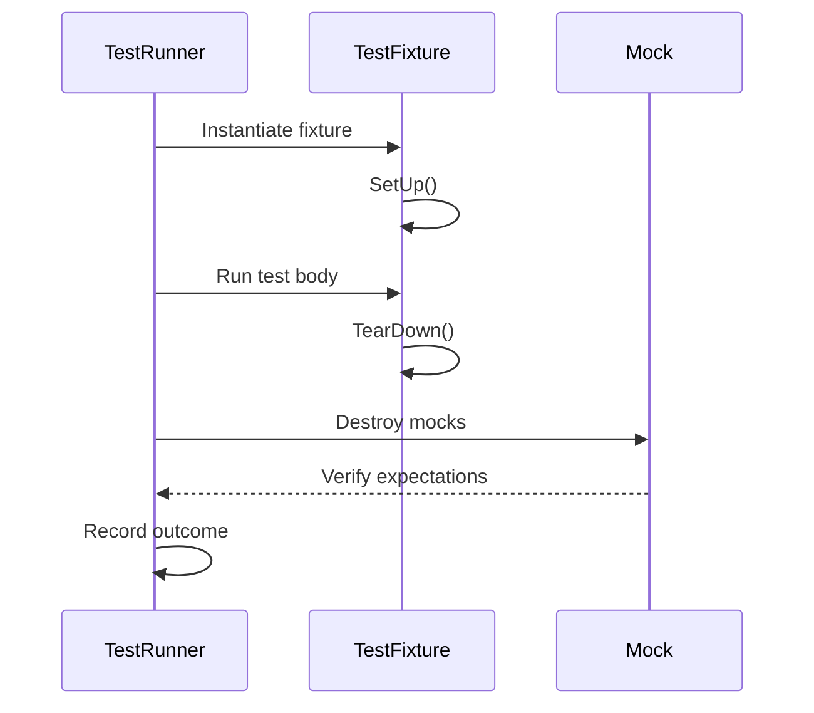
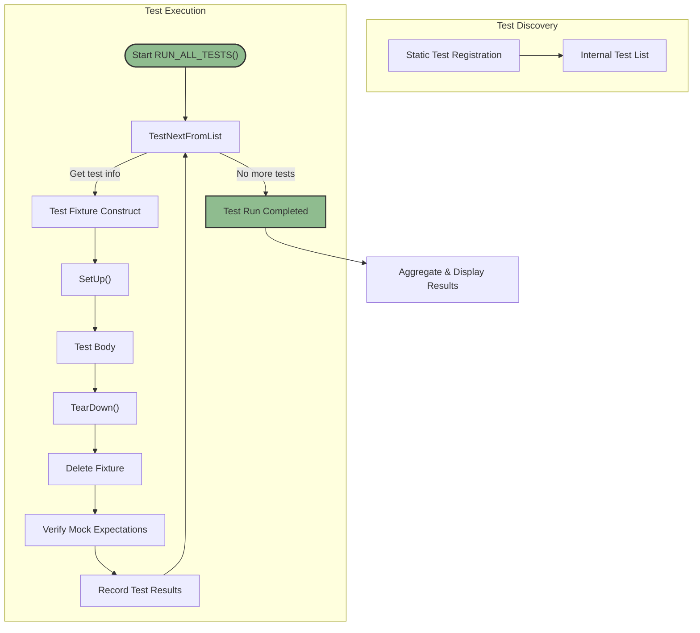

# Test Discovery & Execution Lifecycle

Understand how GoogleTest and GoogleMock uncover, manage, and run your tests, from initialization through to result aggregation. This guide reveals the flow for test discovery, the orchestration of test case lifecycles including setup and teardown, and how results are collected and reported to give you deep insight into the workings behind every test run.

---

## 1. Overview of the Test Lifecycle in GoogleTest and GoogleMock

GoogleTest and GoogleMock together provide a seamless and automated testing experience. After you write your tests, they handle everything from finding and scheduling tests, managing their isolated lifecycles, to summarizing and reporting results.

Every test you define using macros like `TEST()` or `TEST_F()` is automatically discovered and registered with the framework. You never need to manually list tests — GoogleTest tracks them internally. When you run your test binary, GoogleTest orchestrates executing each test in isolation.

Mock objects created via GoogleMock extend this lifecycle by verifying expectations automatically at the right moments.

<Info>
This lifecycle is designed to let you focus on what matters: writing tests and their logic, without worrying about the plumbing.
</Info>

---

## 2. Test Discovery and Registration

### How Tests Get Registered

When you write tests with `TEST()` or `TEST_F()`, internally GoogleTest registers test functions automatically during static initialization:

- Each test is associated with a *test suite* (formerly called test case) and a *test name*.
- Registration captures the fixture and test function pointers.

This mechanism ensures all tests are known before execution begins.

### Managing Test Cases and Suites

GoogleTest treats a *test suite* as a collection of related tests that share a fixture or purpose. Tests discovered belong to suites, which helps organize reporting and execution.

### The Role of GoogleMock

GoogleMock integrates tightly to discover mocks and setup their behaviors.

- Mock classes using macros are integrated to allow expectations to be checked upon mock destruction.
- Mocking-related tests follow the same discovery flow.

<Tip>
Using GoogleMock within a test does not change how tests are discovered or executed but enhances verification during test execution.
</Tip>

---

## 3. Test Initialization and Setup

### Construction of Test Fixtures

For each test in a test suite, GoogleTest:

1. Constructs a fresh test fixture object.
2. Calls the optional `SetUp()` method where you prepare resources.

This strict isolation ensures tests are independent and repeatable.

### Setup and Teardown Flow

- `SetUp()` runs before the test body runs.
- The test itself executes afterward.
- `TearDown()` runs immediately after the test, where you release any resources.

If your test uses GoogleMock:

- Mock expectations set via `EXPECT_CALL` are verified once the test fixture is destructed or mocks go out of scope.
- Default behaviors set with `ON_CALL` are applied automatically.

Use of `TEST_F` macro enables access to fixture members conveniently during tests.

### Automatic Fixture Disposal

GoogleTest deletes the test fixture after teardown. Each test has a separate instance ensuring no shared mutable state.

<Note>
Always keep your fixture teardown logic idempotent and safe, as GoogleTest calls `TearDown()` just once per test.
</Note>

---

## 4. Test Execution Orchestration

### Running Tests Sequentially or via Parallel Runs

By default, tests run sequentially in registration order.

- You can configure parallel execution via external tools; GoogleTest itself supports sharding and filtering suits and tests.

### Assertion Handling During Execution

- GoogleTest uses assertions to check correctness.
- Fatal failures abort the current test; non-fatal failures allow the test to continue.

### Exception and Crash Handling

GoogleTest catches failures and exceptions to continue test execution where feasible.

### Role of GoogleMock During Test Execution

Mocked behavior controls method call outcomes.

- GoogleMock verifies that calls meet expectations in arrival count, argument values, order, and allowable repeats.
- Violations cause immediate test fail reporting.

---

## 5. Test Teardown and Result Aggregation

### Test Fixture Cleanup

After a test completes:

- TearDown() is called, cleaning environment and freeing resources.
- Mocks are destructed; GoogleMock verifies all specified expectations.

### Test Result Recording

GoogleTest records:

- Test pass/fail status.
- Assertion failure details.
- Execution duration.

### Reporting

- After all tests, GoogleTest aggregates and summarizes results.
- Reports include failures with file & line locations, error messages, and stack traces.

<Tip>
Use GoogleTest’s flags and listeners to customize how results are output, e.g., XML reports for CI systems.
</Tip>

---

## 6. Understanding Setup and Teardown Timing

### Order of Operations

### Implications for Users

- Prepare all prerequisites inside `SetUp()`.
- Release everything in `TearDown()`.
- Expect mock verification at fixture destruction time.

---

## 7. Test Execution Flow Diagram

---

## 8. Common Pitfalls and Troubleshooting

### Tests Not Being Discovered

- Ensure tests use the correct GoogleTest macros.
- Confirm `RUN_ALL_TESTS()` is called in `main()` or test entry.

### Setup/TearDown Not Called

- Define `SetUp()` and `TearDown()` exactly with correct casing.
- Verify your fixtures derive from `testing::Test`.

### Mock Expectations Failing

- Verify all `EXPECT_CALL` are set *before* code exercising the mock runs.
- Ensure mocks are properly destructed so verifications run.
- Use `NiceMock`, `NaggyMock`, or `StrictMock` to control strictness behavior per test.

### Tests Interfering With One Another

- Remember GoogleTest creates fresh fixtures per test.
- Avoid global or static mutable state between tests.

---

## 9. Practical Tips for Maximizing Test Lifecycle Benefits

- Use `TEST_F` fixtures to share common setup/teardown code.
- Use GoogleMock to precisely control and validate dependencies.
- Run tests individually or in groups using filtering to isolate failures.
- Take advantage of GoogleTest flags to control verbosity, output formats, and sharding.

---

## 10. Further Learning and Related Documentation

- [GoogleTest Primer](../primer.md) — Get started writing and understanding tests.
- [Writing and Organizing Tests](../../api-reference/core-testing-apis/writing-tests) — API for defining tests and fixtures.
- [GoogleMock Cookbook](../gmock_cook_book.md) — Advanced mocking techniques.
- [Mocking Reference](../reference/mocking.md) — Detailed mock APIs.
- [Nice, Naggy, and Strict Mocks](../../api-reference/mocking-apis/nice-strict-mocks) — Mock strictness modes.
- [Test Runner Initialization and Main](../../api-reference/configuration-runtime/initialization-main) — Setting up test entry points.

---

Explore the lifecycle thoroughly to master test isolation, mocking verification, and efficient test flow control. This understanding will empower you to write reliable, maintainable, and fast C++ tests with GoogleTest and GoogleMock.