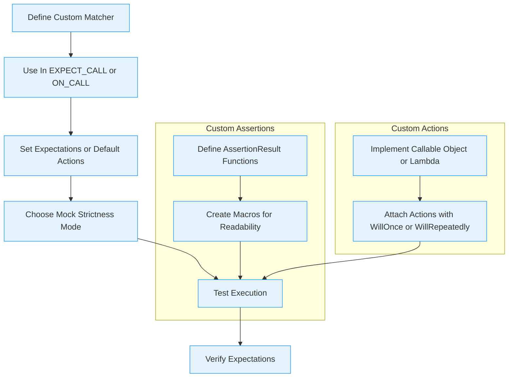

# Framework Extensibility & Customization

GoogleTest and GoogleMock are designed to be versatile and powerful, but they also provide extensive extension points that allow users to tailor the framework for advanced or domain-specific testing needs. This guide explores the main customization options available, such as defining custom assertion macros, matchers, and actions, enabling you to adapt the framework seamlessly into your testing workflow.

---

## 1. Custom Assertion Macros

GoogleTest allows you to define your own assertion macros to encapsulate common patterns or complex checks in readable, reusable code. Custom assertions improve test clarity and provide tailored failure messages relevant to your domain.

### Defining Custom Assertions

A custom assertion macro typically wraps a function that returns `::testing::AssertionResult`.

```cpp
::testing::AssertionResult IsEven(int n) {
  if (n % 2 == 0) {
    return ::testing::AssertionSuccess();
  } else {
    return ::testing::AssertionFailure() << n << " is not even";
  }
}

#define ASSERT_IS_EVEN(val) ASSERT_PRED_FORMAT1(IsEven, val)
#define EXPECT_IS_EVEN(val) EXPECT_PRED_FORMAT1(IsEven, val)
```

You can then use `ASSERT_IS_EVEN(x)` or `EXPECT_IS_EVEN(x)` in your tests, making them clearer and more intention-revealing.

### Best Practices
- Provide informative failure messages that help diagnose errors quickly.
- Use `AssertionResult` over boolean returns so you can enrich assertion failures with context.
- Make assertion macros expressive and consistent with GoogleTest naming conventions.

### Troubleshooting
If your custom assertions fail silently or don't show helpful messages, verify that your `AssertionResult` function returns meaningful messages and use the `_PRED_FORMAT` variants to integrate properly with GoogleTest.


## 2. Custom Matchers

Matchers in GoogleMock specify expectations on function arguments. Beyond built-in matchers, you can write your own for precise, domain-specific argument validation.

### Writing Matchers with `MATCHER` Macros

The easiest way is to use GoogleMock's `MATCHER` family of macros:

```cpp
MATCHER(IsDivisibleBy7, "checks if a number is divisible by 7") {
  return (arg % 7) == 0;
}

// Parameterized example
MATCHER_P(HasAbsoluteValue, val, "checks absolute value") {
  return std::abs(arg) == val;
}
```

Use these in expectations:

```cpp
EXPECT_CALL(mock, Foo(IsDivisibleBy7()));
EXPECT_CALL(mock, Foo(HasAbsoluteValue(5)));
```

### Advanced Matcher Interface Implementation

For complex matchers:

- Implement a matcher class with `MatchAndExplain()`, `DescribeTo()`, and `DescribeNegationTo()` methods.
- Provide template-based polymorphic matching if needed.

Example snippet:

```cpp
class DivisibleByNMatcher {
 public:
  explicit DivisibleByNMatcher(int divisor) : divisor_(divisor) {}

  template <typename T>
  bool MatchAndExplain(const T& n, std::ostream* os) const {
    bool match = (n % divisor_) == 0;
    if (!match && os) {
      *os << "whose remainder is " << (n % divisor_);
    }
    return match;
  }

  void DescribeTo(std::ostream* os) const {
    *os << "is divisible by " << divisor_;
  }

  void DescribeNegationTo(std::ostream* os) const {
    *os << "is not divisible by " << divisor_;
  }

 private:
  int divisor_;
};

inline ::testing::Matcher<int> DivisibleBy(int divisor) {
  return ::testing::MakePolymorphicMatcher(DivisibleByNMatcher(divisor));
}
```

### Tips for Writing Custom Matchers
- Keep matchers pure (no side effects).
- Provide clear descriptions to help failure diagnostics.
- Use parameterized matchers to maximize reusability.

### Resources
- See the [MATCHER macros](https://google.github.io/googletest/gmock_cook_book.html#WritingNewMatchers) for quick creation.
- Read the [Matchers Reference](reference/matchers.md) for examples and advanced details.


## 3. Custom Actions

Actions define what happens when a mock method is called. Custom actions enable you to specify complex behaviors beyond the built-in ones such as `Return()`, `Invoke()`, or `SetArgPointee()`.

### Creating Custom Actions

You can create a custom action by providing a callable (like a lambda, function object, or function pointer) compatible with the mocked method's signature.

Example:

```cpp
struct IncrementValue {
  int operator()(int x) const { return x + 1; }
};

EXPECT_CALL(mock, Foo).WillOnce(IncrementValue());
```

For more control or polymorphism:

- Implement `ActionInterface<F>` with your own `Perform()` method.
- Use `MakePolymorphicAction()` to create a polymorphic action usable with multiple signatures.

### Using Built-in Utilities
- `DoAll()` to perform multiple actions sequentially.
- `Invoke()` to run a delegate function, method, or lambda.
- `InvokeWithoutArgs()` to call a zero-argument callable regardless of mock args.
- `InvokeArgument<N>(...)` to invoke the N-th argument callable with supplied parameters.

### Example: Chaining Actions

```cpp
EXPECT_CALL(mock, Mutate(_))
    .WillOnce(::testing::DoAll(
        ::testing::SetArgPointee<0>(5),
        ::testing::Return(true)));
```

### Tips
- Make sure return types in actions match the mock method’s return type.
- Use `IgnoreResult()` if you want to discard the return value of an action.
- Remember that actions used with `WillOnce()` can afford move-only callables.

### Troubleshooting
If an action causes compilation errors, verify the callable matches the mock signature, especially with move-only or templated argument types.


## 4. Customizing Mock Strictness

GoogleMock offers three strictness modes controlling how *uninteresting calls* (calls to mock methods without explicit expectations) are handled:

1. **NiceMock** — suppresses warnings about uninteresting calls.
2. **NaggyMock** — prints warnings about uninteresting calls (default behavior).
3. **StrictMock** — treats uninteresting calls as errors.

You can customize a mock class’s strictness by wrapping it:

```cpp
NiceMock<MockFoo> nice_foo;
NaggyMock<MockFoo> naggy_foo;
StrictMock<MockFoo> strict_foo;
```

### Choosing the Right Mode
- Use **NiceMock** to reduce noise in tests that have many calls you don't care about.
- Use **NaggyMock** during development to discover unexpected calls.
- Use **StrictMock** to enforce precise call patterns.

### Important Notes
- Wrapping a mock is a subclassing operation; it inherits constructors.
- Nesting different strictness wrappers is not supported.
- Only methods mocked directly in the mock class via `MOCK_METHOD` are affected.
- Virtual destructors are recommended for mocks wrapped in strictness wrappers.

### Best Practices
- Be mindful: **strict** mocks make tests more brittle.
- Start with **nice** mocks and tighten expectations as tests mature.


## 5. Extending GoogleMock via Generated Custom Matchers and Actions

GoogleMock supports user-provided extensions through its `internal/custom/` directory in the codebase, allowing platforms or projects to define custom matchers, actions, or config flags relevant to their needs.

### Custom Flag Macros
GoogleMock’s port header allows defining flags:

```cpp
#define GMOCK_DECLARE_bool_(name)
#define GMOCK_DEFINE_bool_(name, default_val, doc)
// Similarly for int32 and string
```

This lets users extend and control behavior at compile or runtime.

### Adding Custom Matchers and Actions
- Place user macros and template specializations in `gmock/internal/custom/` for integration.
- Follow existing examples to maintain compatibility and clarity.


## 6. Practical Examples & User Flow

### Scenario: Adding a Custom Matcher for a Domain Type

Imagine you have a `Widget` class and want to test that a mock method receives a `Widget` whose size is in a specific range.

```cpp
MATCHER_P(SizeInRange, range, "checks widget size is in range") {
  return arg.size() >= range.min && arg.size() <= range.max;
}

EXPECT_CALL(mock, ProcessWidget(SizeInRange(MinMax{10, 20})));
```

This matcher contributes to more expressive tests.

### Scenario: Defining an Action to Simulate a Side Effect

Suppose your mock method should not only return a value but also modify an argument:

```cpp
EXPECT_CALL(mock, UpdateFlag(_))
    .WillOnce(
        ::testing::DoAll(
            ::testing::SetArgPointee<0>(true),
            ::testing::Return(42)));
```

The `DoAll` action sequences the side effect and return value.

### Recommended Flow
1. Define custom matchers with `MATCHER` or explicit classes.
2. Use `EXPECT_CALL` or `ON_CALL` with your matchers.
3. Specify actions that reflect intended mock behavior.
4. Choose mock strictness based on test needs.
5. Use custom assertion macros to capture common patterns.


## 7. References and Further Reading

- [GoogleTest Primer - Writing Your First Test](../getting_started/first_test_run_validation/write_first_test)
- [GoogleMock Cookbook](../docs/gmock_cook_book.md) for advanced recipes
- [Matchers Reference](../reference/matchers.md) and [Actions Reference](../reference/actions.md)
- [gMock Cheat Sheet](../docs/gmock_cheat_sheet.md) for quick lookup
- [Nice, Naggy, and Strict Mocks](../api-reference/mocking-apis/nice-strict-mocks.md)


---

# Mermaid Diagram: User Interaction Flow for Custom Extensions



---

## Troubleshooting

### Custom Matchers Fail to Compile
- Check template type matching.
- Use `SafeMatcherCast` if type conversions are safe but implicit cast fails.

### Actions Cause Unexpected Behavior
- Confirm callable signatures match mock methods.
- Avoid side effects that violate mocking purity.

### Unwanted Warnings from Uninteresting Calls
- Consider wrapping mocks with `NiceMock`.
- Explicitly set default behaviors with `ON_CALL()` or expectations with `EXPECT_CALL()`.


## Summary
Customizing GoogleTest and GoogleMock empowers you to write more expressive, maintainable, and domain-specific tests. Whether through defining custom assertions for repeated test checks, crafting precise matchers to validate mock function arguments rigorously, or shaping mock actions to simulate complex behavior, these extension points provide the flexibility to tailor testing to your exact needs. Additionally, managing mock strictness and leveraging the internal customization hooks allows for fine control over test enforcement and reporting, ensuring your tests are both robust and clear.

---